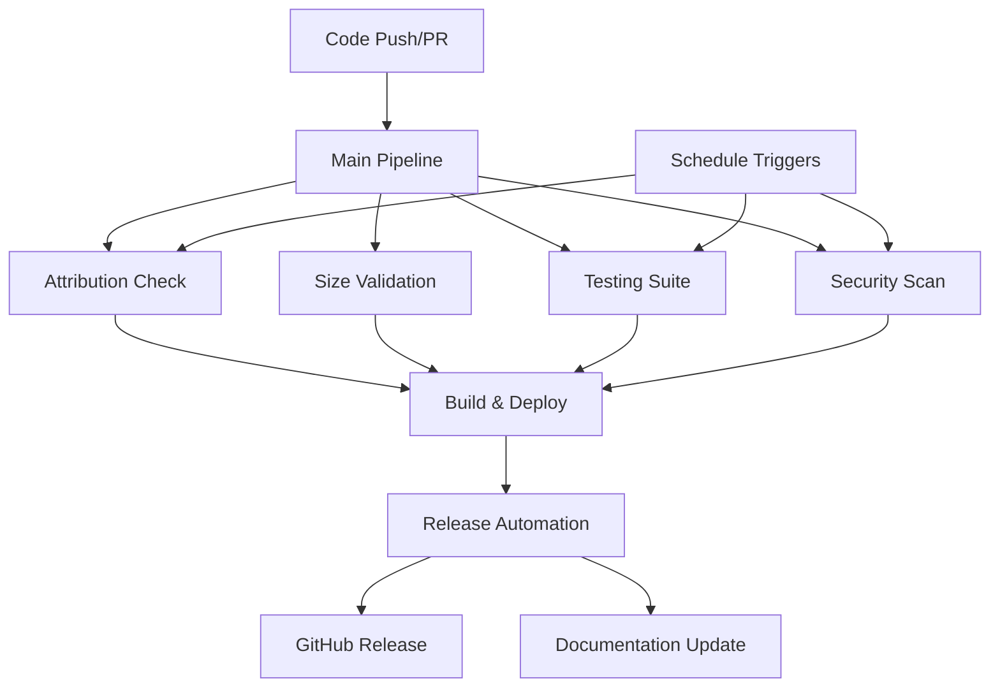

# CI/CD Pipeline Documentation

## Claude Code Dev Stack v3.0 - Comprehensive CI/CD System

This repository includes a comprehensive CI/CD pipeline designed specifically for the Claude Code Development Stack v3.0. The pipeline provides automated testing, security scanning, deployment, and release management.

### 🚀 Pipeline Overview

The CI/CD system consists of several interconnected workflows that ensure code quality, security, and reliable deployments:

1. **Attribution Check** - Validates licensing and contributor attribution
2. **Size Validation** - Monitors bundle sizes and performance budgets  
3. **Comprehensive Testing** - Multi-platform testing across Python and Node.js
4. **Security Scanning** - Vulnerability and secret detection
5. **Build & Deploy** - Automated building and deployment
6. **Release Automation** - Automated versioning and changelog generation

### 📋 Workflow Files

| Workflow | File | Purpose | Trigger |
|----------|------|---------|---------|
| Main Pipeline | `main-pipeline.yml` | Orchestrates all other workflows | Push to main/develop, PRs |
| Attribution Check | `attribution-check.yml` | License and attribution validation | Push, PRs, weekly schedule |
| Size Validation | `size-validation.yml` | Bundle size and performance monitoring | Push, PRs |
| Testing Suite | `testing.yml` | Comprehensive testing across platforms | Push, PRs, daily schedule |
| Security Scan | `security-scan.yml` | Security vulnerability scanning | Push, PRs, weekly schedule |
| Build & Deploy | `build-deploy.yml` | Build artifacts and deploy to environments | Push to main, tags |
| Release Automation | `release-automation.yml` | Automated releases and changelog | Push to main, tags, manual |
| Legacy Validation | `validate.yml` | Legacy agent system validation | Path-specific changes |
| Dashboard Deploy | `dashboard-deploy.yml` | Existing dashboard deployment | Push, PRs |

### 🏗️ Architecture



### 🔧 Configuration

#### Environment Variables

The pipeline uses several environment variables that can be configured:

```yaml
env:
  NODE_VERSION: '18'                    # Node.js version for builds
  PYTHON_VERSION: '3.11'               # Python version for testing
  MAX_BUNDLE_SIZE_KB: 2048             # Bundle size limit in KB
  COVERAGE_THRESHOLD: 80               # Code coverage requirement
  SECURITY_SCAN_LEVEL: 'comprehensive' # Security scan depth
```

#### Secrets Required

To fully utilize all pipeline features, configure these GitHub secrets:

- `GITHUB_TOKEN` - Automatically provided by GitHub
- `PYPI_API_TOKEN` - For Python package publishing (optional)
- `FOSSA_API_KEY` - For advanced license scanning (optional)

### 🎯 Usage

#### Automatic Triggers

The pipeline automatically runs on:

- **Push to main/develop**: Full pipeline execution
- **Pull Requests**: Validation and testing only
- **Tags (v*)**: Production deployment and release
- **Scheduled**: Security scans and dependency updates

#### Manual Triggers

You can manually trigger workflows with custom parameters:

1. **Main Pipeline**: 
   - Skip tests or security scans
   - Force deployment

2. **Release Automation**:
   - Choose release type (patch/minor/major/prerelease)
   - Create draft or pre-releases

3. **Security Scanning**:
   - Adjust scan level (basic/comprehensive/advanced)

#### Workflow Dispatch Examples

```bash
# Trigger main pipeline with custom settings
gh workflow run main-pipeline.yml \
  -f skip_tests=false \
  -f skip_security=false \
  -f force_deploy=true

# Create a new release
gh workflow run release-automation.yml \
  -f release_type=minor \
  -f pre_release=false \
  -f draft_release=false

# Run comprehensive security scan
gh workflow run security-scan.yml \
  -f scan_level=advanced
```

### 📊 Pipeline Stages

#### 1. Attribution & License Validation

- **Purpose**: Ensure proper attribution and license compliance
- **Checks**: 
  - Dependency license compatibility
  - Source file attribution
  - Repository metadata validation
- **Artifacts**: Attribution reports, license summaries

#### 2. Size & Performance Validation

- **Purpose**: Monitor bundle sizes and performance impact
- **Checks**:
  - Bundle size limits
  - Individual file size limits
  - Performance budget validation
- **Artifacts**: Size analysis reports, bundle manifests

#### 3. Comprehensive Testing

- **Purpose**: Validate functionality across platforms
- **Test Types**:
  - Unit tests (Python & Node.js)
  - Integration tests
  - End-to-end tests
  - Cross-browser testing (optional)
- **Platforms**: Ubuntu, Windows, macOS
- **Artifacts**: Test reports, coverage data

#### 4. Security Scanning

- **Purpose**: Identify security vulnerabilities and secrets
- **Scan Types**:
  - Dependency vulnerability scanning
  - Source code security analysis
  - Secret detection
  - Container security (advanced)
  - Infrastructure security (comprehensive)
- **Artifacts**: Security reports, vulnerability summaries

#### 5. Build & Deployment

- **Purpose**: Build artifacts and deploy to environments
- **Components**:
  - Web application (React/Vite)
  - Backend service (Node.js)
  - Python components
  - Container images
- **Environments**: Development, Staging, Production

#### 6. Release Management

- **Purpose**: Automate version management and releases
- **Features**:
  - Automatic version bumping
  - Changelog generation
  - GitHub release creation
  - Documentation updates

### 🔍 Monitoring & Reporting

#### Pipeline Status

Monitor pipeline status through:

- **GitHub Actions UI**: Real-time workflow execution
- **PR Comments**: Automated status updates on pull requests
- **Step Summaries**: Detailed execution summaries
- **Artifacts**: Downloadable reports and logs

#### Notification Channels

The pipeline provides notifications via:

- **PR Comments**: Status updates and recommendations
- **GitHub Releases**: Automated release notes
- **Workflow Summaries**: Execution details and metrics

### 🛠️ Customization

#### Adding New Workflows

1. Create workflow file in `.github/workflows/`
2. Update `main-pipeline.yml` to include the new workflow
3. Add appropriate triggers and dependencies
4. Update this documentation

#### Modifying Existing Workflows

1. Edit the relevant workflow file
2. Test changes in a feature branch
3. Update environment variables if needed
4. Update documentation

#### Custom Test Integration

To integrate custom tests:

1. Add test scripts to the appropriate workflow
2. Ensure proper artifacts are uploaded
3. Update the pipeline summary logic
4. Add any required dependencies

### 🚨 Troubleshooting

#### Common Issues

1. **Failed Tests**: Check test logs in workflow artifacts
2. **Security Scan Failures**: Review security reports for vulnerabilities
3. **Build Failures**: Verify dependencies and build scripts
4. **Deployment Issues**: Check environment configurations

#### Debug Mode

Enable debug logging by adding this to workflow files:

```yaml
env:
  ACTIONS_STEP_DEBUG: true
  ACTIONS_RUNNER_DEBUG: true
```

#### Artifact Analysis

Download and review artifacts for detailed analysis:

- Test results and coverage reports
- Security scan outputs
- Build logs and manifests
- Performance analysis data

### 📚 Best Practices

#### Development Workflow

1. **Feature Branches**: Create feature branches for new work
2. **Pull Requests**: Always use PRs for code review
3. **Testing**: Ensure tests pass before merging
4. **Security**: Address security findings promptly

#### Release Management

1. **Semantic Versioning**: Follow semver principles
2. **Release Notes**: Maintain clear, descriptive changelogs
3. **Testing**: Thoroughly test releases before production
4. **Rollback Plans**: Have rollback procedures ready

#### Performance Optimization

1. **Bundle Size**: Monitor and optimize bundle sizes
2. **Dependencies**: Regularly update and audit dependencies
3. **Caching**: Utilize workflow caching effectively
4. **Parallel Execution**: Leverage parallel job execution

### 🔄 Migration from Legacy System

If migrating from the legacy agent system:

1. **Legacy Validation**: The `validate.yml` workflow handles legacy components
2. **Gradual Migration**: Use both systems during transition
3. **Documentation**: Update project documentation
4. **Training**: Ensure team understands new pipeline

### 📈 Metrics & Analytics

The pipeline provides various metrics:

- **Build Success Rate**: Percentage of successful builds
- **Test Coverage**: Code coverage across components
- **Security Score**: Security posture metrics
- **Performance Metrics**: Bundle sizes and load times
- **Deployment Frequency**: Release cadence tracking

### 🤝 Contributing

To contribute to the CI/CD pipeline:

1. **Fork** the repository
2. **Create** a feature branch
3. **Make** your changes
4. **Test** thoroughly
5. **Submit** a pull request

#### Testing Pipeline Changes

Test pipeline changes by:

1. Creating a test branch
2. Pushing changes to trigger workflows
3. Reviewing execution logs
4. Validating artifacts and reports

### 📞 Support

For CI/CD pipeline support:

- **Issues**: Create GitHub issues for bugs or feature requests
- **Discussions**: Use GitHub Discussions for questions
- **Documentation**: Refer to this README and workflow comments
- **Community**: Engage with the Claude Code community

---

**Generated with [Claude Code](https://claude.ai/code)**

**Co-Authored-By: Claude <noreply@anthropic.com>**