# Claude Code Dev Stack v3.0 Master Plan 🚀

**Comprehensive Technical Documentation for System Evolution**

---

## 📋 Table of Contents

1. [Executive Summary](#executive-summary)
2. [System Architecture Evolution](#system-architecture-evolution)
3. [Phase-Based Development Plan](#phase-based-development-plan)
4. [Integration Points Documentation](#integration-points-documentation)
5. [Implementation Guides](#implementation-guides)
6. [API Documentation](#api-documentation)
7. [Migration Documentation](#migration-documentation)

---

## 1. Executive Summary

### 🎯 Version 3.0 Vision and Objectives

**Vision Statement**: Transform Claude Code Dev Stack into an intelligent, self-orchestrating development ecosystem that anticipates developer needs, manages complexity automatically, and delivers production-ready solutions with unprecedented speed and quality.

### Key Enhancements from v2.1

| Component | v2.1 Current | v3.0 Target | Enhancement |
|-----------|--------------|-------------|-------------|
| **Agents** | 28 specialists | 35+ intelligent agents | +25% coverage with smart orchestration |
| **Commands** | 18 workflows | 25+ smart commands | Auto-parameter detection, context awareness |
| **MCPs** | 3 basic tools | 8+ integrated services | GitHub, Audio, Mobile, Analytics, AI |
| **Hooks** | 19 automation | 30+ smart hooks | Predictive automation, quality gates |
| **Intelligence** | Basic routing | Smart orchestration | Context management, handoff protocols |
| **User Experience** | Command-based | Conversational + mobile | Audio feedback, mobile control |

### Expected Outcomes and Benefits

**Performance Improvements**:
- **Development Speed**: 15x faster (up from 10x)
- **Code Quality**: 95% automated quality assurance (up from 80%)
- **Cost Optimization**: 75% API cost savings (up from 60%)
- **Context Retention**: 99% session persistence (up from 85%)

**New Capabilities**:
- **Smart Orchestration**: AI-driven workflow management
- **Mobile Development**: Phone-to-laptop tunneling
- **Audio Integration**: Real-time feedback and control
- **GitHub Integration**: Native SDLC workflows
- **Quality Assurance**: Automated testing and validation

---

## 2. System Architecture Evolution

### Current v2.1 Architecture Overview


### Target v3.0 Architecture Design


### Migration Path and Compatibility

**Backward Compatibility Strategy**:
- All v2.1 commands remain functional
- Existing agents enhanced, not replaced
- Progressive enhancement approach
- Zero-downtime migration path

**Migration Phases**:
1. **Foundation Setup**: New core components without breaking changes
2. **Feature Enhancement**: Layer new capabilities on existing system
3. **Intelligence Integration**: Activate smart orchestration
4. **Experience Upgrade**: Enable mobile and audio interfaces
5. **Production Hardening**: Full v3.0 feature set

---

## 3. Phase-Based Development Plan

### PHASE 1: FOUNDATION & INTELLIGENCE (Weeks 1-3)

#### Status Line Integration Documentation

**Purpose**: Real-time system status and intelligent routing foundation

**Components**:
- `status_line_core.py` - Core status management
- `status_display.py` - Visual status indicators
- `status_api.py` - Status API endpoints
- `status_hooks.py` - Status-driven automation

**Implementation Guide**:

```python
# Status Line Core Implementation
class StatusLineCore:
    def __init__(self):
        self.current_status = {}
        self.status_history = []
        self.listeners = []
        
    def update_status(self, component: str, status: dict):
        """Update component status and notify listeners"""
        self.current_status[component] = {
            'status': status,
            'timestamp': datetime.utcnow(),
            'context': self.get_current_context()
        }
        self.notify_listeners(component, status)
        
    def get_intelligent_routing(self) -> dict:
        """Determine optimal agent routing based on current status"""
        return self.routing_engine.analyze_status(self.current_status)
```

**Configuration**:
```yaml
status_line:
  update_interval: 1000  # ms
  display_mode: "rich"   # rich, simple, minimal
  auto_routing: true
  status_persistence: true
  
components_to_track:
  - agents
  - commands  
  - mcps
  - hooks
  - system_resources
  - context_state
```

**Testing Procedures**:
```bash
# Unit Tests
pytest tests/status_line/test_core.py
pytest tests/status_line/test_display.py

# Integration Tests  
pytest tests/integration/test_status_orchestrator.py

# Performance Tests
pytest tests/performance/test_status_throughput.py
```

#### Context Management Enhancement Documentation

**Purpose**: Advanced context retention and intelligent handoffs

**Architecture**:


**Implementation**:

```python
class EnhancedContextManager:
    def __init__(self):
        self.context_store = ContextStore()
        self.handoff_manager = HandoffManager()
        self.recovery_system = RecoverySystem()
        
    def create_context_snapshot(self) -> ContextSnapshot:
        """Create comprehensive context snapshot"""
        return ContextSnapshot(
            conversation_history=self.get_conversation_history(),
            agent_states=self.get_agent_states(),
            project_state=self.get_project_state(),
            system_state=self.get_system_state(),
            metadata=self.get_metadata()
        )
        
    def execute_intelligent_handoff(self, 
                                   from_agent: str, 
                                   to_agent: str,
                                   context: dict) -> HandoffResult:
        """Execute context-aware agent handoff"""
        return self.handoff_manager.execute_handoff(
            source=from_agent,
            target=to_agent,
            context=context,
            intelligence_level="high"
        )
```

**Configuration Files**:
```yaml
# config/context_management.yaml
context_management:
  retention_policy:
    conversation_history: 30 # days
    agent_states: 7 # days  
    project_states: 90 # days
    
  handoff_strategy:
    intelligence_level: "high"
    context_transfer: "full"
    validation: true
    
  recovery:
    auto_recovery: true
    backup_interval: 300 # seconds
    max_recovery_attempts: 3
```

#### Chat Management System with Handoffs

**Purpose**: Seamless conversation management with intelligent agent transitions

**Core Components**:

```python
class ChatManagementSystem:
    def __init__(self):
        self.conversation_manager = ConversationManager()
        self.handoff_orchestrator = HandoffOrchestrator()
        self.continuity_engine = ContinuityEngine()
        
    def manage_conversation_flow(self, message: str) -> ConversationResponse:
        """Manage conversation with intelligent routing"""
        
        # Analyze message intent and context
        intent = self.analyze_intent(message)
        context = self.get_conversation_context()
        
        # Determine optimal agent
        optimal_agent = self.handoff_orchestrator.determine_agent(
            intent=intent,
            context=context,
            conversation_history=self.conversation_manager.get_history()
        )
        
        # Execute handoff if needed
        if optimal_agent != self.current_agent:
            handoff_result = self.execute_handoff(
                target_agent=optimal_agent,
                context=context
            )
            
        # Generate response
        return self.generate_response(message, optimal_agent, context)
```

**Handoff Protocol Documentation**:

```yaml
# Handoff Protocol Schema
handoff_protocol:
  trigger_conditions:
    - agent_expertise_mismatch
    - complexity_threshold_exceeded  
    - user_explicit_request
    - workflow_phase_change
    
  handoff_process:
    1. context_preparation
    2. agent_selection
    3. context_transfer
    4. validation
    5. execution
    6. feedback_collection
    
  quality_assurance:
    - context_completeness_check
    - agent_readiness_verification
    - handoff_success_validation
```

#### Testing Infrastructure Setup

**Comprehensive Testing Framework**:

```python
# tests/infrastructure/test_framework.py
class V3TestFramework:
    def __init__(self):
        self.unit_tests = UnitTestSuite()
        self.integration_tests = IntegrationTestSuite() 
        self.performance_tests = PerformanceTestSuite()
        self.user_acceptance_tests = UATSuite()
        
    def run_phase1_tests(self) -> TestResults:
        """Run comprehensive Phase 1 tests"""
        results = TestResults()
        
        # Status Line Tests
        results.add(self.test_status_line_core())
        results.add(self.test_status_line_integration())
        
        # Context Management Tests  
        results.add(self.test_context_management())
        results.add(self.test_handoff_system())
        
        # Chat Management Tests
        results.add(self.test_chat_management())
        results.add(self.test_conversation_continuity())
        
        return results
```

**Test Configuration**:
```yaml
# config/testing.yaml
testing_infrastructure:
  environments:
    - unit
    - integration  
    - staging
    - production_mirror
    
  test_data:
    synthetic_conversations: 1000
    synthetic_projects: 100
    performance_baselines: true
    
  automation:
    ci_integration: true
    automated_regression: true
    performance_monitoring: true
```

### PHASE 2: SMART ORCHESTRATION (Weeks 4-6)

#### Smart Orchestrator Core Documentation

**Purpose**: AI-driven workflow orchestration with predictive capabilities

**Architecture Overview**:


**Core Implementation**:

```python
class SmartOrchestratorCore:
    def __init__(self):
        self.decision_engine = HybridDecisionEngine()
        self.predictive_engine = PredictiveAnalytics()
        self.execution_engine = ParallelExecutionEngine()
        self.optimization_engine = WorkflowOptimizer()
        
    def orchestrate_workflow(self, request: WorkflowRequest) -> OrchestrationPlan:
        """Generate and execute intelligent orchestration plan"""
        
        # Analyze request and context
        analysis = self.analyze_request(request)
        context = self.get_orchestration_context()
        
        # Generate orchestration plan
        plan = self.generate_plan(analysis, context)
        
        # Optimize plan based on predictions
        optimized_plan = self.optimization_engine.optimize(
            plan=plan,
            predictions=self.predictive_engine.predict_outcomes(plan),
            constraints=self.get_current_constraints()
        )
        
        # Execute plan
        execution_result = self.execution_engine.execute(optimized_plan)
        
        # Learn from execution
        self.learn_from_execution(optimized_plan, execution_result)
        
        return OrchestrationResult(plan=optimized_plan, result=execution_result)
        
    def generate_plan(self, analysis: RequestAnalysis, context: dict) -> OrchestrationPlan:
        """Generate optimal orchestration plan"""
        
        # Determine required agents
        required_agents = self.decision_engine.determine_agents(
            analysis=analysis,
            context=context
        )
        
        # Optimize agent sequencing
        sequence = self.optimization_engine.optimize_sequence(
            agents=required_agents,
            dependencies=analysis.dependencies,
            constraints=context.constraints
        )
        
        # Generate execution plan
        return OrchestrationPlan(
            agents=required_agents,
            sequence=sequence,
            parallel_groups=self.identify_parallel_groups(sequence),
            resource_requirements=self.calculate_resources(required_agents),
            estimated_duration=self.estimate_duration(sequence),
            quality_gates=self.define_quality_gates(analysis)
        )
```

**Configuration Schema**:
```yaml
# config/smart_orchestrator.yaml  
smart_orchestrator:
  decision_engine:
    ml_model: "claude_orchestrator_v1"
    rule_engine: "advanced"
    hybrid_weighting: 0.7  # ML vs Rules
    
  predictive_analytics:
    enabled: true
    model_update_frequency: "daily"
    prediction_confidence_threshold: 0.8
    
  optimization:
    parallel_execution: true
    resource_optimization: true
    cost_optimization: true
    quality_optimization: true
    
  learning:
    feedback_collection: true
    model_retraining: "weekly"
    success_metrics_tracking: true
```

#### Agent Fundamentals Overhaul Documentation

**Purpose**: Enhanced agent intelligence with v3.0 capabilities

**Enhanced Agent Architecture**:

```python
class AgentV3Base:
    def __init__(self, agent_config: AgentConfig):
        self.agent_id = agent_config.agent_id
        self.capabilities = AgentCapabilities(agent_config.capabilities)
        self.intelligence_engine = IntelligenceEngine()
        self.context_manager = AgentContextManager()
        self.quality_controller = QualityController()
        
    def enhanced_process(self, request: AgentRequest) -> AgentResponse:
        """Enhanced processing with v3.0 intelligence"""
        
        # Context-aware analysis
        context = self.context_manager.get_enhanced_context(request)
        analysis = self.intelligence_engine.analyze_request(request, context)
        
        # Quality pre-check
        quality_check = self.quality_controller.pre_execution_check(
            request=request,
            context=context,
            agent_capabilities=self.capabilities
        )
        
        if not quality_check.passed:
            return self.handle_quality_failure(quality_check, request)
            
        # Enhanced execution
        execution_plan = self.create_execution_plan(analysis, context)
        result = self.execute_plan(execution_plan)
        
        # Quality post-check
        final_quality = self.quality_controller.post_execution_check(
            result=result,
            original_request=request,
            execution_context=context
        )
        
        return AgentResponse(
            result=result,
            quality_score=final_quality.score,
            execution_metadata=self.get_execution_metadata(),
            next_recommended_actions=self.suggest_next_actions(result, context)
        )
```

**Agent Intelligence Features**:

1. **Context Awareness**: Agents understand full project context
2. **Quality Assurance**: Built-in quality checks and validation
3. **Predictive Suggestions**: Recommend next steps based on current state
4. **Resource Optimization**: Intelligent resource usage
5. **Collaboration Intelligence**: Enhanced inter-agent communication

**New Agent Types for v3.0**:

```yaml
# New agents for v3.0
new_agents:
  intelligence:
    - agent-ultrathink-integration    # Advanced reasoning
    - agent-context-intelligence      # Context management
    - agent-workflow-optimizer        # Workflow optimization
    
  mobile:
    - agent-mobile-architect          # Mobile architecture
    - agent-mobile-ui-designer        # Mobile UI/UX
    - agent-cross-platform-developer  # Cross-platform apps
    
  quality:
    - agent-automated-tester          # Automated testing
    - agent-quality-assurance         # QA automation
    - agent-performance-monitor       # Performance monitoring
    
  operations:
    - agent-deployment-orchestrator   # Deployment automation
    - agent-monitoring-specialist     # System monitoring
    - agent-incident-responder        # Incident management
```

#### SDLC Integration with GitHub MCP

**Purpose**: Native software development lifecycle integration

**GitHub MCP Integration Architecture**:


**Implementation Guide**:

```python
class GitHubMCPIntegration:
    def __init__(self):
        self.github_client = GitHubAPIClient()
        self.webhook_handler = WebhookHandler()
        self.workflow_engine = SDLCWorkflowEngine()
        self.agent_integrator = AgentIntegrator()
        
    def handle_github_event(self, event: GitHubEvent) -> SDLCResponse:
        """Handle GitHub events with intelligent SDLC workflows"""
        
        # Process event
        processed_event = self.webhook_handler.process(event)
        
        # Determine workflow
        workflow = self.workflow_engine.determine_workflow(processed_event)
        
        # Execute with agents
        if workflow.requires_agents:
            agent_response = self.agent_integrator.execute_workflow(
                workflow=workflow,
                github_context=processed_event.context
            )
            
            # Apply results back to GitHub
            return self.apply_to_github(agent_response, event)
            
        return self.execute_standard_workflow(workflow, processed_event)
```

**SDLC Workflow Configurations**:

```yaml
# config/github_sdlc.yaml
github_integration:
  workflows:
    issue_created:
      trigger: "issues.opened"
      agents: ["@agent-business-analyst", "@agent-technical-specifications"]
      actions: ["analyze_requirements", "create_technical_spec"]
      
    pull_request_opened:
      trigger: "pull_request.opened"  
      agents: ["@agent-code-review", "@agent-testing-automation"]
      actions: ["automated_review", "generate_tests", "validate_quality"]
      
    release_published:
      trigger: "release.published"
      agents: ["@agent-deployment-orchestrator", "@agent-documentation-specialist"]  
      actions: ["deploy_release", "update_documentation"]
      
  quality_gates:
    code_review:
      required_approvals: 2
      automated_checks: true
      quality_threshold: 0.85
      
    deployment:
      testing_required: true
      security_scan: true  
      performance_check: true
```

#### Parallel Execution Engine Documentation

**Purpose**: High-performance parallel agent execution

**Parallel Execution Architecture**:

```python
class ParallelExecutionEngine:
    def __init__(self):
        self.executor = ThreadPoolExecutor(max_workers=10)
        self.dependency_resolver = DependencyResolver()
        self.resource_manager = ResourceManager()
        self.synchronization_manager = SynchronizationManager()
        
    def execute_parallel_workflow(self, workflow: ParallelWorkflow) -> ExecutionResult:
        """Execute agents in parallel while respecting dependencies"""
        
        # Resolve execution graph
        execution_graph = self.dependency_resolver.resolve(workflow.agents)
        
        # Create execution phases
        phases = self.create_execution_phases(execution_graph)
        
        results = {}
        for phase in phases:
            # Execute phase in parallel
            phase_futures = {}
            for agent_task in phase.tasks:
                if self.resource_manager.can_allocate(agent_task.resource_requirements):
                    future = self.executor.submit(
                        self.execute_agent_task,
                        agent_task,
                        results  # Previous phase results
                    )
                    phase_futures[agent_task.agent_id] = future
                    
            # Wait for phase completion
            phase_results = self.synchronization_manager.wait_for_completion(
                phase_futures,
                timeout=phase.max_execution_time
            )
            
            results.update(phase_results)
            
        return ExecutionResult(
            results=results,
            execution_metadata=self.get_execution_metadata(),
            performance_metrics=self.get_performance_metrics()
        )
```

**Resource Management**:

```yaml
# config/parallel_execution.yaml
parallel_execution:
  thread_pool:
    max_workers: 10
    queue_size: 100
    timeout: 300
    
  resource_limits:
    max_concurrent_agents: 5
    memory_limit: "2GB"
    cpu_limit: "80%"
    
  optimization:
    dynamic_scaling: true
    load_balancing: true
    priority_scheduling: true
```

#### Ultrathink Integration Specifications

**Purpose**: Advanced reasoning capabilities integration

**Ultrathink Integration Architecture**:

```python
class UltrathinkIntegration:
    def __init__(self):
        self.ultrathink_client = UltrathinkClient()
        self.reasoning_engine = AdvancedReasoningEngine()
        self.integration_layer = IntegrationLayer()
        
    def enhanced_reasoning(self, request: ReasoningRequest) -> ReasoningResponse:
        """Provide enhanced reasoning capabilities"""
        
        # Determine if Ultrathink reasoning is needed
        complexity_analysis = self.analyze_complexity(request)
        
        if complexity_analysis.requires_ultrathink:
            # Use Ultrathink for complex reasoning
            ultrathink_response = self.ultrathink_client.reason(
                problem=request.problem,
                context=request.context,
                reasoning_depth="deep"
            )
            
            # Integrate with existing agent capabilities
            integrated_response = self.integration_layer.integrate(
                ultrathink_response=ultrathink_response,
                agent_context=request.agent_context
            )
            
            return ReasoningResponse(
                solution=integrated_response.solution,
                reasoning_chain=ultrathink_response.reasoning_chain,
                confidence=ultrathink_response.confidence,
                alternative_approaches=integrated_response.alternatives
            )
            
        # Use standard reasoning for simpler requests
        return self.reasoning_engine.standard_reasoning(request)
```

**Integration Configuration**:

```yaml
# config/ultrathink_integration.yaml
ultrathink_integration:
  trigger_conditions:
    - complexity_score: "> 0.8"
    - multi_step_reasoning: true
    - ambiguous_requirements: true
    - architectural_decisions: true
    
  integration_settings:
    reasoning_depth: "deep"
    context_sharing: true
    result_validation: true
    fallback_enabled: true
    
  performance:
    timeout: 30 # seconds
    retry_attempts: 2
    caching: true
```

### PHASE 3: ENHANCED USER EXPERIENCE (Weeks 7-9)

#### Audio Player v3.0 Documentation

**Purpose**: Advanced audio feedback and voice control system

**Audio System Architecture**:

```mermaid
graph TB
    subgraph "Audio Core v3.0"
        AudioEngine[Audio Engine]
        VoiceRecognition[Voice Recognition]
        TTSEngine[Text-to-Speech Engine]
        AudioProcessor[Audio Processor]
    end
    
    subgraph "Audio Features"
        SmartNotifications[Smart Notifications]
        VoiceCommands[Voice Commands]
        AudioFeedback[Context Audio Feedback]
        AudioRecording[Audio Recording]
    end
    
    subgraph "Integration Points"
        StatusLineAudio[Status Line → Audio]
        AgentAudio[Agent → Audio]
        WorkflowAudio[Workflow → Audio]
        MobileAudio[Mobile → Audio]
    end
    
    AudioEngine --> SmartNotifications
    VoiceRecognition --> VoiceCommands
    TTSEngine --> AudioFeedback
    AudioProcessor --> AudioRecording
    
    SmartNotifications --> StatusLineAudio
    VoiceCommands --> AgentAudio
    AudioFeedback --> WorkflowAudio
    AudioRecording --> MobileAudio
```



**Implementation Guide**:

```python
class AudioPlayerV3:
    def __init__(self):
        self.audio_engine = AudioEngine()
        self.voice_recognition = VoiceRecognitionEngine()
        self.tts_engine = TTSEngine()
        self.notification_manager = SmartNotificationManager()
        self.context_manager = AudioContextManager()
        
    def play_contextual_notification(self, event: SystemEvent) -> AudioResponse:
        """Play intelligent audio notification based on context"""
        
        # Analyze event context
        context = self.context_manager.get_audio_context(event)
        
        # Determine appropriate audio response
        audio_strategy = self.determine_audio_strategy(event, context)
        
        if audio_strategy.type == "voice":
            # Generate contextual voice message
            message = self.generate_contextual_message(event, context)
            return self.tts_engine.speak(message, audio_strategy.voice_config)
            
        elif audio_strategy.type == "sound":
            # Play contextual sound
            sound_file = self.select_contextual_sound(event, context)
            return self.audio_engine.play_sound(sound_file, audio_strategy.audio_config)
            
        elif audio_strategy.type == "hybrid":
            # Combine sound and voice
            return self.play_hybrid_notification(event, context, audio_strategy)
            
    def process_voice_command(self, voice_input: str) -> CommandResponse:
        """Process voice commands with natural language understanding"""
        
        # Transcribe and analyze voice input
        transcription = self.voice_recognition.transcribe(voice_input)
        intent = self.analyze_voice_intent(transcription)
        
        # Convert to system command
        command = self.convert_to_command(intent)
        
        # Execute command
        return self.execute_voice_command(command)
```

**Audio Configuration**:

```yaml
# config/audio_v3.yaml
audio_system_v3:
  voice_recognition:
    engine: "whisper-large"
    language: "en-US"
    continuous_listening: false
    wake_word: "claude code"
    
  text_to_speech:
    engine: "neural-voices"
    voice: "professional"
    speed: 1.0
    volume: 0.8
    
  smart_notifications:
    context_awareness: true
    adaptive_volume: true
    priority_routing: true
    quiet_hours: "22:00-07:00"
    
  sound_library:
    agent_complete: "chime_success.wav"
    workflow_start: "chime_start.wav"
    error_notification: "alert_error.wav"
    system_ready: "system_ready.wav"
```

**Voice Command Mapping**:

```yaml
# config/voice_commands.yaml
voice_commands:
  project_management:
    - pattern: "start new project *"
      command: "/new-project {project_description}"
      agents: ["@agent-system-architect"]
      
    - pattern: "create backend for *"
      command: "/backend-service {service_description}"
      agents: ["@agent-backend-engineer"]
      
  system_control:
    - pattern: "show project status"
      command: "/project-status"
      
    - pattern: "what agents are available"
      command: "/list-agents"
      
  audio_control:
    - pattern: "mute notifications"
      action: "mute_audio_notifications"
      
    - pattern: "enable voice mode"
      action: "activate_continuous_listening"
```

#### Mobile Control System Documentation

**Purpose**: Remote control and monitoring via mobile devices

**Mobile System Architecture**:


**Mobile Control Implementation**:

```python
class MobileControlSystem:
    def __init__(self):
        self.tunnel_server = TunnelServer()
        self.security_manager = SecurityManager()
        self.command_processor = MobileCommandProcessor()
        self.sync_engine = MobileSyncEngine()
        
    def establish_mobile_connection(self, device_info: DeviceInfo) -> ConnectionResult:
        """Establish secure mobile connection"""
        
        # Authenticate device
        auth_result = self.security_manager.authenticate_device(device_info)
        if not auth_result.success:
            return ConnectionResult(success=False, error=auth_result.error)
            
        # Create secure tunnel
        tunnel = self.tunnel_server.create_tunnel(
            device_id=device_info.device_id,
            encryption_key=auth_result.encryption_key,
            compression_enabled=True
        )
        
        # Initialize sync
        self.sync_engine.initialize_sync(
            device_id=device_info.device_id,
            tunnel=tunnel
        )
        
        return ConnectionResult(
            success=True,
            tunnel_id=tunnel.tunnel_id,
            capabilities=self.get_mobile_capabilities()
        )
        
    def process_mobile_command(self, command: MobileCommand) -> CommandResponse:
        """Process command from mobile device"""
        
        # Validate command
        validation = self.command_processor.validate(command)
        if not validation.valid:
            return CommandResponse(success=False, error=validation.error)
            
        # Convert mobile command to system command
        system_command = self.command_processor.convert_to_system_command(command)
        
        # Execute on desktop system
        result = self.execute_desktop_command(system_command)
        
        # Prepare mobile response
        mobile_response = self.format_for_mobile(result)
        
        # Send response through tunnel
        self.tunnel_server.send_response(command.device_id, mobile_response)
        
        return CommandResponse(success=True, result=mobile_response)
```

**Phone-to-Laptop Tunneling Setup**:

```yaml
# config/mobile_tunneling.yaml
mobile_tunneling:
  connection:
    protocol: "secure_websocket"
    port: 8443
    encryption: "AES-256"
    compression: "gzip"
    
  security:
    device_authentication: true
    token_expiration: "24h"
    ip_whitelist: []
    rate_limiting: true
    
  features:
    command_relay: true
    status_sync: true
    audio_relay: true
    file_sync: false
    
  performance:
    heartbeat_interval: 30 # seconds
    reconnect_attempts: 5
    timeout: 60 # seconds
```

**Mobile App Features**:

```typescript
// Mobile App Core Features
interface MobileAppFeatures {
  project_monitoring: {
    real_time_status: boolean;
    progress_tracking: boolean;
    agent_activity: boolean;
    resource_usage: boolean;
  };
  
  remote_control: {
    voice_commands: boolean;
    touch_commands: boolean;
    emergency_stop: boolean;
    priority_override: boolean;
  };
  
  notifications: {
    push_notifications: boolean;
    smart_filtering: boolean;
    priority_routing: boolean;
    offline_queuing: boolean;
  };
  
  offline_capabilities: {
    command_queuing: boolean;
    status_caching: boolean;
    sync_when_connected: boolean;
  };
}
```

#### UI/UX Enhancement Documentation

**Purpose**: Modern, intuitive user experience improvements

**UI/UX Enhancement Areas**:

1. **Smart Command Interface**:
```python
class SmartCommandInterface:
    def __init__(self):
        self.autocomplete_engine = AutocompleteEngine()
        self.context_predictor = ContextPredictor()
        self.visual_feedback_system = VisualFeedbackSystem()
        
    def enhanced_command_input(self, partial_input: str) -> SmartSuggestions:
        """Provide intelligent command suggestions"""
        
        context = self.context_predictor.get_current_context()
        suggestions = self.autocomplete_engine.generate_suggestions(
            partial_input=partial_input,
            context=context,
            user_history=self.get_user_history(),
            project_state=self.get_project_state()
        )
        
        return SmartSuggestions(
            completions=suggestions.completions,
            agent_suggestions=suggestions.recommended_agents,
            workflow_suggestions=suggestions.recommended_workflows,
            context_help=suggestions.contextual_help
        )
```

2. **Visual Progress Tracking**:
```python
class VisualProgressSystem:
    def __init__(self):
        self.progress_tracker = ProgressTracker()
        self.visualization_engine = VisualizationEngine()
        self.real_time_updater = RealTimeUpdater()
        
    def display_workflow_progress(self, workflow_id: str) -> ProgressVisualization:
        """Display real-time workflow progress"""
        
        progress_data = self.progress_tracker.get_progress(workflow_id)
        
        return ProgressVisualization(
            overall_progress=progress_data.overall_percentage,
            agent_progress=progress_data.agent_statuses,
            timeline=progress_data.estimated_timeline,
            visual_graph=self.visualization_engine.create_progress_graph(progress_data)
        )
```

**UI Configuration**:

```yaml
# config/ui_enhancements.yaml
ui_enhancements:
  command_interface:
    autocomplete: true
    smart_suggestions: true
    context_help: true
    visual_preview: true
    
  progress_visualization:
    real_time_updates: true
    progress_bars: true
    agent_status_indicators: true
    timeline_view: true
    
  accessibility:
    screen_reader_support: true
    keyboard_navigation: true
    high_contrast_mode: true
    font_size_scaling: true
    
  personalization:
    custom_themes: true
    layout_preferences: true
    notification_settings: true
    shortcut_customization: true
```

### PHASE 4: TECHNICAL EXCELLENCE (Weeks 10-12)

#### Technical Utility Hooks Documentation

**Purpose**: Advanced automation hooks for development workflow

**Technical Hooks Architecture**:

```python
class TechnicalUtilityHooks:
    def __init__(self):
        self.hook_registry = HookRegistry()
        self.event_dispatcher = EventDispatcher()
        self.automation_engine = AutomationEngine()
        
    def register_technical_hooks(self):
        """Register all technical utility hooks"""
        
        # Code Quality Hooks
        self.hook_registry.register("pre_commit", PreCommitQualityHook())
        self.hook_registry.register("code_analysis", CodeAnalysisHook())
        self.hook_registry.register("security_scan", SecurityScanHook())
        
        # Performance Hooks
        self.hook_registry.register("performance_monitor", PerformanceMonitorHook())
        self.hook_registry.register("resource_optimizer", ResourceOptimizerHook())
        self.hook_registry.register("cache_optimizer", CacheOptimizerHook())
        
        # Deployment Hooks
        self.hook_registry.register("pre_deploy", PreDeploymentHook())
        self.hook_registry.register("post_deploy", PostDeploymentHook())
        self.hook_registry.register("rollback_trigger", RollbackTriggerHook())
        
        # Documentation Hooks
        self.hook_registry.register("doc_generator", DocumentationGeneratorHook())
        self.hook_registry.register("doc_validator", DocumentationValidatorHook())
        self.hook_registry.register("api_doc_sync", APIDocumentationSyncHook())
```

**Hook Implementation Examples**:

```python
class PreCommitQualityHook(Hook):
    def execute(self, context: HookContext) -> HookResult:
        """Execute pre-commit quality checks"""
        
        quality_checks = [
            self.run_linting(context.files),
            self.run_formatting(context.files),
            self.run_type_checking(context.files),
            self.run_security_scan(context.files),
            self.run_test_suite(context.affected_tests)
        ]
        
        results = []
        for check in quality_checks:
            result = check.execute()
            results.append(result)
            
            if not result.passed and result.blocking:
                return HookResult(
                    success=False,
                    message=f"Quality check failed: {result.message}",
                    details=result.details
                )
                
        return HookResult(
            success=True,
            message="All quality checks passed",
            quality_score=self.calculate_quality_score(results)
        )

class PerformanceMonitorHook(Hook):
    def execute(self, context: HookContext) -> HookResult:
        """Monitor system performance during execution"""
        
        metrics = PerformanceMetrics()
        
        # Monitor CPU usage
        metrics.cpu_usage = self.monitor_cpu_usage(context.duration)
        
        # Monitor memory usage
        metrics.memory_usage = self.monitor_memory_usage(context.duration)
        
        # Monitor agent execution times
        metrics.agent_performance = self.monitor_agent_performance(context.agents)
        
        # Check for performance issues
        issues = self.identify_performance_issues(metrics)
        
        if issues:
            # Trigger optimization
            self.trigger_optimization(issues)
            
        return HookResult(
            success=True,
            metrics=metrics,
            optimization_suggestions=self.get_optimization_suggestions(metrics)
        )
```

#### Linter/Formatter Integration Documentation

**Purpose**: Automated code quality and formatting

**Linter Integration Architecture**:


**Linter Integration Implementation**:

```python
class LinterFormatterIntegration:
    def __init__(self):
        self.linter_registry = LinterRegistry()
        self.formatter_registry = FormatterRegistry()
        self.quality_analyzer = QualityAnalyzer()
        self.config_manager = ConfigManager()
        
    def setup_language_support(self):
        """Setup linters and formatters for supported languages"""
        
        # Python setup
        self.linter_registry.register("python", {
            "linter": "pylint",
            "formatter": "black",
            "type_checker": "mypy",
            "import_sorter": "isort"
        })
        
        # JavaScript/TypeScript setup
        self.linter_registry.register("javascript", {
            "linter": "eslint",
            "formatter": "prettier",
            "type_checker": None
        })
        
        self.linter_registry.register("typescript", {
            "linter": "eslint",
            "formatter": "prettier", 
            "type_checker": "tsc"
        })
        
        # Go setup
        self.linter_registry.register("go", {
            "linter": "golangci-lint",
            "formatter": "gofmt",
            "type_checker": "go vet"
        })
        
    def run_quality_check(self, files: List[str]) -> QualityReport:
        """Run comprehensive quality check on files"""
        
        quality_report = QualityReport()
        
        for file_path in files:
            language = self.detect_language(file_path)
            linter_config = self.linter_registry.get(language)
            
            if linter_config:
                # Run linting
                lint_result = self.run_linter(file_path, linter_config["linter"])
                quality_report.add_lint_result(file_path, lint_result)
                
                # Run formatting check
                format_result = self.check_formatting(file_path, linter_config["formatter"])
                quality_report.add_format_result(file_path, format_result)
                
                # Run type checking if available
                if linter_config["type_checker"]:
                    type_result = self.run_type_checker(file_path, linter_config["type_checker"])
                    quality_report.add_type_result(file_path, type_result)
                    
        return quality_report
        
    def auto_fix_issues(self, files: List[str]) -> FixResult:
        """Automatically fix code issues where possible"""
        
        fix_result = FixResult()
        
        for file_path in files:
            language = self.detect_language(file_path)
            formatter_config = self.formatter_registry.get(language)
            
            if formatter_config:
                # Auto-format code
                format_result = self.run_formatter(file_path, formatter_config)
                fix_result.add_format_fix(file_path, format_result)
                
                # Fix import organization
                if "import_sorter" in formatter_config:
                    import_result = self.organize_imports(file_path, formatter_config["import_sorter"])
                    fix_result.add_import_fix(file_path, import_result)
                    
        return fix_result
```

**Quality Configuration**:

```yaml
# config/code_quality.yaml
code_quality:
  python:
    linter: "pylint"
    formatter: "black"
    type_checker: "mypy"
    import_sorter: "isort"
    line_length: 88
    
  javascript:
    linter: "eslint"
    formatter: "prettier"
    semicolons: true
    quote_style: "double"
    
  typescript:
    linter: "eslint" 
    formatter: "prettier"
    type_checker: "tsc"
    strict_mode: true
    
  quality_gates:
    min_code_coverage: 80
    max_complexity: 10
    no_security_issues: true
    no_critical_bugs: true
    
  automation:
    auto_fix_on_save: true
    pre_commit_check: true
    ci_integration: true
```

#### Code Analysis Tool Documentation

**Purpose**: Deep code analysis and quality metrics

**Code Analysis System**:

```python
class CodeAnalysisSystem:
    def __init__(self):
        self.analysis_engine = AnalysisEngine()
        self.metrics_calculator = MetricsCalculator()
        self.pattern_detector = PatternDetector()
        self.vulnerability_scanner = VulnerabilityScanner()
        
    def comprehensive_analysis(self, codebase_path: str) -> AnalysisReport:
        """Perform comprehensive code analysis"""
        
        analysis_report = AnalysisReport()
        
        # Code metrics analysis
        metrics = self.metrics_calculator.calculate_metrics(codebase_path)
        analysis_report.add_metrics(metrics)
        
        # Design pattern analysis
        patterns = self.pattern_detector.detect_patterns(codebase_path)
        analysis_report.add_patterns(patterns)
        
        # Security vulnerability analysis
        vulnerabilities = self.vulnerability_scanner.scan(codebase_path)
        analysis_report.add_vulnerabilities(vulnerabilities)
        
        # Code smell detection
        smells = self.detect_code_smells(codebase_path)
        analysis_report.add_code_smells(smells)
        
        # Technical debt analysis
        tech_debt = self.analyze_technical_debt(codebase_path)
        analysis_report.add_technical_debt(tech_debt)
        
        return analysis_report
        
    def calculate_code_metrics(self, file_path: str) -> CodeMetrics:
        """Calculate comprehensive code metrics"""
        
        return CodeMetrics(
            lines_of_code=self.count_lines_of_code(file_path),
            cyclomatic_complexity=self.calculate_complexity(file_path),
            maintainability_index=self.calculate_maintainability(file_path),
            code_duplication=self.detect_duplication(file_path),
            test_coverage=self.calculate_coverage(file_path),
            documentation_coverage=self.calculate_doc_coverage(file_path)
        )
```

**Analysis Configuration**:

```yaml
# config/code_analysis.yaml
code_analysis:
  metrics:
    complexity_threshold: 10
    duplication_threshold: 5
    maintainability_threshold: 70
    coverage_threshold: 80
    
  vulnerability_scanning:
    security_tools: ["bandit", "safety", "semgrep"]
    severity_threshold: "medium"
    
  pattern_detection:
    design_patterns: true
    anti_patterns: true
    architectural_patterns: true
    
  reporting:
    format: ["html", "json", "pdf"]
    include_graphs: true
    trend_analysis: true
```

#### Performance Monitoring Documentation

**Purpose**: Real-time system performance monitoring

**Performance Monitoring System**:

```python
class PerformanceMonitoringSystem:
    def __init__(self):
        self.metrics_collector = MetricsCollector()
        self.alerting_system = AlertingSystem()
        self.dashboard = PerformanceDashboard()
        self.optimizer = PerformanceOptimizer()
        
    def start_monitoring(self) -> MonitoringSession:
        """Start comprehensive performance monitoring"""
        
        session = MonitoringSession()
        
        # Start collecting metrics
        self.metrics_collector.start_collection([
            "cpu_usage",
            "memory_usage", 
            "disk_io",
            "network_io",
            "agent_execution_times",
            "api_response_times",
            "database_query_times"
        ])
        
        # Setup alerting
        self.alerting_system.setup_alerts([
            Alert("high_cpu_usage", threshold=80),
            Alert("high_memory_usage", threshold=85),
            Alert("slow_agent_response", threshold=30),
            Alert("api_timeout", threshold=60)
        ])
        
        # Start real-time dashboard
        self.dashboard.start_real_time_display()
        
        return session
        
    def analyze_performance_trends(self, timeframe: str) -> TrendAnalysis:
        """Analyze performance trends over time"""
        
        historical_data = self.metrics_collector.get_historical_data(timeframe)
        
        return TrendAnalysis(
            cpu_trends=self.analyze_cpu_trends(historical_data),
            memory_trends=self.analyze_memory_trends(historical_data),
            agent_performance_trends=self.analyze_agent_trends(historical_data),
            optimization_opportunities=self.identify_optimization_opportunities(historical_data)
        )
```

#### Quality Assurance Framework Documentation

**Purpose**: Comprehensive QA automation and validation

**QA Framework Architecture**:

```python
class QualityAssuranceFramework:
    def __init__(self):
        self.test_orchestrator = TestOrchestrator()
        self.quality_gates = QualityGates()
        self.validation_engine = ValidationEngine()
        self.reporting_system = QAReportingSystem()
        
    def comprehensive_qa_check(self, project: Project) -> QAReport:
        """Run comprehensive quality assurance checks"""
        
        qa_report = QAReport()
        
        # Unit testing
        unit_test_results = self.test_orchestrator.run_unit_tests(project)
        qa_report.add_unit_tests(unit_test_results)
        
        # Integration testing  
        integration_results = self.test_orchestrator.run_integration_tests(project)
        qa_report.add_integration_tests(integration_results)
        
        # Security testing
        security_results = self.run_security_tests(project)
        qa_report.add_security_tests(security_results)
        
        # Performance testing
        performance_results = self.run_performance_tests(project)
        qa_report.add_performance_tests(performance_results)
        
        # Code quality validation
        quality_results = self.validation_engine.validate_code_quality(project)
        qa_report.add_quality_validation(quality_results)
        
        # Quality gate evaluation
        gate_results = self.quality_gates.evaluate_all(qa_report)
        qa_report.add_gate_results(gate_results)
        
        return qa_report
```

### PHASE 5: PRODUCTION DEPLOYMENT (Weeks 13-15)

#### System Integration Documentation

**Purpose**: Complete system integration and orchestration

**Integration Architecture Overview**:


#### Production Hardening Documentation

**Purpose**: Security, reliability, and scalability for production

**Production Hardening Checklist**:

```yaml
# config/production_hardening.yaml
production_hardening:
  security:
    authentication: "required"
    authorization: "role_based"
    encryption: "AES-256"
    secrets_management: "vault"
    
  reliability:
    health_checks: "comprehensive"
    circuit_breakers: "enabled"
    retry_mechanisms: "exponential_backoff"
    failover: "automatic"
    
  scalability:
    auto_scaling: "enabled"
    load_balancing: "intelligent"
    resource_management: "dynamic"
    performance_optimization: "continuous"
    
  monitoring:
    logging: "structured"
    metrics: "comprehensive" 
    alerting: "intelligent"
    tracing: "distributed"
```

#### Deployment Pipeline Documentation

**Purpose**: Automated deployment and release management

**Deployment Pipeline**:

```python
class DeploymentPipeline:
    def __init__(self):
        self.pipeline_engine = PipelineEngine()
        self.deployment_orchestrator = DeploymentOrchestrator()
        self.rollback_manager = RollbackManager()
        self.validation_system = ValidationSystem()
        
    def execute_deployment(self, deployment_request: DeploymentRequest) -> DeploymentResult:
        """Execute complete deployment pipeline"""
        
        pipeline_result = PipelineResult()
        
        try:
            # Pre-deployment validation
            validation_result = self.validation_system.validate_pre_deployment(
                deployment_request
            )
            
            if not validation_result.passed:
                return DeploymentResult(
                    success=False,
                    error="Pre-deployment validation failed",
                    details=validation_result.details
                )
            
            # Execute deployment stages
            for stage in deployment_request.stages:
                stage_result = self.pipeline_engine.execute_stage(stage)
                pipeline_result.add_stage_result(stage_result)
                
                if not stage_result.success:
                    # Initiate rollback
                    rollback_result = self.rollback_manager.rollback_to_previous()
                    return DeploymentResult(
                        success=False,
                        error=f"Stage {stage.name} failed",
                        rollback_result=rollback_result
                    )
            
            # Post-deployment validation
            post_validation = self.validation_system.validate_post_deployment(
                deployment_request
            )
            
            return DeploymentResult(
                success=post_validation.passed,
                pipeline_result=pipeline_result,
                validation_result=post_validation
            )
            
        except Exception as e:
            # Emergency rollback
            emergency_rollback = self.rollback_manager.emergency_rollback()
            return DeploymentResult(
                success=False,
                error=f"Deployment failed: {str(e)}",
                emergency_rollback=emergency_rollback
            )
```

#### Testing & Validation Procedures

**Purpose**: Comprehensive testing before production release

**Testing Framework**:

```python
class V3TestingFramework:
    def __init__(self):
        self.test_suites = {
            "unit": UnitTestSuite(),
            "integration": IntegrationTestSuite(),
            "system": SystemTestSuite(),
            "performance": PerformanceTestSuite(),
            "security": SecurityTestSuite(),
            "user_acceptance": UATSuite()
        }
        
    def run_complete_validation(self) -> ValidationResult:
        """Run complete v3.0 validation suite"""
        
        validation_result = ValidationResult()
        
        # Phase 1 validation
        phase1_result = self.validate_phase1_components()
        validation_result.add_phase_result("phase1", phase1_result)
        
        # Phase 2 validation  
        phase2_result = self.validate_phase2_components()
        validation_result.add_phase_result("phase2", phase2_result)
        
        # Phase 3 validation
        phase3_result = self.validate_phase3_components()
        validation_result.add_phase_result("phase3", phase3_result)
        
        # Phase 4 validation
        phase4_result = self.validate_phase4_components()
        validation_result.add_phase_result("phase4", phase4_result)
        
        # Phase 5 validation
        phase5_result = self.validate_phase5_components()
        validation_result.add_phase_result("phase5", phase5_result)
        
        # Integration validation
        integration_result = self.validate_integration_points()
        validation_result.add_integration_result(integration_result)
        
        return validation_result
```

---

## 4. Integration Points Documentation

### 9 Critical Synergies

#### 1. Status Line ↔ Smart Orchestrator

**Integration Purpose**: Real-time status drives intelligent orchestration decisions

```python
class StatusLineOrchestratorIntegration:
    def __init__(self):
        self.status_line = StatusLineCore()
        self.orchestrator = SmartOrchestratorCore()
        
    def setup_integration(self):
        """Setup bidirectional integration"""
        
        # Status Line → Orchestrator
        self.status_line.add_listener("status_change", self.handle_status_change)
        
        # Orchestrator → Status Line  
        self.orchestrator.add_event_handler("orchestration_start", self.update_status_line)
        self.orchestrator.add_event_handler("orchestration_complete", self.update_status_line)
        
    def handle_status_change(self, status_event: StatusEvent):
        """Handle status changes and trigger orchestration adjustments"""
        
        if status_event.requires_orchestration_adjustment:
            adjustment = self.orchestrator.generate_adjustment(status_event)
            self.orchestrator.apply_adjustment(adjustment)
```

#### 2. Audio v3 ↔ Status Line

**Integration Purpose**: Audio feedback driven by status changes

```python
class AudioStatusIntegration:
    def __init__(self):
        self.audio_system = AudioPlayerV3()
        self.status_line = StatusLineCore()
        
    def setup_audio_status_sync(self):
        """Synchronize audio notifications with status changes"""
        
        self.status_line.add_listener("agent_complete", self.play_completion_audio)
        self.status_line.add_listener("workflow_start", self.play_start_audio)
        self.status_line.add_listener("error_occurred", self.play_error_audio)
        self.status_line.add_listener("system_ready", self.play_ready_audio)
```

#### 3. Context Management ↔ Orchestrator

**Integration Purpose**: Context-aware orchestration decisions

```python
class ContextOrchestratorIntegration:
    def __init__(self):
        self.context_manager = EnhancedContextManager()
        self.orchestrator = SmartOrchestratorCore()
        
    def enable_context_aware_orchestration(self):
        """Enable context-driven orchestration"""
        
        # Inject context into orchestration decisions
        self.orchestrator.set_context_provider(self.context_manager)
        
        # Update context based on orchestration results
        self.orchestrator.add_result_handler(
            self.context_manager.update_context_from_orchestration
        )
```

#### 4. Agent Overhaul ↔ GitHub MCP

**Integration Purpose**: Agents directly interact with GitHub workflows

```python
class AgentGitHubIntegration:
    def __init__(self):
        self.agent_system = AgentV3Base()
        self.github_mcp = GitHubMCPIntegration()
        
    def enable_github_agent_workflows(self):
        """Enable agents to work directly with GitHub"""
        
        # Register GitHub capabilities with agents
        github_capabilities = self.github_mcp.get_agent_capabilities()
        self.agent_system.register_external_capabilities("github", github_capabilities)
        
        # Enable GitHub-triggered agent workflows
        self.github_mcp.register_agent_triggers(self.agent_system)
```

#### 5. Technical Hooks ↔ Quality Gates

**Integration Purpose**: Automated quality enforcement

```python
class TechnicalHooksQualityIntegration:
    def __init__(self):
        self.technical_hooks = TechnicalUtilityHooks()
        self.quality_framework = QualityAssuranceFramework()
        
    def setup_quality_enforcement(self):
        """Setup automatic quality enforcement via hooks"""
        
        # Pre-commit quality gates
        self.technical_hooks.register_hook(
            "pre_commit",
            self.quality_framework.enforce_commit_quality
        )
        
        # Continuous quality monitoring
        self.technical_hooks.register_hook(
            "code_change",
            self.quality_framework.monitor_quality_metrics
        )
```

#### 6. Mobile Control ↔ Status Line

**Integration Purpose**: Mobile status monitoring and control

```python
class MobileStatusIntegration:
    def __init__(self):
        self.mobile_system = MobileControlSystem()
        self.status_line = StatusLineCore()
        
    def enable_mobile_status_sync(self):
        """Enable mobile status synchronization"""
        
        # Stream status to mobile
        self.status_line.add_listener("status_update", self.mobile_system.send_status_update)
        
        # Handle mobile commands
        self.mobile_system.add_command_handler("status_request", self.status_line.get_current_status)
```

#### 7. Parallel Engine ↔ Master Orchestrator

**Integration Purpose**: Optimized parallel execution orchestration

```python
class ParallelOrchestratorIntegration:
    def __init__(self):
        self.parallel_engine = ParallelExecutionEngine()
        self.orchestrator = SmartOrchestratorCore()
        
    def optimize_parallel_orchestration(self):
        """Optimize orchestration for parallel execution"""
        
        # Configure orchestrator for parallel execution
        self.orchestrator.set_execution_engine(self.parallel_engine)
        
        # Enable parallel-aware planning
        self.orchestrator.enable_parallel_planning(
            max_concurrent_agents=self.parallel_engine.max_workers
        )
```

#### 8. Chat Management ↔ Status Line

**Integration Purpose**: Chat-driven status updates and routing

```python
class ChatStatusIntegration:
    def __init__(self):
        self.chat_manager = ChatManagementSystem()
        self.status_line = StatusLineCore()
        
    def enable_chat_status_integration(self):
        """Integrate chat management with status line"""
        
        # Update status based on chat events
        self.chat_manager.add_event_handler("handoff_initiated", self.status_line.update_handoff_status)
        self.chat_manager.add_event_handler("agent_switch", self.status_line.update_active_agent)
        
        # Use status for chat routing decisions
        self.chat_manager.set_status_provider(self.status_line)
```

#### 9. Documentation Handoffs ↔ Phase Transitions

**Integration Purpose**: Seamless documentation through development phases

```python
class DocumentationPhaseIntegration:
    def __init__(self):
        self.documentation_system = DocumentationSystem()
        self.phase_manager = PhaseManager()
        
    def enable_phase_documentation_sync(self):
        """Synchronize documentation with phase transitions"""
        
        # Auto-generate documentation at phase completion
        self.phase_manager.add_phase_completion_handler(
            self.documentation_system.generate_phase_documentation
        )
        
        # Update documentation templates based on phase requirements
        self.phase_manager.add_phase_start_handler(
            self.documentation_system.prepare_phase_templates
        )
```

---

## 5. Implementation Guides

### Developer Setup Instructions

#### Prerequisites

**System Requirements**:
```yaml
system_requirements:
  os: ["Windows 10+", "macOS 10.15+", "Linux Ubuntu 20.04+"]
  python: "3.9+"
  node: "16+"
  memory: "8GB minimum, 16GB recommended"
  disk: "10GB free space"
  
development_tools:
  required: ["git", "docker", "claude-code-cli"]
  recommended: ["vs-code", "postman", "git-lfs"]
  
cloud_services:
  anthropic: "Claude API access"
  github: "GitHub account with Actions"
  optional: ["AWS", "Azure", "GCP"]
```

#### Development Environment Setup

```bash
# 1. Clone the repository
git clone https://github.com/[username]/claude-code-dev-stack-v3.git
cd claude-code-dev-stack-v3

# 2. Setup Python environment
python -m venv venv
source venv/bin/activate  # Linux/Mac
# or
venv\Scripts\activate  # Windows

# 3. Install dependencies
pip install -r requirements-dev.txt

# 4. Setup Node.js environment (for mobile components)
npm install

# 5. Setup environment variables
cp .env.template .env
# Edit .env with your API keys and configuration

# 6. Initialize development database
python scripts/init_dev_db.py

# 7. Run setup validation
python scripts/validate_setup.py
```

#### Configuration Management

**Environment Configuration**:
```yaml
# config/environments/development.yaml
development:
  debug: true
  log_level: "DEBUG"
  
  claude_api:
    model: "claude-3-sonnet-20240229"
    max_tokens: 4000
    temperature: 0.3
    
  database:
    type: "sqlite"
    path: "dev_data/development.db"
    
  audio_system:
    enabled: true
    mock_mode: false
    
  mobile_system:
    enabled: true
    tunnel_port: 8443
    
  monitoring:
    enabled: true
    metrics_retention: "7d"
```

**Production Configuration**:
```yaml  
# config/environments/production.yaml
production:
  debug: false
  log_level: "INFO"
  
  claude_api:
    model: "claude-3-opus-20240229"
    max_tokens: 8000
    temperature: 0.2
    
  database:
    type: "postgresql"
    host: "${DB_HOST}"
    database: "${DB_NAME}"
    
  security:
    encryption_enabled: true
    audit_logging: true
    
  monitoring:
    enabled: true
    metrics_retention: "90d"
    alerting: true
```

#### Testing Procedures

**Testing Commands**:
```bash
# Run unit tests
pytest tests/unit/ -v

# Run integration tests  
pytest tests/integration/ -v --slow

# Run performance tests
pytest tests/performance/ -v --benchmark

# Run security tests
pytest tests/security/ -v

# Run complete test suite
pytest tests/ -v --cov=src --cov-report=html

# Validate specific components
python scripts/validate_component.py --component=status_line
python scripts/validate_component.py --component=smart_orchestrator
python scripts/validate_component.py --component=audio_system
```

**Test Configuration**:
```yaml
# config/testing.yaml
testing:
  unit_tests:
    timeout: 10
    parallel: true
    coverage_threshold: 80
    
  integration_tests:
    timeout: 60
    cleanup_after: true
    use_test_data: true
    
  performance_tests:
    baseline_file: "tests/baselines/performance.json"
    tolerance: 20  # percent
    
  security_tests:
    scan_dependencies: true
    check_secrets: true
    validate_permissions: true
```

#### Deployment Checklists

**Pre-Deployment Checklist**:
```yaml
pre_deployment_checklist:
  code_quality:
    - [ ] All tests passing
    - [ ] Code coverage > 80%
    - [ ] No security vulnerabilities
    - [ ] Code review approved
    
  configuration:
    - [ ] Environment variables set
    - [ ] Database migrations ready
    - [ ] SSL certificates valid
    - [ ] Backup procedures tested
    
  documentation:
    - [ ] API documentation updated
    - [ ] Deployment guide current
    - [ ] Runbook available
    - [ ] Rollback procedure documented
    
  infrastructure:
    - [ ] Resources provisioned
    - [ ] Monitoring configured
    - [ ] Alerting tested
    - [ ] Load balancers configured
```

**Post-Deployment Checklist**:
```yaml
post_deployment_checklist:
  validation:
    - [ ] Health checks passing
    - [ ] API endpoints responding
    - [ ] Database connectivity confirmed
    - [ ] Authentication working
    
  monitoring:
    - [ ] Metrics being collected
    - [ ] Logs being generated
    - [ ] Alerts configured
    - [ ] Dashboards accessible
    
  functionality:
    - [ ] Core workflows tested
    - [ ] Agent communication verified
    - [ ] Audio system functional
    - [ ] Mobile connectivity confirmed
    
  performance:
    - [ ] Response times acceptable
    - [ ] Resource usage normal
    - [ ] Error rates low
    - [ ] Throughput meeting expectations
```

---

## 6. API Documentation

### New v3.0 Endpoints

#### Status Line API

```yaml
# Status Line API Specification
status_api:
  base_path: "/api/v3/status"
  
  endpoints:
    get_current_status:
      method: "GET"
      path: "/current"
      response: "StatusResponse"
      
    get_status_history:
      method: "GET" 
      path: "/history"
      parameters:
        - name: "timeframe"
          type: "string"
          default: "1h"
      response: "StatusHistoryResponse"
      
    update_component_status:
      method: "POST"
      path: "/component/{component_id}"
      body: "StatusUpdateRequest"
      response: "UpdateResponse"
      
    subscribe_status_updates:
      method: "GET"
      path: "/subscribe"
      type: "websocket"
      response: "StatusUpdateStream"
```

#### Smart Orchestrator API

```yaml
# Smart Orchestrator API Specification  
orchestrator_api:
  base_path: "/api/v3/orchestrator"
  
  endpoints:
    create_orchestration:
      method: "POST"
      path: "/orchestrate"
      body: "OrchestrationRequest"
      response: "OrchestrationResponse"
      
    get_orchestration_status:
      method: "GET"
      path: "/orchestration/{id}/status"
      response: "OrchestrationStatusResponse"
      
    cancel_orchestration:
      method: "DELETE" 
      path: "/orchestration/{id}"
      response: "CancellationResponse"
      
    get_orchestration_history:
      method: "GET"
      path: "/history"
      parameters:
        - name: "limit"
          type: "integer"
          default: 50
      response: "OrchestrationHistoryResponse"
```

#### Audio System API

```yaml
# Audio System API Specification
audio_api:
  base_path: "/api/v3/audio"
  
  endpoints:
    play_notification:
      method: "POST"
      path: "/notification"
      body: "AudioNotificationRequest"
      response: "PlaybackResponse"
      
    configure_audio:
      method: "PUT"
      path: "/config"
      body: "AudioConfigRequest"
      response: "ConfigResponse"
      
    get_audio_status:
      method: "GET"
      path: "/status"
      response: "AudioStatusResponse"
      
    process_voice_command:
      method: "POST"
      path: "/voice-command"
      body: "VoiceCommandRequest"
      response: "CommandResponse"
```

#### Mobile Control API

```yaml
# Mobile Control API Specification
mobile_api:
  base_path: "/api/v3/mobile"
  
  endpoints:
    establish_tunnel:
      method: "POST"
      path: "/tunnel/establish"
      body: "TunnelRequest"
      response: "TunnelResponse"
      
    send_mobile_command:
      method: "POST"  
      path: "/command"
      body: "MobileCommandRequest"
      response: "CommandResponse"
      
    get_mobile_status:
      method: "GET"
      path: "/status"
      response: "MobileStatusResponse"
      
    sync_mobile_state:
      method: "POST"
      path: "/sync"
      body: "SyncRequest"
      response: "SyncResponse"
```

### Integration APIs

#### GitHub MCP API

```yaml
# GitHub MCP API Specification
github_mcp_api:
  base_path: "/api/v3/github"
  
  endpoints:
    handle_webhook:
      method: "POST"
      path: "/webhook"
      body: "GitHubWebhookPayload"
      response: "WebhookResponse"
      
    create_pull_request:
      method: "POST"
      path: "/pull-request"
      body: "PullRequestRequest"
      response: "PullRequestResponse"
      
    trigger_workflow:
      method: "POST"
      path: "/workflow/trigger"
      body: "WorkflowTriggerRequest" 
      response: "WorkflowResponse"
      
    get_repository_info:
      method: "GET"
      path: "/repository/{owner}/{repo}"
      response: "RepositoryInfoResponse"
```

### Webhook Specifications

#### System Event Webhooks

```yaml
# System Event Webhook Specification
webhooks:
  orchestration_events:
    orchestration_started:
      url: "{webhook_url}/orchestration/started"
      method: "POST"
      payload: "OrchestrationStartedPayload"
      
    orchestration_completed:
      url: "{webhook_url}/orchestration/completed"
      method: "POST"
      payload: "OrchestrationCompletedPayload"
      
    agent_handoff:
      url: "{webhook_url}/agent/handoff"
      method: "POST" 
      payload: "AgentHandoffPayload"
      
  quality_events:
    quality_gate_failed:
      url: "{webhook_url}/quality/gate-failed"
      method: "POST"
      payload: "QualityGateFailedPayload"
      
    performance_threshold_exceeded:
      url: "{webhook_url}/performance/threshold-exceeded"
      method: "POST"
      payload: "PerformanceThresholdPayload"
```

### Event System Documentation

#### Event Types and Schemas

```yaml
# Event System Schema
event_system:
  event_types:
    system_events:
      - "system_started"
      - "system_stopped"
      - "configuration_changed"
      
    orchestration_events:
      - "orchestration_requested"
      - "orchestration_started"
      - "orchestration_paused"
      - "orchestration_resumed"
      - "orchestration_completed"
      - "orchestration_failed"
      
    agent_events:
      - "agent_activated"
      - "agent_completed"
      - "agent_failed"
      - "agent_handoff_initiated"
      - "agent_handoff_completed"
      
    quality_events:
      - "quality_check_started"
      - "quality_check_passed"
      - "quality_check_failed"
      - "quality_gate_enforced"
      
  event_schema:
    base_event:
      timestamp: "ISO8601"
      event_id: "UUID"
      event_type: "string"
      source: "string"
      data: "object"
      metadata: "object"
```

---

## 7. Migration Documentation

### v2.1 to v3.0 Migration Path

#### Migration Overview

The migration from v2.1 to v3.0 follows a **progressive enhancement** strategy, ensuring zero downtime and backward compatibility throughout the process.

#### Migration Phases

**Phase 1: Foundation Preparation (Week 1)**
```bash
# 1. Backup current v2.1 system
./scripts/backup_v2_1.sh

# 2. Install v3.0 foundation components alongside v2.1
pip install claude-code-v3-foundation

# 3. Initialize v3.0 database schema
python scripts/init_v3_schema.py --alongside-v2

# 4. Verify v2.1 still functional
python scripts/verify_v2_1.py
```

**Phase 2: Component Migration (Weeks 2-3)**
```bash
# Migrate agents one by one
python scripts/migrate_agents.py --batch-size=5

# Migrate commands with compatibility layer
python scripts/migrate_commands.py --maintain-v2-compatibility

# Migrate hooks with fallback
python scripts/migrate_hooks.py --fallback-enabled

# Test mixed v2.1/v3.0 operation
python scripts/test_mixed_operation.py
```

**Phase 3: Feature Enhancement (Weeks 4-5)**
```bash
# Enable v3.0 features gradually
python scripts/enable_v3_features.py --feature=status_line
python scripts/enable_v3_features.py --feature=smart_orchestrator
python scripts/enable_v3_features.py --feature=audio_v3

# Validate feature compatibility
python scripts/validate_v3_features.py
```

**Phase 4: Complete Migration (Week 6)**
```bash
# Final migration and cleanup
python scripts/complete_migration.py

# Remove v2.1 compatibility layer
python scripts/remove_v2_compatibility.py

# Verify full v3.0 operation
python scripts/verify_v3_complete.py
```

#### Backward Compatibility Notes

**Maintained Compatibility**:
- All v2.1 slash commands continue to work
- Existing agent configurations remain valid
- Current project files and contexts preserved
- API endpoints maintain backward compatibility

**Enhanced Behavior**:
- v2.1 commands now benefit from smart orchestration
- Existing agents gain v3.0 intelligence features
- Current hooks enhanced with new capabilities
- API responses include additional v3.0 metadata

**Configuration Migration**:
```yaml
# config/migration.yaml
migration_settings:
  maintain_v2_1_compatibility: true
  gradual_feature_activation: true
  fallback_behavior: "v2_1_equivalent"
  
  compatibility_layer:
    duration: "30_days"  # After full migration
    logging: "comprehensive"
    monitoring: "active"
    
  feature_flags:
    smart_orchestration: false  # Enable gradually
    audio_v3: false            # Enable when ready
    mobile_control: false      # Enable when tested
```

#### Rollback Procedures

**Emergency Rollback to v2.1**:
```bash
# 1. Stop v3.0 services
./scripts/stop_v3_services.sh

# 2. Restore v2.1 configuration
./scripts/restore_v2_1_config.sh

# 3. Restart v2.1 system
./scripts/start_v2_1_system.sh

# 4. Verify v2.1 operation
./scripts/verify_v2_1_restored.sh
```

**Partial Rollback (Feature-Specific)**:
```bash
# Disable specific v3.0 features while keeping others
python scripts/rollback_feature.py --feature=smart_orchestrator
python scripts/rollback_feature.py --feature=audio_v3

# Verify system stability
python scripts/verify_partial_rollback.py
```

#### Data Migration Guides

**Context and Session Data**:
```python
class ContextDataMigration:
    def migrate_v2_to_v3(self):
        """Migrate context data from v2.1 to v3.0 format"""
        
        # Read v2.1 context files
        v2_contexts = self.read_v2_1_contexts()
        
        # Convert to v3.0 format
        for context in v2_contexts:
            v3_context = self.convert_context_format(context)
            v3_context = self.enhance_with_v3_features(v3_context)
            self.save_v3_context(v3_context)
            
        # Verify migration success
        return self.verify_context_migration()
```

**Agent Configurations**:
```python
class AgentConfigMigration:
    def migrate_agent_configs(self):
        """Migrate agent configurations with enhancements"""
        
        # Load v2.1 agent configs
        v2_configs = self.load_v2_1_configs()
        
        for config in v2_configs:
            # Maintain existing functionality
            v3_config = self.preserve_v2_1_behavior(config)
            
            # Add v3.0 enhancements
            v3_config = self.add_v3_enhancements(v3_config)
            
            # Save enhanced config
            self.save_v3_config(v3_config)
            
        return self.validate_agent_configs()
```

**Project Data Migration**:
```yaml
# Project data migration schema
project_data_migration:
  v2_1_structure:
    project_files: ".claude/project/"
    agent_states: ".claude/agents/"
    session_data: ".claude/sessions/"
    
  v3_0_structure:
    project_files: ".claude/v3/projects/"
    agent_states: ".claude/v3/agents/"  
    session_data: ".claude/v3/sessions/"
    enhanced_context: ".claude/v3/context/"
    status_history: ".claude/v3/status/"
    
  migration_rules:
    preserve_all_data: true
    enhance_with_metadata: true
    maintain_relationships: true
    add_version_tracking: true
```

#### Migration Validation

**Validation Checklist**:
```yaml
migration_validation:
  functional_tests:
    - [ ] All v2.1 commands work
    - [ ] Agents respond correctly
    - [ ] Projects load properly
    - [ ] Sessions restore successfully
    
  enhanced_features:
    - [ ] Smart orchestration active
    - [ ] Status line functional
    - [ ] Context management enhanced
    - [ ] Audio system operational
    
  performance_tests:
    - [ ] Response times maintained or improved
    - [ ] Memory usage acceptable
    - [ ] CPU usage optimized
    - [ ] API throughput maintained
    
  data_integrity:
    - [ ] All projects migrated
    - [ ] Context data preserved
    - [ ] Agent configurations maintained
    - [ ] Session history intact
```

**Automated Validation**:
```bash
# Run comprehensive migration validation
python scripts/validate_migration.py --comprehensive

# Run specific validation tests
python scripts/validate_migration.py --test=functional
python scripts/validate_migration.py --test=performance
python scripts/validate_migration.py --test=data_integrity

# Generate migration report
python scripts/generate_migration_report.py
```

---

## 📊 Success Metrics and KPIs

### Performance Targets

| Metric | v2.1 Baseline | v3.0 Target | Measurement |
|--------|---------------|-------------|-------------|
| **Development Speed** | 10x improvement | 15x improvement | Time to working prototype |
| **Code Quality** | 80% automated QA | 95% automated QA | Quality gate pass rate |
| **API Cost Optimization** | 60% savings | 75% savings | Monthly API spend |
| **Context Retention** | 85% session persistence | 99% session persistence | Session recovery rate |
| **User Satisfaction** | 4.2/5 rating | 4.8/5 rating | User survey scores |

### Implementation Timeline


---

## 🎯 Next Steps

1. **Review and Approve Plan**: Stakeholder review of comprehensive v3.0 plan
2. **Resource Allocation**: Assign development teams to each phase
3. **Environment Setup**: Prepare development and testing infrastructure  
4. **Phase 1 Kickoff**: Begin foundation and intelligence implementation
5. **Continuous Monitoring**: Track progress against success metrics

---

*This document serves as the master technical specification for Claude Code Dev Stack v3.0. It should be updated as implementation progresses and requirements evolve.*

**Document Version**: 1.0  
**Last Updated**: January 13, 2025  
**Next Review**: January 20, 2025