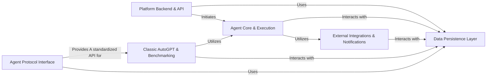
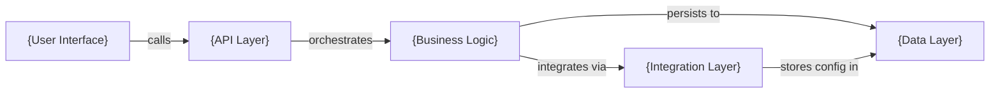

# Application Project Analysis: AutoGPT

This analysis extracts key patterns from the AutoGPT onboarding documentation for application projects.

## Architecture Pattern

Application projects follow a **Service-Oriented Layered Architecture** where distinct service layers handle different aspects of the application lifecycle.



## Key Documentation Elements

### 1. Service Layer Architecture
Application projects emphasize clear service boundaries:

- **API Layer**: External interfaces and user interaction
- **Business Logic**: Core application functionality and workflows
- **Data Layer**: Persistence and storage abstraction
- **Integration Layer**: External service connections
- **Interface Layer**: Protocol compliance and standardization

### 2. System Responsibility Distribution

**Platform Backend & API**:
- User authentication and authorization
- REST and WebSocket API endpoints
- Agent and preset management
- Feature flags and configuration

**Agent Core & Execution**:
- Workflow orchestration and task scheduling
- LLM interaction and tool integration
- Execution state management
- Performance monitoring

### 3. Sub-Component Breakdown

**Example: Platform Backend & API**
```
├── Server Components (REST/WebSocket APIs)
├── Authentication System (User management)
├── Feature Flag System (Configuration)
├── Library Management (Agent definitions)
└── Store Management (Preset handling)
```

Each sub-component handles specific application concerns.

## Content Organization Patterns

### 1. Layered Service Structure
```
Application Name (e.g., AutoGPT)
  ├── API Layer (Platform Backend & API)
  ├── Business Logic (Agent Core & Execution)
  ├── Data Layer (Data Persistence Layer)
  ├── Integration Layer (External Integrations)
  ├── Legacy Systems (Classic AutoGPT)
  └── Protocol Layer (Agent Protocol Interface)
```

### 2. Code Reference Pattern
Application projects reference entire service directories:
```markdown
**Related Classes/Methods**:
- `All files in autogpt_platform/backend/backend/server/` (1:1)
- `All files in autogpt_platform/autogpt_libs/autogpt_libs/auth/` (1:1)
- `All files in autogpt_platform/backend/backend/executor/` (1:1)
```

Focus on service boundaries rather than individual classes.

### 3. Relationship Descriptions
Application relationships focus on service interactions:
- `"Uses"` - Service dependency
- `"Initiates"` - Workflow triggering
- `"Provides"` - Service offering
- `"Interacts with"` - Data exchange
- `"Utilizes"` - Feature consumption

## Template Application

### Application Project Onboarding Template

```markdown
# {Application Name} System Architecture



## Component Details

{Application overview explaining system purpose, user workflows, and service architecture}

### {API Layer}
{Description of external interfaces and user interaction points}

**Service Responsibilities**:
- {API responsibility 1}
- {API responsibility 2}

**Related Service Modules**:
- `All files in {app_path}/api/` (service reference)
- `All files in {app_path}/auth/` (service reference)

### {Business Logic Layer}
{Description of core application functionality and workflows}

**Dependencies**: {API Layer}, {Data Layer}
**Service Capabilities**:
- {Core capability 1}
- {Core capability 2}
```

## Service Detail Structure

### Application Service Template

```markdown
# {Service Name}

## Service Overview

{High-level service purpose and responsibilities within the application architecture}

### Service Boundaries
- **Input Interfaces**: {What the service accepts}
- **Output Interfaces**: {What the service provides}
- **Dependencies**: {Required services or data}
- **Consumers**: {Services that use this service}

### Implementation Structure
```

Service Directory Structure:
{service_name}/
├── api/ (External interfaces)
├── core/ (Business logic)
├── data/ (Data access)
└── utils/ (Supporting utilities)
```

**Related Service Modules**:
- `All files in {service_path}/` (complete service reference)
- `Key modules in {service_path}/{specific_module}/` (focused reference)

### Key Service Features
- {Feature 1}: {Description and purpose}
- {Feature 2}: {Description and purpose}

### Integration Points
- {External Service 1}: {Integration purpose}
- {Internal Service 2}: {Dependency relationship}
```

## Adaptation Guidelines

### For Different Application Types

**Web Applications**:
- Emphasize request/response flow and user experience
- Include frontend and backend service separation
- Focus on scalability and performance considerations

**Desktop Applications**:
- Highlight local data management and file system integration
- Include installation and deployment services
- Emphasize user interface and experience components

**Microservices Applications**:
- Focus on service discovery and communication patterns
- Include API gateway and load balancing components
- Emphasize distributed system considerations

### Service Documentation Depth

**Level 1 - System Overview**: High-level service architecture and data flow
**Level 2 - Service Details**: Individual service functionality and responsibilities
**Level 3 - API Documentation**: Detailed interface specifications and contracts
**Level 4 - Deployment Guide**: Infrastructure and operational considerations

### Operational Considerations

Application documentation should include:
- **Deployment Architecture**: How services are deployed and scaled
- **Data Flow Diagrams**: How data moves through the system
- **Error Handling**: How failures are managed across services
- **Monitoring**: How system health and performance are tracked
- **Security**: How authentication, authorization, and data protection work

### Service Interaction Patterns

Common service interaction patterns in applications:
- **Request/Response**: Synchronous service communication
- **Event-Driven**: Asynchronous service communication via events
- **Message Queues**: Decoupled service communication via queues
- **Data Sharing**: Services sharing common data stores
- **API Gateway**: Centralized service access and routing

This pattern ensures developers understand the complete application ecosystem and how to work with the various services and components.