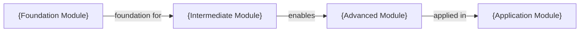

# Educational Project Analysis: 30-Days-Of-Python

This analysis extracts key patterns from the 30-Days-Of-Python onboarding documentation for educational projects.

## Architecture Pattern

Educational projects follow a **Linear Learning Progression** pattern where each component builds foundational knowledge for subsequent components.

```mermaid
graph LR
    Fundamentals["Python Fundamentals"]
    DataStructures["Core Data Structures & Control Flow"]
    Functions["Functions & Modularity"]
    ErrorHandling["Error Handling & File Operations"]
    OOP["Object-Oriented Programming & Packaging"]
    Applications["Web & Data Applications"]
    
    Fundamentals -- "feeds into" --> DataStructures
    DataStructures -- "provides data to" --> Functions
    Functions -- "is fundamental for" --> OOP
    ErrorHandling -- "depends on" --> Functions
    ErrorHandling -- "provides data to" --> Applications
    OOP -- "is fundamental for" --> Applications
    Applications -- "utilizes" --> ErrorHandling
```



## Key Documentation Elements

### 1. Progressive Skill Building
Each component represents a distinct learning milestone with clear prerequisites:

- **Foundation First**: Basic concepts before advanced topics
- **Dependency Mapping**: Clear "depends on" relationships  
- **Practical Application**: Real examples and exercises
- **Building Complexity**: Simple to complex progression

### 2. Component Structure Pattern

**Python Fundamentals** → **Core Data Structures** → **Functions** → **OOP** → **Applications**

Each component includes:
- **Learning Objectives**: What the student will master
- **Prerequisites**: Required prior knowledge  
- **Code Examples**: Practical implementations
- **Related Files**: Direct links to exercise files

### 3. Sub-Component Breakdown

**Example: Python Fundamentals**
```
├── Output and Basic Data Types
├── Variable Management  
├── Arithmetic Operations
└── Comparison and Logical Operations
```

Each sub-component focuses on specific skills within the broader topic.

## Content Organization Patterns

### 1. Hierarchical Learning Structure
```
Main Topic (e.g., Python Fundamentals)
  ├── Concept 1 (Output and Basic Data Types)
  ├── Concept 2 (Variable Management)
  ├── Concept 3 (Arithmetic Operations)  
  └── Concept 4 (Comparison and Logical Operations)
```

### 2. Code Reference Pattern
Educational projects emphasize practical files:
```markdown
**Related Classes/Methods**:
- `01_Day_Introduction/helloworld.py` (1:1)
- `02_Day_Variables_builtin_functions/variables.py` (1:1)
- `03_Day_Operators/day-3.py` (1:1)
```

Focus on exercise files rather than complex class hierarchies.

### 3. Relationship Descriptions
Educational relationships focus on learning progression:
- `"feeds into"` - Provides foundation for next topic
- `"depends on"` - Requires prior knowledge
- `"enables"` - Makes possible advanced concepts
- `"utilizes"` - Applies previously learned skills

## Template Application

### Educational Project Onboarding Template

```markdown
# {Course/Tutorial Name} Learning Path



## Component Details

{High-level learning objectives and course overview}

### {Foundation Module}
{Description of fundamental concepts and skills}

**Learning Objectives**:
- {Specific skill 1}
- {Specific skill 2}

**Related Files/Exercises**:
- `{exercise_file_path}` (line references)
- `{example_file_path}` (line references)

### {Intermediate Module}  
{Description building on foundation}

**Prerequisites**: {Foundation Module}
**Learning Objectives**:
- {Advanced skill 1}
- {Advanced skill 2}
```

## Adaptation Guidelines

### For Different Educational Contexts

**Programming Bootcamps**:
- Emphasize practical projects and portfolio building
- Include deployment and real-world application modules
- Focus on industry-relevant tools and frameworks

**University Courses**:
- Include theoretical foundations and computer science concepts
- Add algorithm and data structure modules
- Emphasize problem-solving and analytical thinking

**Self-Paced Learning**:
- Provide multiple difficulty paths
- Include assessment and review modules
- Offer supplementary resources and alternative explanations

### Measurement and Assessment

Educational projects should include:
- **Progress Indicators**: Clear completion criteria
- **Assessment Methods**: Projects, quizzes, or practical exercises
- **Skill Validation**: Demonstrable outcomes
- **Prerequisite Checking**: Readiness assessments

This pattern ensures learners can track their progress and understand their current position in the learning journey.