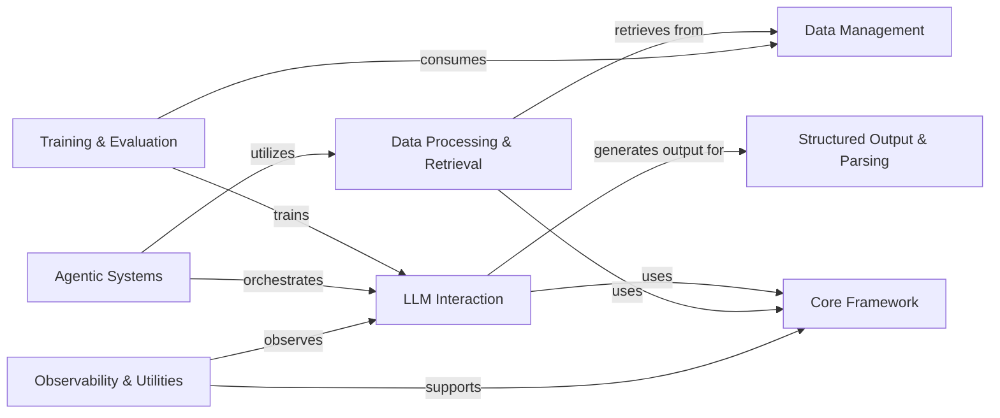
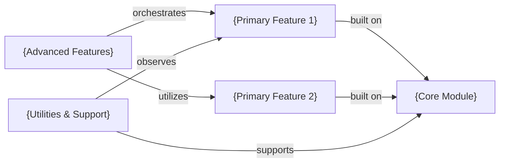
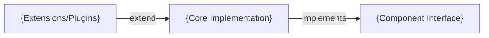

# Framework Project Analysis: AdalFlow

This analysis extracts key patterns from the AdalFlow onboarding documentation for framework projects.

## Architecture Pattern

Framework projects follow a **Hub-and-Spoke Modular Architecture** where core components provide foundation services to specialized functional modules.



## Key Documentation Elements

### 1. Modular Component Architecture
Framework projects emphasize reusable, composable components:

- **Core Foundation**: Base classes and interfaces (Component, DataClass)
- **Functional Modules**: Specialized capabilities (LLM, Data Processing)
- **Integration Points**: External service connections (Model Clients)
- **Utility Layer**: Supporting tools and observability

### 2. Component Interaction Patterns

**Core Framework Hub**:
- Provides base classes (Component, DataClass)
- Manages component lifecycle and serialization
- Defines interfaces and protocols

**Specialized Modules**:
- Built on core foundation
- Focused on specific functionality
- Can be used independently or composed

### 3. Sub-Component Breakdown

**Example: Core Framework**
```
├── Component (base class for all components)
├── DataClass (data handling foundation)
├── Sequential (workflow orchestration)
├── ComponentList (component management)
├── EntityMapping (component registry)
├── Types (core data types)
├── ModelClient (external integration interface)
├── Parameter (optimization data container)
└── ToolManager (function execution management)
```

Each sub-component has a specific architectural responsibility.

## Content Organization Patterns

### 1. Functional Module Structure
```
Framework Name (e.g., AdalFlow)
  ├── Core Framework (Foundation)
  ├── Primary Functions (LLM Interaction, Data Processing)
  ├── Advanced Features (Training, Agentic Systems)
  └── Supporting Infrastructure (Observability, Data Management)
```

### 2. Code Reference Pattern
Framework projects emphasize architectural components:
```markdown
**Related Classes/Methods**:
- `adalflow.core.component` (full file reference)
- `adalflow.core.model_client.ModelClient` (16:127)
- `adalflow.optim.trainer` (full file reference)
```

Focus on classes, interfaces, and architectural components.

### 3. Relationship Descriptions
Framework relationships focus on architectural patterns:
- `"uses"` - Composition and dependency
- `"inherits from"` - Class inheritance
- `"orchestrates"` - Control and coordination
- `"built on"` - Foundation dependency
- `"provides"` - Service offering

## Template Application

### Framework Project Onboarding Template

```markdown
# {Framework Name} Architecture



## Component Details

{Framework overview explaining architecture, purpose, and component relationships}

### {Core Module}
{Description of foundational services and base classes}

**Architectural Responsibilities**:
- {Core service 1}
- {Core service 2}

**Related Classes/Methods**:
- `{framework}.core.{base_class}` (full file reference)
- `{framework}.core.{interface}` ({line_start}:{line_end})

### {Primary Feature Module}
{Description of main functionality built on core}

**Dependencies**: {Core Module}
**Capabilities**:
- {Feature capability 1}
- {Feature capability 2}
```

## Component Detail Structure

### Architectural Component Template

```markdown
# {Component Name}



## Component Details

{Detailed explanation of component's architectural role and responsibilities}

### {Sub-Component}
{Specific functionality and implementation details}

**Architectural Role**: {Role in larger system}
**Key Interfaces**: {Public APIs and contracts}
**Extension Points**: {How to extend/customize}

**Related Classes/Methods**:
- {Direct implementation references}
- {Interface definitions}
- {Extension examples}
```

## Adaptation Guidelines

### For Different Framework Types

**ML/AI Frameworks**:
- Emphasize model abstraction and data pipeline components
- Include training, inference, and evaluation modules
- Focus on extensibility and plugin architectures

**Web Frameworks**:
- Highlight request/response handling and routing
- Include middleware and plugin systems
- Emphasize security and performance components

**Data Processing Frameworks**:
- Focus on data transformation and pipeline components
- Include connectors and format handlers
- Emphasize scalability and performance

### Documentation Depth Levels

**Level 1 - Architecture Overview**: High-level component relationships
**Level 2 - Component Details**: Individual component functionality  
**Level 3 - Implementation Guide**: How to use and extend components
**Level 4 - Integration Examples**: Real-world usage patterns

### Code Organization Alignment

Framework documentation should mirror code structure:
- **Package Structure**: Match documentation hierarchy to code packages
- **Interface Documentation**: Document all public APIs
- **Extension Points**: Clearly identify customization opportunities
- **Usage Patterns**: Provide common usage examples and best practices

This pattern ensures developers can understand both the framework's architecture and how to effectively use and extend it.