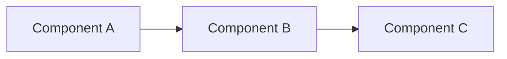
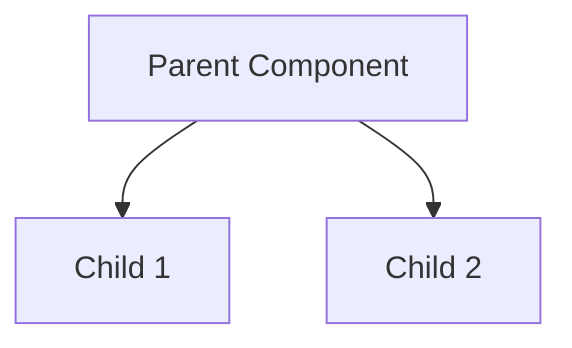
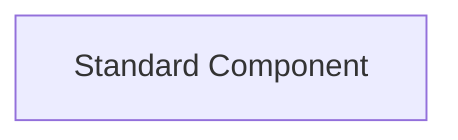
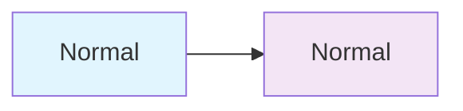
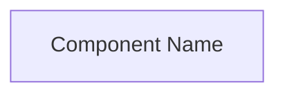

# Visual Design Guidelines

This document establishes the visual design standards for onboarding documentation to ensure consistency, readability, and professional presentation.

## 🎨 Core Design Principles

### 1. Clarity and Readability
- **Single Purpose**: Each diagram should convey one main concept
- **Visual Hierarchy**: Use size, color, and positioning to guide attention
- **Minimal Cognitive Load**: Avoid overwhelming users with too much information

### 2. Consistency
- **Standardized Components**: Use consistent naming and styling across all diagrams
- **Uniform Layout**: Maintain consistent spacing and alignment
- **Brand Coherence**: Follow CodeBoarding visual identity

### 3. Progressive Disclosure
- **Overview First**: Start with high-level architecture before diving into details
- **Layered Information**: Provide multiple levels of detail through linked documents
- **Contextual Navigation**: Clear pathways between related content

## 🖼️ Mermaid Diagram Standards

### Layout Directions

**Left-to-Right (LR)** - Recommended Default

- **Use for**: Process flows, data pipelines, sequential operations
- **Benefits**: Natural reading flow, works well with English text

**Top-Down (TD)** - Hierarchical Structures

- **Use for**: Organizational hierarchies, class inheritance, categorization
- **Benefits**: Clear parent-child relationships

### Node Styling Standards

**Standard Rectangle Nodes** (Default)

- **Use for**: All standard components and services
- **Format**: `NodeID["Display Name"]`
- **Naming**: Use descriptive, user-friendly names

**Component Naming Conventions**
- **Descriptive**: Use full, meaningful names (not abbreviations)
- **Consistent**: Follow project-specific naming patterns
- **User-Focused**: Write for the intended audience level

### Color and Visual Weight

**Default Styling** (Recommended)
- Use Mermaid's default styling for consistency
- Avoid custom colors unless absolutely necessary for distinction
- Let content hierarchy guide visual importance

**Advanced Styling** (Use Sparingly)

- **Use only when**: Critical distinction is needed
- **Limit to**: 2-3 different styles maximum per diagram

## 📐 Layout Guidelines

### Component Count Limits

**Main System Overview**
- **Maximum**: 8 components
- **Recommended**: 4-6 components
- **Rationale**: Cognitive load management and readability

**Component Detail Diagrams**
- **Maximum**: 6 sub-components
- **Recommended**: 3-5 sub-components
- **Focus**: Internal structure without overwhelming detail

### Relationship Density

**Per Component Connections**
- **Maximum**: 3 incoming + 3 outgoing relationships
- **Recommended**: 2 incoming + 2 outgoing relationships
- **Exception**: Central hub components may have more connections

**Total Diagram Relationships**
- **Maximum**: 12 relationships in a single diagram
- **Recommended**: 6-8 relationships
- **Solution**: Split complex diagrams into multiple focused diagrams

### Spacing and Alignment

**Node Spacing**
- Ensure adequate white space between components
- Maintain consistent spacing throughout the diagram
- Allow room for relationship labels

**Text Readability**
- Use concise but descriptive relationship labels
- Avoid overlapping text or crossing arrows
- Consider diagram orientation for text flow

## 🏷️ Branding and Identity

### Required Badges
All onboarding documents must include the standard badge set:

```markdown
[](https://github.com/CodeBoarding/CodeBoarding)[](https://www.codeboarding.org/demo)[](mailto:contact@codeboarding.org)
```

**Badge Placement**: Immediately after the main Mermaid diagram

### Visual Hierarchy

**Document Structure**
1. **Title**: Clear, descriptive project name
2. **Main Diagram**: Primary system overview with clickable links
3. **Badges**: CodeBoarding branding and links
4. **Component Details**: Structured breakdown of each component
5. **FAQ Link**: Standard footer reference

## 🔗 Link and Navigation Standards

### Clickable Diagram Links

**Component Detail Links**

- **Link Text**: Always use "Details" for consistency
- **Target**: Component-specific documentation files
- **Format**: Relative links to markdown files

### GitHub Source Links

**Specific Code References**
```markdown
<a href="https://github.com/user/repo/blob/master/path/file.py#L10-L25" target="_blank" rel="noopener noreferrer">`module.class.method` (10:25)</a>
```

**Full File References**
```markdown
`module.path` (full file reference)
```

**Link Standards**:
- **External Links**: Always include `target="_blank" rel="noopener noreferrer"`
- **Line Numbers**: Use format `(start:end)` for clarity
- **Module Paths**: Use full qualified names

## 📱 Responsive and Accessibility

### Diagram Scalability
- **Test at Multiple Sizes**: Ensure readability on different screen sizes
- **Text Legibility**: Maintain readable text at standard zoom levels
- **Mobile Consideration**: Verify diagrams work on mobile devices

### Accessibility Standards
- **Alt Text**: While Mermaid doesn't support alt text directly, provide description text
- **Color Independence**: Don't rely solely on color to convey information
- **Text Contrast**: Ensure sufficient contrast for text readability

### Description Text Pattern
```markdown
## Diagram Description
This system architecture diagram shows [brief description] with [number] main components: [list components]. The flow demonstrates [key relationships].
```

## 🎯 Quality Checklist

### Pre-Publication Review

**Visual Quality**
- [ ] All text is readable at standard zoom levels
- [ ] No overlapping or crossing relationship lines
- [ ] Consistent spacing and alignment
- [ ] Professional appearance

**Content Accuracy**
- [ ] All component names are accurate and consistent
- [ ] Relationships accurately reflect system architecture
- [ ] Links point to correct targets
- [ ] No broken or missing references

**Brand Compliance**
- [ ] Required badges present and correctly formatted
- [ ] Consistent visual styling with other project documentation
- [ ] Professional and polished presentation

**User Experience**
- [ ] Clear navigation paths between related content
- [ ] Appropriate level of detail for target audience
- [ ] Logical information flow and progression

## 📝 Style Guide Summary

| Element | Standard | Example |
|---------|----------|---------|
| **Layout Direction** | Left-to-Right (LR) | `graph LR` |
| **Node Format** | `NodeID["Display Name"]` | `Core["Core Framework"]` |
| **Relationship Format** | `"action verb"` | `"uses"`, `"built on"` |
| **Link Text** | "Details" | `click Node href "file.md" "Details"` |
| **Component Count** | 4-6 (overview), 3-5 (details) | Maximum 8 total |
| **Badge Placement** | After main diagram | Standard CodeBoarding badges |

This style guide ensures all onboarding documentation maintains professional quality and provides an excellent user experience while remaining consistent with the CodeBoarding brand and standards.