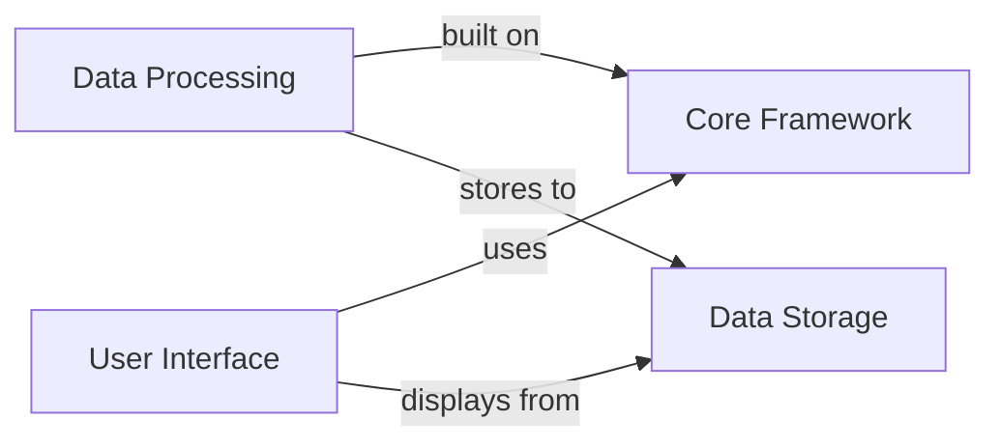
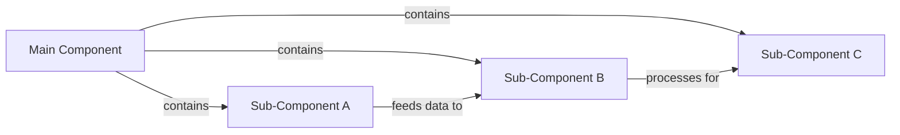
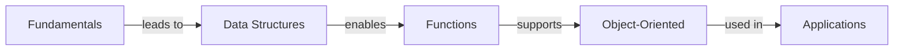
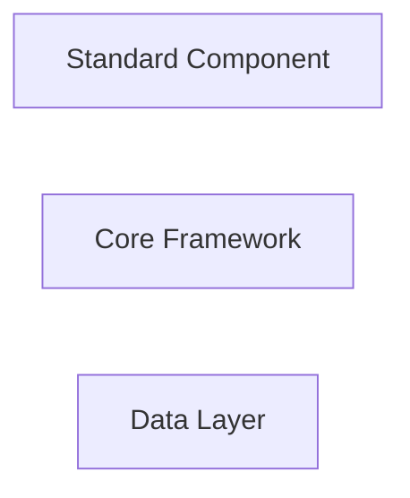
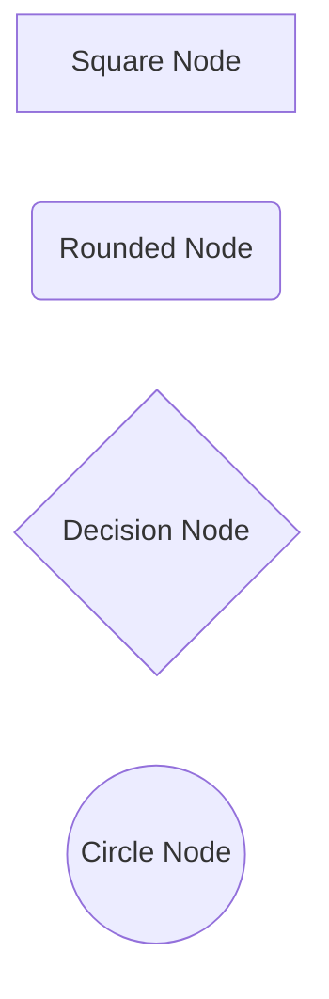
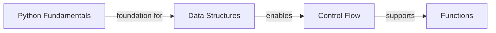
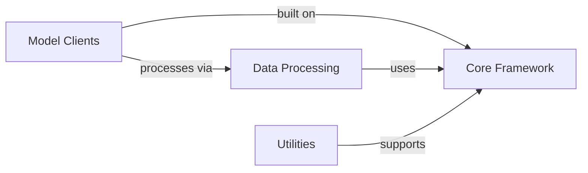
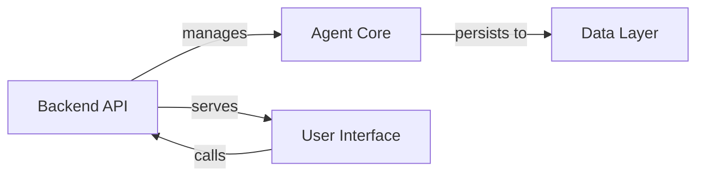

# Mermaid Diagram Patterns

This document outlines the visual patterns and conventions used in onboarding documentation diagrams.

## Core Diagram Types

### 1. System Architecture Diagrams
Used in main onboarding files to show high-level component relationships.



**Usage**: Main system overview showing 4-8 major components
**Direction**: Left-to-Right (LR) for process flow, Top-Down (TD) for hierarchical

### 2. Component Breakdown Diagrams  
Used in component detail files to show internal structure.



**Usage**: Internal component structure showing 3-6 sub-components
**Direction**: Varies based on relationships (LR for flow, TD for hierarchy)

### 3. Learning Path Diagrams
Used in educational content to show progression.



**Usage**: Sequential learning progression
**Direction**: Left-to-Right (LR) showing prerequisite flow

## Node Styling Patterns

### 1. Standard Nodes


**Format**: `NodeID["Display Name"]`
**Usage**: Standard components and services

### 2. Specialized Nodes (Advanced)


**Usage**: Different shapes for different component types (rarely used in current patterns)

## Relationship Patterns

### 1. Functional Relationships
| Pattern | Description | Example Usage |
|---------|-------------|---------------|
| `"uses"` | Dependency/composition | UI uses Core Framework |
| `"built on"` | Foundation dependency | Framework built on Base Classes |
| `"feeds into"` | Data flow | Processing feeds into Storage |
| `"orchestrates"` | Control relationship | Core orchestrates Agents |

### 2. Hierarchical Relationships
| Pattern | Description | Example Usage |
|---------|-------------|---------------|
| `"contains"` | Parent-child | System contains Components |
| `"inherits from"` | Class inheritance | Client inherits from Base |
| `"manages"` | Control hierarchy | Manager manages Workers |

### 3. Data Flow Relationships
| Pattern | Description | Example Usage |
|---------|-------------|---------------|
| `"provides data to"` | Data source | Database provides data to API |
| `"retrieves from"` | Data consumer | Service retrieves from Database |
| `"processes for"` | Data transformation | Engine processes for Output |

## Clickable Link Patterns

### 1. Component Detail Links


**Format**: Links to detailed component documentation
**Target**: Separate markdown files with component details

### 2. Code Reference Links (In Documentation)
```markdown
click Component href "https://github.com/user/repo/blob/master/src/component.py#L1-50" "Source Code"
```

**Format**: Direct links to source code with line numbers
**Target**: GitHub source files with specific line ranges

## Layout Guidelines

### 1. Component Count Recommendations
- **Main Overview**: 4-8 major components maximum
- **Component Details**: 3-6 sub-components maximum  
- **Learning Paths**: 4-7 steps maximum

### 2. Direction Guidelines
- **Process Flow**: Left-to-Right (LR)
- **Hierarchy**: Top-Down (TD)
- **Circular Dependencies**: Top-Down (TD) with careful relationship naming

### 3. Relationship Density
- **Maximum 2-3 relationships per node** to maintain readability
- **Avoid crossing lines** where possible
- **Group related components** visually

## Project-Specific Adaptations

### Educational Projects (30-Days-Of-Python)


**Pattern**: Linear progression with clear prerequisites
**Focus**: Learning sequence and skill building

### Framework Projects (AdalFlow, BERTopic)


**Pattern**: Hub-and-spoke with core foundation
**Focus**: Modular architecture and dependencies

### Application Projects (AutoGPT, Archon)


**Pattern**: Service layers with clear separation
**Focus**: System architecture and data flow