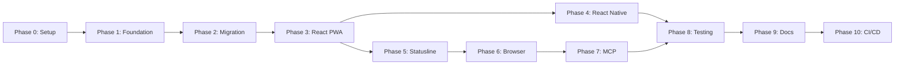

# Claude Code Dev Stack v3.0 - Master Requirements & Specification Document

## 📋 Table of Contents
1. [Executive Summary](#executive-summary)
2. [Project Overview](#project-overview)
3. [Phase Structure](#phase-structure)
4. [Detailed Phase Specifications](#detailed-phase-specifications)
5. [Success Metrics](#success-metrics)
6. [Technical Requirements](#technical-requirements)
7. [Integration Matrix](#integration-matrix)
8. [Todo Generation Templates](#todo-generation-templates)

---

## Executive Summary

### Project Goal
Build a comprehensive, unified AI development environment that integrates 7 major open-source projects with an existing ecosystem of 28 custom AI agents, 28 automation hooks, 18 slash commands, and 102 phase-aware audio files.

### Key Deliverables
- **React PWA**: Primary platform with real-time monitoring
- **React Native Apps**: iOS and Android with Flutter feature parity
- **Ultimate Statusline**: Powerline + Dev Stack metrics (100ms updates)
- **Browser Integration**: Session monitoring with streaming
- **MCP Orchestration**: Unified service management
- **Complete Attribution**: Full compliance with all licenses

### Timeline
- **Total Duration**: 4-6 weeks
- **Priority Focus**: React Native (1 week target)
- **Repository Constraint**: < 200MB total size

---

## Project Overview

### Core Components Integration

#### Original Work (by Zach)
```yaml
agents:
  count: 28
  purpose: "AI development orchestration"
  location: "core/agents/"

hooks:
  count: 28  # Extended from original 15
  purpose: "Event-driven automation"
  location: "core/hooks/"

commands:
  count: 18
  purpose: "Quick action slash commands"
  location: "core/commands/"

audio_files:
  count: 102
  purpose: "Phase-aware notifications"
  location: "core/audio/"
```

#### Integrated Open-Source Projects
```yaml
claude_code_browser:
  author: "@zainhoda"
  license: "AGPL-3.0"
  purpose: "Session monitoring and automation"
  modifications: "Extended with real-time streaming"

claude_code_app:
  author: "@9cat"
  license: "MIT"
  purpose: "Mobile interface (Flutter)"
  modifications: "Ported to React Native"

mcp_manager:
  author: "@qdhenry"
  license: "MIT"
  purpose: "MCP server configuration"
  modifications: "PowerShell wrapper, mobile API"

openapi_mcp_codegen:
  author: "@cnoe-io"
  license: "Apache-2.0"
  purpose: "Python MCP generation"
  modifications: "Unified generator interface"

openapi_mcp_generator:
  author: "@harsha-iiiv"
  license: "MIT"
  purpose: "Node.js MCP generation"
  modifications: "Integrated selection system"

claude_powerline:
  author: "@Owloops"
  license: "MIT"
  purpose: "Advanced statusline"
  modifications: "Extended with Dev Stack segments"

cc_statusline:
  author: "@chongdashu"
  license: "MIT"
  purpose: "Quick setup patterns"
  modifications: "Integration patterns adopted"
```

---

## Phase Structure

### Phase Dependencies Graph


---

## Detailed Phase Specifications

### ✅ PHASE 0: GitHub Repository Setup
**Status**: COMPLETED
**Duration**: 1 day
**Agents**: @devops-engineer, @technical-cto

#### Completed Tasks:
- [x] Create repository structure
- [x] Setup LICENSE-THIRD-PARTY directory
- [x] Initialize git with feature branch
- [x] Configure .gitignore for < 200MB

---

### ✅ PHASE 1: Foundation Setup
**Status**: COMPLETED
**Duration**: 2 days
**Agents**: @script-automation, @project-manager, @technical-documentation, @business-analyst, @api-integration-specialist, @integration-setup

#### Track A: Repository Structure (COMPLETED)
```bash
Claude_Code_Dev_Stack_v3/
├── apps/
│   ├── web/          # React PWA
│   ├── mobile/       # React Native
│   └── shared/       # Shared components (70% reuse)
├── core/
│   ├── agents/       # 28 AI agents
│   ├── hooks/        # 28 automation hooks
│   ├── commands/     # 18 slash commands
│   └── audio/        # 102 audio files
├── integrations/
│   ├── browser/      # @zainhoda
│   ├── mobile/       # @9cat
│   ├── mcp-manager/  # @qdhenry
│   ├── generators/   # @cnoe-io, @harsha-iiiv
│   └── statusline/   # @Owloops, @chongdashu
├── extensions/
├── platform-tools/
├── docs/
├── scripts/
└── LICENSE-THIRD-PARTY/
```

#### Track B: Attribution Setup (COMPLETED)
- [x] CREDITS.md with full attribution
- [x] README.md with "Built With" section
- [x] License compatibility matrix
- [x] Copyright preservation

#### Track C: Clone Repositories (COMPLETED)
- [x] Clone script created
- [x] Shallow depth for size optimization
- [x] License preservation system

---

### ✅ PHASE 2: Core Systems Migration
**Status**: COMPLETED
**Duration**: 3 days
**Agents**: @backend-services, @database-architecture

#### Completed Migrations:
- [x] 29 agent files → core/agents/
- [x] Hook system → core/hooks/
- [x] 18 commands → core/commands/
- [x] 96 audio files → core/audio/
- [x] Attribution headers added

---

### 🚧 PHASE 3: React PWA Development
**Status**: IN PROGRESS
**Duration**: 5 days
**Agents**: @frontend-architecture, @production-frontend, @ui-ux-designer

#### Requirements:
```yaml
framework: "React 18 with TypeScript"
bundler: "Vite"
pwa: "vite-plugin-pwa"
state: "Zustand + React Query"
ui: "Tailwind CSS"
charts: "Recharts"
icons: "Lucide React"
websocket: "Socket.io-client"
```

#### Component Architecture:
```typescript
// Core Components
<App>
  <Statusline />           // Powerline + Dev Stack
  <AgentDashboard />       // 28 agents monitoring
  <TaskMonitor />          // Task progress tracking
  <AudioController />      // 102 audio files manager
  <MCPManager />          // Service orchestration
  <BrowserViewer />       // Session monitoring
  <SettingsPanel />       // Configuration
</App>
```

#### Todo Items:
1. [ ] Create Vite project structure
2. [ ] Setup PWA manifest and service worker
3. [ ] Implement WebSocket connection (100ms updates)
4. [ ] Create Statusline component
5. [ ] Build AgentDashboard with real-time updates
6. [ ] Implement TaskMonitor with progress bars
7. [ ] Create AudioController with waveform display
8. [ ] Build MCPManager interface
9. [ ] Add responsive design for mobile
10. [ ] Implement offline functionality
11. [ ] Setup push notifications
12. [ ] Optimize bundle size (< 10MB)

---

### 📱 PHASE 4: React Native Mobile Development
**Status**: PENDING
**Duration**: 5 days (1 week target)
**Priority**: HIGH
**Agents**: @mobile-developer, @frontend-mockup

#### Flutter → React Native Conversion Strategy:
```yaml
analysis:
  flutter_structure: "lib/ directory mapping"
  screens: "Identify all screens and flows"
  components: "Map widgets to RN components"
  services: "Port business logic"

conversion_map:
  StatefulWidget: "useState hook"
  StatelessWidget: "Functional component"
  Container: "View with styles"
  Column/Row: "View with flexDirection"
  WebSocketChannel: "Socket.io-client"
  Navigator: "React Navigation"
```

#### Technical Stack:
```json
{
  "framework": "React Native 0.72+",
  "navigation": "React Navigation 6",
  "state": "Redux Toolkit",
  "ui": "React Native Paper",
  "animations": "Reanimated 3",
  "voice": "React Native Voice",
  "audio": "React Native Sound",
  "websocket": "Socket.io-client",
  "storage": "AsyncStorage"
}
```

#### Component Requirements:
```typescript
// Mobile-Specific Components
<MobileApp>
  <StatuslineViewer />      // Native statusline display
  <AgentMonitor />          // Touch-optimized dashboard
  <VoiceCommander />        // Voice control interface
  <AudioPlayer />           // Native audio playback
  <BrowserStream />         // WebRTC viewer
  <FileExplorer />          // Native file access
  <QRScanner />            // Desktop connection
</MobileApp>
```

#### Todo Items:
1. [ ] Analyze Flutter app structure (9cat repository)
2. [ ] Create Expo project with TypeScript
3. [ ] Setup React Navigation structure
4. [ ] Port StatuslineViewer from Flutter
5. [ ] Implement AgentMonitor with gestures
6. [ ] Add VoiceCommander with permissions
7. [ ] Create AudioPlayer with native bridge
8. [ ] Setup WebSocket connection
9. [ ] Implement push notifications
10. [ ] Add biometric authentication
11. [ ] Test on iOS simulator
12. [ ] Test on Android emulator
13. [ ] Optimize for 60fps performance
14. [ ] Create app store assets
15. [ ] Bundle size optimization (< 50MB)

#### Performance Targets:
- Launch time: < 2 seconds
- Frame rate: 60fps sustained
- Memory usage: < 200MB
- Battery impact: Minimal
- Offline support: Full functionality

---

### 🎨 PHASE 5: Statusline Integration
**Status**: PENDING
**Duration**: 3 days
**Agents**: @script-automation, @performance-optimization

#### Ultimate Statusline Architecture:
```yaml
line_1_powerline:
  segments:
    - directory: "Current working directory"
    - git: "Branch, status, commits"
    - model: "Claude model in use"
    - session_cost: "Current session cost"
    - today_cost: "Today's total cost"
    - context: "Token usage"

line_2_devstack:
  segments:
    - agents: "Active/Total (0-28)"
    - tasks: "Completed/Total"
    - hooks: "Triggered/Total (0-28)"
    - audio: "Last notification"
    - connection: "WebSocket status"
    - timestamp: "Last update time"
```

#### Configuration:
```json
{
  "powerline": {
    "theme": "custom",
    "updateInterval": 100,
    "budget": {
      "session": 10.0,
      "today": 25.0,
      "warningThreshold": 80
    },
    "colors": {
      "directory": "#7aa2f7",
      "git": "#9ece6a",
      "model": "#e0af68",
      "costs": "#bb9af7"
    }
  },
  "devstack": {
    "websocket": "ws://localhost:8080",
    "metrics": {
      "agents": true,
      "tasks": true,
      "hooks": true,
      "audio": true
    }
  }
}
```

#### Custom Segments Development:
```typescript
// Custom segment for agent monitoring
class AgentSegment extends PowerlineSegment {
  async getData() {
    const status = await getAgentStatus()
    return {
      text: `🤖 ${status.active}/${status.total}`,
      bg: '#2d3748',
      fg: status.active > 0 ? '#48bb78' : '#718096',
      priority: 5
    }
  }
}
```

#### Todo Items:
1. [ ] Install @owloops/claude-powerline globally
2. [ ] Create powerline-config.json
3. [ ] Implement DevStackStatusMonitor class
4. [ ] Create AgentSegment module
5. [ ] Create TaskSegment module
6. [ ] Create HookSegment module
7. [ ] Create AudioSegment module
8. [ ] Setup ultimate-statusline.sh script
9. [ ] Configure Claude settings.json
10. [ ] Test 100ms update frequency
11. [ ] Implement theme switching
12. [ ] Create mobile statusline API
13. [ ] Build statusline viewer for PWA
14. [ ] Create React Native statusline component
15. [ ] Submit PR to @Owloops with new segments

---

### 🌐 PHASE 6: Browser Integration
**Status**: PENDING
**Duration**: 3 days
**Agents**: @middleware-specialist, @api-integration-specialist

#### Adapter Pattern Architecture:
```go
// Browser adapter preserving @zainhoda's original work
package main

type ExtendedServer struct {
    browser.Server  // Embed original (AGPL-3.0)
    HookMonitor    *HookMonitor
    AudioSystem    *AudioNotifier
    StatusLine     *StatusLineIntegration
    StreamServer   *WebRTCStreamer
}
```

#### API Endpoints:
```yaml
original_endpoints:  # Preserved from @zainhoda
  - /api/sessions
  - /api/metrics
  - /api/history

extended_endpoints:  # New additions
  - /api/devstack/agents
  - /api/devstack/tasks
  - /api/devstack/hooks
  - /api/devstack/audio
  - /api/stream/start
  - /api/stream/stop
  - /ws/realtime
```

#### Streaming Architecture:
```typescript
// WebRTC/noVNC streaming for mobile viewing
interface StreamConfig {
  protocol: 'webrtc' | 'novnc'
  resolution: '1920x1080' | '1280x720'
  framerate: 30 | 60
  bitrate: 2000000  // 2 Mbps
  codec: 'h264' | 'vp8'
}
```

#### Todo Items:
1. [ ] Clone @zainhoda browser repository
2. [ ] Create Go adapter structure
3. [ ] Implement ExtendedServer wrapper
4. [ ] Add WebRTC streaming server
5. [ ] Create noVNC fallback option
6. [ ] Implement REST API extensions
7. [ ] Add WebSocket endpoints
8. [ ] Create authentication middleware
9. [ ] Build session analytics
10. [ ] Implement mobile browser viewer
11. [ ] Add performance monitoring
12. [ ] Create browser extension
13. [ ] Test AGPL compliance
14. [ ] Document all modifications
15. [ ] Optimize for low latency

---

### 🔌 PHASE 7: MCP Systems Integration
**Status**: PENDING
**Duration**: 3 days
**Agents**: @devops-engineer, @integration-setup

#### MCP Orchestration Architecture:
```yaml
orchestrator:
  core: "@qdhenry/mcp-manager"
  extensions:
    - powershell_wrapper: "Windows support"
    - mobile_api: "React Native bridge"
    - service_discovery: "Auto-detection"
    - load_balancer: "Round-robin"

generators:
  python:
    source: "@cnoe-io/openapi-mcp-codegen"
    purpose: "Python MCP generation"
    
  nodejs:
    source: "@harsha-iiiv/openapi-mcp-generator"
    purpose: "TypeScript MCP generation"

services:
  - playwright: "Browser automation"
  - github: "Version control"
  - websearch: "Information gathering"
  - custom: "Dev Stack specific"
```

#### Service Configuration:
```json
{
  "services": {
    "playwright": {
      "enabled": true,
      "port": 8090,
      "healthCheck": "/health",
      "timeout": 30000
    },
    "github": {
      "enabled": true,
      "port": 8091,
      "auth": "token",
      "rateLimit": 5000
    },
    "devstack": {
      "enabled": true,
      "port": 8092,
      "endpoints": [
        "/agents",
        "/hooks",
        "/commands",
        "/audio"
      ]
    }
  }
}
```

#### PowerShell Wrapper:
```powershell
# MCP Manager PowerShell Extension
function Start-MCPService {
    param(
        [string]$Service,
        [int]$Port,
        [hashtable]$Config
    )
    # Implementation
}
```

#### Todo Items:
1. [ ] Setup @qdhenry MCP Manager base
2. [ ] Create PowerShell wrapper scripts
3. [ ] Integrate Python generator (@cnoe-io)
4. [ ] Integrate Node.js generator (@harsha-iiiv)
5. [ ] Build orchestration service
6. [ ] Implement service discovery
7. [ ] Add load balancing logic
8. [ ] Create health monitoring
9. [ ] Build management UI
10. [ ] Add mobile API bridge
11. [ ] Implement dynamic loading
12. [ ] Create service templates
13. [ ] Test service coordination
14. [ ] Add metrics collection
15. [ ] Document API endpoints

---

### 🧪 PHASE 8: Testing with MCP Playwright
**Status**: PENDING
**Duration**: 3 days
**Agents**: @testing-automation, @quality-assurance-lead

#### Test Coverage Requirements:
```yaml
unit_tests:
  target: 80%
  framework: "Jest + React Testing Library"
  scope:
    - agents: 28 tests
    - hooks: 28 tests
    - commands: 18 tests
    - components: All React components
    - utilities: All helper functions

integration_tests:
  framework: "Playwright"
  scope:
    - statusline: "Powerline + Dev Stack"
    - browser: "Adapter functionality"
    - mobile: "React Native features"
    - mcp: "Service coordination"
    - audio: "Notification system"

e2e_tests:
  framework: "Playwright"
  scenarios:
    - user_onboarding: "First-time setup"
    - agent_workflow: "Complete agent task"
    - mobile_sync: "Desktop to mobile"
    - voice_commands: "Speech recognition"
    - offline_mode: "PWA functionality"

performance_tests:
  metrics:
    - statusline: "< 100ms updates"
    - mobile: "60fps animations"
    - pwa: "< 3s load time"
    - bundle: "< 10MB PWA, < 50MB mobile"
    - memory: "< 200MB usage"

security_tests:
  scope:
    - authentication: "OAuth, JWT"
    - authorization: "Role-based access"
    - encryption: "Data in transit/rest"
    - vulnerabilities: "OWASP Top 10"
    - dependencies: "Known CVEs"
```

#### Test Implementation:
```typescript
// Example agent test
describe('Agent System', () => {
  test('should initialize 28 agents', async () => {
    const agents = await initializeAgents()
    expect(agents.length).toBe(28)
    expect(agents.every(a => a.status === 'ready')).toBe(true)
  })

  test('should handle parallel execution', async () => {
    const results = await executeAgentsParallel(['agent1', 'agent2'])
    expect(results).toHaveLength(2)
    expect(results.every(r => r.success)).toBe(true)
  })
})
```

#### Attribution Compliance Tests:
```typescript
// Verify all attributions present
describe('Attribution Compliance', () => {
  test('should have all 7 project licenses', () => {
    const licenses = fs.readdirSync('LICENSE-THIRD-PARTY')
    expect(licenses).toContain('LICENSE-claude-code-browser')
    expect(licenses).toContain('LICENSE-9cat-mobile')
    // ... etc
  })

  test('should have proper credits in CREDITS.md', () => {
    const credits = fs.readFileSync('CREDITS.md', 'utf8')
    expect(credits).toContain('@zainhoda')
    expect(credits).toContain('@9cat')
    // ... etc
  })
})
```

#### Todo Items:
1. [ ] Setup Jest and testing libraries
2. [ ] Write agent unit tests (28)
3. [ ] Write hook unit tests (28)
4. [ ] Write command unit tests (18)
5. [ ] Test React components
6. [ ] Setup Playwright for E2E
7. [ ] Create statusline integration tests
8. [ ] Test browser adapter
9. [ ] Test React Native app
10. [ ] Test MCP orchestration
11. [ ] Run performance benchmarks
12. [ ] Execute security scan
13. [ ] Validate attribution compliance
14. [ ] Check repository size (< 200MB)
15. [ ] Generate test coverage report

---

### 📚 PHASE 9: Documentation
**Status**: PENDING
**Duration**: 2 days
**Agents**: @technical-documentation, @usage-guide-agent

#### Documentation Structure:
```yaml
api_documentation:
  format: "OpenAPI 3.0"
  tools: "Swagger UI"
  sections:
    - authentication
    - agents_api
    - hooks_api
    - commands_api
    - audio_api
    - statusline_api
    - mcp_api

user_guides:
  - quickstart.md
  - installation.md
  - configuration.md
  - agent_usage.md
  - mobile_setup.md
  - voice_commands.md
  - troubleshooting.md

developer_docs:
  - architecture.md
  - contributing.md
  - plugin_development.md
  - custom_agents.md
  - hook_creation.md
  - testing_guide.md

attribution_docs:
  - CREDITS.md
  - LICENSE.md
  - ACKNOWLEDGMENTS.md
  - MODIFICATIONS.md
```

#### Interactive Documentation:
```typescript
// Setup wizard component
interface SetupWizard {
  steps: [
    'Welcome',
    'Prerequisites',
    'Installation',
    'Configuration',
    'Agent Setup',
    'Mobile Connection',
    'Testing',
    'Complete'
  ]
  validation: (step: string) => boolean
  help: (step: string) => string
}
```

#### Todo Items:
1. [ ] Generate API documentation
2. [ ] Write quickstart guide
3. [ ] Create installation instructions
4. [ ] Document all 28 agents
5. [ ] Document all 28 hooks
6. [ ] Document all 18 commands
7. [ ] Create mobile setup guide
8. [ ] Write troubleshooting FAQ
9. [ ] Build interactive setup wizard
10. [ ] Create video tutorials
11. [ ] Document architecture
12. [ ] Write contributing guidelines
13. [ ] Validate all attributions
14. [ ] Create migration guide
15. [ ] Build documentation site

---

### 🚀 PHASE 10: CI/CD Pipeline
**Status**: PENDING
**Duration**: 2 days
**Agents**: @devops-engineer, @security-architecture

#### GitHub Actions Workflow:
```yaml
name: Claude Code Dev Stack v3.0 CI/CD

on:
  push:
    branches: [main, develop]
  pull_request:
    branches: [main]

jobs:
  attribution-check:
    runs-on: ubuntu-latest
    steps:
      - name: Check attributions
        run: |
          ./scripts/check-attributions.sh
          ./scripts/validate-licenses.sh

  size-check:
    runs-on: ubuntu-latest
    steps:
      - name: Check repository size
        run: |
          SIZE=$(du -sb . | cut -f1)
          if [ $SIZE -gt 209715200 ]; then
            echo "Repository exceeds 200MB!"
            exit 1
          fi

  test:
    runs-on: ubuntu-latest
    strategy:
      matrix:
        test-suite: [unit, integration, e2e]
    steps:
      - name: Run tests
        run: npm run test:${{ matrix.test-suite }}

  security:
    runs-on: ubuntu-latest
    steps:
      - name: Security scan
        run: |
          npm audit
          ./scripts/security-scan.sh

  build:
    runs-on: ubuntu-latest
    needs: [attribution-check, size-check, test, security]
    steps:
      - name: Build PWA
        run: npm run build:pwa
      - name: Build mobile
        run: npm run build:mobile

  deploy:
    runs-on: ubuntu-latest
    needs: build
    if: github.ref == 'refs/heads/main'
    steps:
      - name: Deploy to production
        run: ./scripts/deploy.sh
```

#### Deployment Configuration:
```yaml
environments:
  development:
    url: "dev.claudecodestack.com"
    auto_deploy: true
    
  staging:
    url: "staging.claudecodestack.com"
    auto_deploy: false
    approval_required: true
    
  production:
    url: "claudecodestack.com"
    auto_deploy: false
    approval_required: true
    rollback_enabled: true
```

#### Monitoring Integration:
```typescript
// Post-deployment monitoring
interface DeploymentMonitor {
  metrics: {
    uptime: number
    responseTime: number
    errorRate: number
    activeUsers: number
  }
  alerts: {
    threshold: number
    channel: 'email' | 'slack' | 'discord'
  }
  rollback: {
    automatic: boolean
    conditions: string[]
  }
}
```

#### Todo Items:
1. [ ] Create .github/workflows directory
2. [ ] Setup attribution validation workflow
3. [ ] Create size monitoring workflow
4. [ ] Configure test automation
5. [ ] Setup security scanning
6. [ ] Create build pipeline
7. [ ] Configure deployment stages
8. [ ] Setup rollback mechanism
9. [ ] Add monitoring integration
10. [ ] Create release automation
11. [ ] Setup changelog generation
12. [ ] Configure branch protection
13. [ ] Add code coverage reporting
14. [ ] Setup performance monitoring
15. [ ] Document pipeline usage

---

## Success Metrics

### Technical Metrics
```yaml
repository_size: "< 200MB (target: 150MB)"
build_time: "< 5 minutes"
test_coverage: "> 80%"
lighthouse_score: "> 90"
security_vulnerabilities: "0 critical, < 5 medium"
```

### Performance Metrics
```yaml
statusline_updates: "100ms real-time"
mobile_framerate: "60fps sustained"
pwa_load_time: "< 3 seconds"
agent_response: "< 2 seconds"
websocket_latency: "< 50ms"
```

### Quality Metrics
```yaml
bug_density: "< 1 per 1000 LOC"
documentation_coverage: "100%"
attribution_compliance: "100%"
user_satisfaction: "> 4.5/5"
```

---

## Technical Requirements

### Platform Requirements
```yaml
node_version: "18.0.0+"
python_version: "3.8+"
go_version: "1.20+"
react_version: "18.2.0+"
react_native_version: "0.72+"
```

### Development Tools
```yaml
ide: "VS Code with extensions"
version_control: "Git with conventional commits"
package_managers:
  - npm: "JavaScript/TypeScript"
  - pip: "Python packages"
  - go_mod: "Go modules"
testing:
  - jest: "Unit tests"
  - playwright: "E2E tests"
  - pytest: "Python tests"
```

### Infrastructure
```yaml
hosting:
  pwa: "Vercel/Netlify"
  api: "AWS Lambda/Google Cloud Run"
  database: "PostgreSQL/MongoDB"
  cache: "Redis"
  cdn: "CloudFlare"

monitoring:
  apm: "DataDog/New Relic"
  logging: "LogRocket"
  analytics: "Mixpanel"
  errors: "Sentry"
```

---

## Integration Matrix

### Component Dependencies
```yaml
agents:
  depends_on: []
  required_by: [hooks, commands, pwa, mobile]

hooks:
  depends_on: [agents]
  required_by: [commands, audio, statusline]

commands:
  depends_on: [agents, hooks]
  required_by: [pwa, mobile, voice]

audio:
  depends_on: [hooks]
  required_by: [pwa, mobile, statusline]

pwa:
  depends_on: [agents, hooks, commands, audio]
  required_by: [mobile, browser]

mobile:
  depends_on: [pwa, audio, voice]
  required_by: []

statusline:
  depends_on: [agents, tasks, hooks, audio]
  required_by: [pwa, mobile]

browser:
  depends_on: [pwa, statusline]
  required_by: [mobile]

mcp:
  depends_on: [agents, commands]
  required_by: [pwa, mobile]
```

### License Compatibility
```yaml
agpl_3_0:
  - claude_code_browser
  impact: "Entire project must be AGPL if distributed"

mit:
  - claude_code_app
  - mcp_manager
  - openapi_mcp_generator
  - claude_powerline
  - cc_statusline
  compatible: true

apache_2_0:
  - openapi_mcp_codegen
  compatible: true
```

---

## Todo Generation Templates

### Phase Todo Template
```markdown
## PHASE [NUMBER]: [NAME]
**Duration**: [X] days
**Agents**: @[agent1], @[agent2]
**Priority**: [HIGH|MEDIUM|LOW]
**Dependencies**: [Previous phases]

### Requirements:
- [ ] Requirement 1
- [ ] Requirement 2

### Technical Specifications:
- Technology stack
- Architecture patterns
- Performance targets

### Todo Items:
1. [ ] Setup and initialization
2. [ ] Core implementation
3. [ ] Integration points
4. [ ] Testing
5. [ ] Documentation
6. [ ] Performance optimization
7. [ ] Security review
8. [ ] Attribution compliance
9. [ ] Size validation
10. [ ] Deployment preparation

### Success Criteria:
- [ ] All tests passing
- [ ] Performance targets met
- [ ] Documentation complete
- [ ] Attribution verified
- [ ] Size < limit
```

### Daily Todo Template
```markdown
## Daily Tasks - [DATE]

### Morning (Phase [X])
- [ ] Task 1 - @agent1
- [ ] Task 2 - @agent2
- [ ] Task 3 - @agent3

### Afternoon (Phase [Y])
- [ ] Task 4 - @agent4
- [ ] Task 5 - @agent5
- [ ] Task 6 - @agent6

### Testing & Review
- [ ] Run test suite
- [ ] Check repository size
- [ ] Verify attributions
- [ ] Update documentation

### Blockers:
- Issue 1: [Description]
- Issue 2: [Description]

### Tomorrow's Priority:
- Continue Phase [X]
- Start Phase [Y]
```

---

## Execution Commands

### Quick Start Commands
```bash
# Phase 4: React Native Development
npm run phase:4:mobile

# Phase 5: Statusline Integration  
npm run phase:5:statusline

# Phase 6: Browser Integration
npm run phase:6:browser

# Phase 7: MCP Integration
npm run phase:7:mcp

# Phase 8: Testing
npm run phase:8:test

# Phase 9: Documentation
npm run phase:9:docs

# Phase 10: CI/CD
npm run phase:10:deploy
```

### Validation Commands
```bash
# Check all attributions
./scripts/check-attributions.sh

# Validate repository size
./scripts/check-size.sh

# Run all tests
npm run test:all

# Security audit
npm run security:audit

# Performance benchmark
npm run benchmark
```

---

## Risk Mitigation

### Critical Risks
```yaml
repository_size:
  risk: "Exceeding 200MB limit"
  mitigation:
    - Use Git LFS for large files
    - Compress audio assets
    - Optimize images to WebP
    - Tree-shake dependencies
    - Monitor size continuously

license_compliance:
  risk: "AGPL-3.0 implications"
  mitigation:
    - Clearly document AGPL components
    - Use adapter pattern for isolation
    - Provide source code access
    - Maintain attribution
    - Consider dual licensing

react_native_timeline:
  risk: "1-week porting target"
  mitigation:
    - Use Expo for rapid development
    - Share 70% code with PWA
    - Focus on core features first
    - Defer advanced features
    - Have fallback to PWA

integration_conflicts:
  risk: "7 projects compatibility"
  mitigation:
    - Use adapter patterns
    - Maintain clear boundaries
    - Version lock dependencies
    - Test incrementally
    - Have rollback procedures
```

---

## Appendix

### Glossary
- **PWA**: Progressive Web App
- **MCP**: Model Context Protocol
- **AGPL**: Affero General Public License
- **WebRTC**: Web Real-Time Communication
- **noVNC**: Browser-based VNC client

### Resources
- [Claude Code Documentation](https://docs.anthropic.com/claude-code)
- [MCP Protocol Spec](https://github.com/anthropics/mcp)
- [React Native Docs](https://reactnative.dev)
- [Playwright Testing](https://playwright.dev)

### Contact & Support
- Project Lead: Zach
- Repository: [GitHub Link]
- Issues: [Issue Tracker]
- Discord: [Community Server]

---

## Document Version
- **Version**: 1.0.0
- **Last Updated**: 2025-01-15
- **Next Review**: After Phase 4 completion

---

*This document serves as the master reference for Claude Code Dev Stack v3.0 development. All phases should generate todos from this specification to ensure complete functionality and proper attribution.*