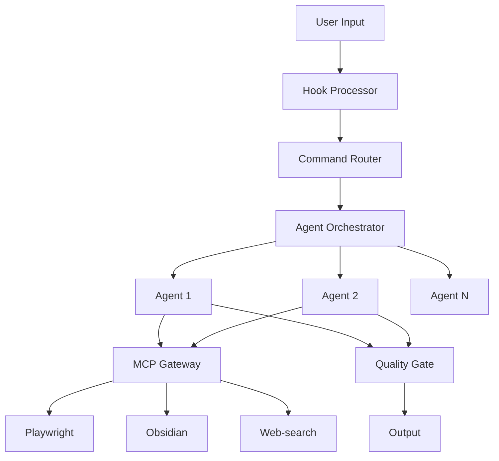

# Claude Code Integrated Dev Stack Documentation

## Complete System Integration: 28 Agents + 18 Commands + 3 MCPs + 15 Hooks

### Table of Contents
1. [Overview](#overview)
2. [Quick Start](#quick-start)
3. [Architecture](#architecture)
4. [Components](#components)
5. [Usage Patterns](#usage-patterns)
6. [Integration Workflows](#integration-workflows)
7. [Troubleshooting](#troubleshooting)
8. [Performance Optimization](#performance-optimization)

---

## Overview

The **Claude Code Integrated Dev Stack** is a comprehensive orchestration system that unifies:
- **28 Specialized Agents** - Expert AI agents for every development task
- **18 Slash Commands** - Rapid workflow triggers
- **3 MCP Servers** - External service integration (Playwright, Obsidian, Web-search)
- **15 Hooks** - Event-driven automation and enhancement

### Key Benefits
- **6-9x Faster Development** - Automated orchestration and intelligent routing
- **Seamless Integration** - All components work together automatically
- **Cost Optimization** - Smart model selection (Opus vs Haiku)
- **Quality Gates** - Automatic validation and testing

---

## Quick Start

### Installation

```powershell
# Windows - One-liner installation
iwr -useb https://raw.githubusercontent.com/.../setup-integrated-hooks.ps1 | iex

# Or run locally
.\setup-integrated-hooks.ps1
```

### Basic Usage

```bash
# Using slash commands
claude "/new-project E-commerce platform with React"

# Using agent mentions
claude "@agent-frontend-mockup create a landing page"

# Using MCP services
claude "Use playwright to test my website at example.com"

# Combining everything
claude "/frontend-mockup with @agent-testing-automation using playwright"
```

---

## Architecture

### System Flow

```
User Input → Hook System → Command Router → Agent Orchestrator → MCP Gateway → Execution
     ↓           ↓              ↓                 ↓                   ↓            ↓
  Captured   Validated      Parsed          Planned            Authorized    Results
```

### Component Interaction



---

## Components

### 28 Specialized Agents

#### Business & Strategy
- **master-orchestrator** - Project coordination and management
- **business-analyst** - Market analysis, ROI calculations
- **technical-cto** - Technical feasibility and architecture
- **ceo-strategy** - Strategic vision and positioning
- **financial-analyst** - Financial modeling and projections

#### Frontend Development
- **frontend-mockup** - HTML/CSS prototypes
- **frontend-architecture** - Component design and structure
- **production-frontend** - Production-ready implementations
- **ui-ux-design** - User experience optimization
- **mobile-development** - iOS/Android applications

#### Backend Development
- **backend-services** - API and server development
- **database-architecture** - Schema design and optimization
- **api-integration-specialist** - Third-party integrations
- **middleware-specialist** - Message queues and event buses

#### Quality & Operations
- **testing-automation** - Test generation and automation
- **security-architecture** - Security implementation
- **performance-optimization** - Speed and efficiency
- **devops-engineering** - CI/CD and deployment
- **quality-assurance** - Code review and standards

#### Support & Documentation
- **technical-documentation** - Comprehensive docs
- **technical-specifications** - Requirements and specs
- **project-manager** - Timeline and milestone management
- **script-automation** - Build and deploy scripts
- **integration-setup** - Environment configuration

#### Meta & Enhancement
- **prompt-engineer** - Prompt optimization
- **development-prompt** - Workflow design
- **business-tech-alignment** - Business-tech bridge
- **usage-guide-agent** - Tutorial creation

### 18 Slash Commands

#### Project Initialization
- `/new-project` - Complete project setup with all planning
- `/mvp` - Minimum viable product development
- `/proof-of-concept` - Quick concept validation

#### Frontend Commands
- `/frontend-mockup` - Create UI mockups
- `/frontend-production` - Build production frontend
- `/ui-components` - Component library creation

#### Backend Commands
- `/backend-api` - API development
- `/database-setup` - Database architecture
- `/microservices` - Microservice architecture

#### Full-Stack Commands
- `/full-stack` - Complete application
- `/saas-platform` - SaaS application setup
- `/e-commerce` - E-commerce platform

#### Specialized Commands
- `/mobile-app` - Mobile application
- `/chrome-extension` - Browser extension
- `/cli-tool` - Command-line tool
- `/data-pipeline` - Data processing pipeline
- `/ml-model` - Machine learning model
- `/blockchain-dapp` - Blockchain application

### 3 MCP Servers

#### Playwright MCP
- **Browser Automation** - Navigate, click, fill forms
- **Web Scraping** - Extract content from websites
- **Visual Testing** - Screenshot and visual validation
- **E2E Testing** - Full user journey testing

#### Obsidian MCP
- **Note Management** - Create, update, search notes
- **Knowledge Base** - Organize documentation
- **Project Wiki** - Maintain project information
- **Meeting Notes** - Store and retrieve discussions

#### Web-search MCP
- **Research** - Find latest information
- **Competitive Analysis** - Analyze competitors
- **Technology Trends** - Stay updated
- **Documentation** - Find API docs and guides

### 15 Hooks

#### Pre-execution Hooks
- **pre_command.py** - Validate commands before execution
- **pre_project.py** - Project initialization checks
- **planning_trigger.py** - Activate planning mode
- **agent_mention_parser.py** - Parse @agent mentions

#### Routing & Orchestration
- **slash_command_router.py** - Route commands to agents
- **agent_orchestrator.py** - Coordinate agent execution
- **agent_orchestrator_integrated.py** - Enhanced orchestration

#### MCP Integration
- **mcp_gateway.py** - Basic MCP validation
- **mcp_gateway_enhanced.py** - Advanced validation with rate limiting
- **mcp_initializer.py** - Check MCP status at startup

#### Quality & Tracking
- **quality_gate.py** - Validate outputs
- **model_tracker.py** - Track model usage and costs
- **post_command.py** - Post-execution cleanup
- **post_project.py** - Project completion tasks

#### Session Management
- **session_loader.py** - Load previous context
- **session_saver.py** - Save current state

---

## Usage Patterns

### Pattern 1: Slash Command Workflow
```bash
# Start new project
claude "/new-project Social media dashboard"

# System automatically:
# 1. Engages master-orchestrator
# 2. Runs business-analyst for market research
# 3. Uses technical-cto for architecture
# 4. Activates web-search for competitive analysis
```

### Pattern 2: Agent Combination
```bash
# Explicit multi-agent coordination
claude "@agent-frontend-architecture design system @agent-backend-services API structure"

# Agents work in parallel when possible
# Sequential when dependencies exist
```

### Pattern 3: MCP Integration
```bash
# Research → Test → Document workflow
claude "Research React best practices, test with playwright, save findings to obsidian"

# Automatically coordinates:
# 1. web-search for research
# 2. playwright for testing
# 3. obsidian for documentation
```

### Pattern 4: Full Stack Development
```bash
# Complete application with all components
claude "/full-stack Task management app with real-time updates"

# Orchestrates:
# - Database design
# - Backend API
# - Frontend UI
# - WebSocket integration
# - Testing suite
# - Documentation
```

---

## Integration Workflows

### Workflow 1: New SaaS Product
```bash
/saas-platform "AI-powered invoice management"
```

**Execution Flow:**
1. **business-analyst** - Market research and competitor analysis
2. **financial-analyst** - Revenue model and pricing
3. **technical-cto** - Technology stack selection
4. **database-architecture** + **backend-services** - Core infrastructure
5. **frontend-architecture** + **frontend-mockup** - UI design
6. **api-integration-specialist** - Payment gateway integration
7. **security-architecture** - Authentication and security
8. **testing-automation** - Test suite creation
9. **technical-documentation** - API docs and user guides

### Workflow 2: Mobile App Development
```bash
/mobile-app "Fitness tracking application"
```

**Execution Flow:**
1. **ui-ux-design** - User journey and wireframes
2. **mobile-development** - React Native/Flutter setup
3. **backend-services** - API development
4. **database-architecture** - User data schema
5. **api-integration-specialist** - Health API integrations
6. **testing-automation** - Mobile testing suite
7. **devops-engineering** - App store deployment

### Workflow 3: Quick Prototype
```bash
/proof-of-concept "AI chatbot for customer service"
```

**Execution Flow:**
1. **frontend-mockup** - Quick UI prototype
2. **backend-services** - Minimal API
3. **api-integration-specialist** - LLM integration
4. **playwright** - Automated demo recording

---

## Troubleshooting

### Common Issues

#### Hooks Not Working
```powershell
# Verify hook installation
ls ~/.claude/hooks/*.py

# Check hook format (should use stdin)
python ~/.claude/hooks/agent_orchestrator.py < test.json

# Re-run setup
.\setup-integrated-hooks.ps1
```

#### MCP Services Not Found
```powershell
# Check MCP status
claude mcp list

# Install missing services
claude mcp add playwright -- cmd /c npx '@playwright/mcp@latest' --headless

# For Obsidian (needs API key)
claude mcp add obsidian --env OBSIDIAN_API_KEY=YOUR_KEY -- cmd /c uvx mcp-obsidian

# For web-search (needs build)
.\platform-tools\windows\mcp\master-mcp-setup.ps1
```

#### Agent Not Responding
```bash
# Check agent installation
ls ~/.claude/agents/

# Verify settings.json
cat ~/.claude/settings.json | jq '.agentSystem.agents | length'
# Should output: 28

# Test specific agent
claude "@agent-frontend-mockup test"
```

#### Rate Limiting Issues
```python
# Check rate limit status
cat ~/.claude/state/mcp_state.json

# Reset rate limits (wait 1 minute or manually clear)
rm ~/.claude/state/mcp_state.json
```

### Debug Mode

Enable detailed logging:
```bash
# Set environment variable
export CLAUDE_DEBUG=true

# Check logs
tail -f ~/.claude/logs/orchestration.jsonl
tail -f ~/.claude/logs/mcp_operations.jsonl
```

---

## Performance Optimization

### Model Selection Strategy

```python
# Automatic model selection based on task complexity
Simple tasks → Haiku (fast, cheap)
Complex tasks → Opus (powerful, thorough)

# Manual override
@agent-frontend-mockup[haiku]  # Force Haiku
@agent-backend-services[opus]   # Force Opus
```

### Parallel Execution

Agents automatically run in parallel when no dependencies exist:
```
Parallel Group 1: [frontend-mockup, database-architecture, business-analyst]
Parallel Group 2: [backend-services, api-integration]
Sequential: [testing-automation, technical-documentation]
```

### Caching Strategy

```bash
# Session state cached between calls
~/.claude/state/session_state.json

# Orchestration plans cached
~/.claude/state/orchestration_plan.json

# MCP operations logged for replay
~/.claude/logs/mcp_operations.jsonl
```

### Resource Management

```python
# Rate limits per service
playwright: 10 requests/minute
obsidian: 30 operations/minute  
web-search: 5 searches/minute

# Automatic queuing when limits reached
# Graceful degradation on service failure
```

---

## Advanced Configuration

### Custom Agent Priorities

Edit `~/.claude/settings.json`:
```json
{
  "agentSystem": {
    "priorities": {
      "frontend-mockup": 10,
      "backend-services": 9,
      "testing-automation": 8
    }
  }
}
```

### Hook Customization

Add custom validation to hooks:
```python
# ~/.claude/hooks/custom_validator.py
def validate_operation(tool_name, tool_input):
    if "production" in tool_input.get("environment", ""):
        return False, "Production operations blocked"
    return True, ""
```

### MCP Service Extension

Add new MCP services:
```bash
# Add custom MCP server
claude mcp add custom-service -- node ~/my-mcp-server/index.js

# Update gateway to recognize it
# Edit mcp_gateway_enhanced.py to add validation rules
```

---

## Best Practices

### 1. Start with Slash Commands
- Use `/new-project` for complete setups
- Use `/mvp` for quick prototypes
- Commands handle orchestration automatically

### 2. Be Specific with Agents
- Use explicit @agent- mentions for precision
- Combine agents for complex tasks
- Let orchestrator determine execution order

### 3. Leverage MCP Services
- Use playwright for all browser operations
- Store documentation in Obsidian
- Research with web-search before implementing

### 4. Monitor Performance
- Check logs regularly: `~/.claude/logs/`
- Review orchestration plans
- Track model usage costs

### 5. Maintain Quality
- Quality gates validate all outputs
- Automated testing with each change
- Documentation updated automatically

---

## Quick Reference Card

### Essential Commands
```bash
# Project initialization
/new-project "Project description"
/mvp "Quick prototype idea"
/proof-of-concept "Concept to validate"

# Development
/frontend-mockup "UI description"
/backend-api "API requirements"
/full-stack "Complete application"

# Specialized
/mobile-app "App description"
/cli-tool "Tool purpose"
/data-pipeline "Data flow"
```

### Agent Mentions
```bash
@agent-[name] "task description"
@agent-[name][opus] "complex task"
@agent-[name][haiku] "simple task"
```

### MCP Usage
```bash
"Use playwright to [browser action]"
"Use obsidian to [note action]"
"Use web-search to [research query]"
```

---

## Support & Updates

### Getting Help
- GitHub Issues: Report bugs and request features
- Documentation: This guide and inline help
- Logs: Check `~/.claude/logs/` for detailed information

### System Requirements
- Claude Code CLI installed
- Python 3.8+ (for hooks)
- Node.js 16+ (for MCP servers)
- 4GB RAM minimum
- Windows 10/11, macOS 10.15+, or Linux

### Version Information
- Current Version: 2.1
- Last Updated: 2024
- Components: 28 agents, 18 commands, 3 MCPs, 15 hooks

---

## Conclusion

The Claude Code Integrated Dev Stack represents a paradigm shift in AI-assisted development. By combining specialized agents, rapid commands, external services, and intelligent orchestration, it enables developers to work 6-9x faster while maintaining high quality standards.

Start with simple commands, explore agent combinations, and let the system handle the complexity. The more you use it, the more powerful your development workflow becomes.

**Happy coding with Claude Code Integrated Dev Stack!** 🚀