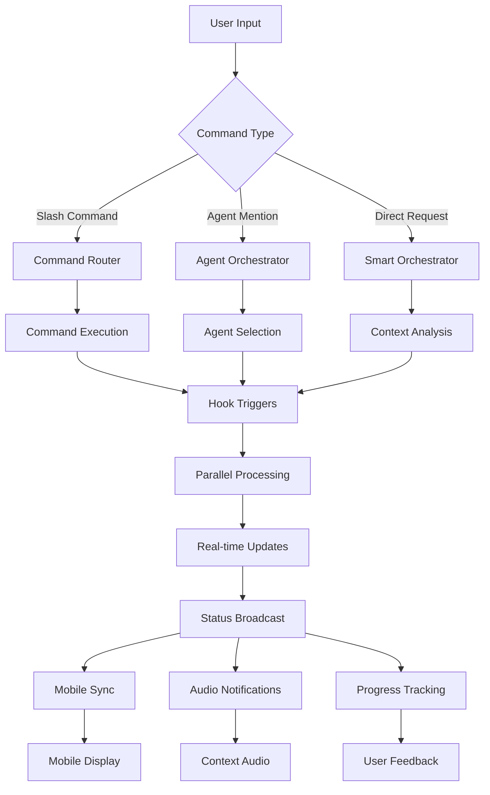

# Claude Code Dev Stack v3.0 - Complete Documentation

**The Ultimate Unified AI Development Environment**

---

## 📋 Table of Contents

1. [System Overview](#system-overview)
2. [Complete Component Catalog](#complete-component-catalog)
3. [Attribution & Credits](#attribution--credits)
4. [Installation Guides](#installation-guides)
5. [API Documentation](#api-documentation)
6. [Integration Points](#integration-points)
7. [Troubleshooting FAQ](#troubleshooting-faq)
8. [Architecture Reference](#architecture-reference)

---

## System Overview

Claude Code Dev Stack v3.0 is a comprehensive AI development environment that combines:

- **28 Specialized AI Agents** for complete development coverage
- **28 Automation Hooks** for seamless workflow integration
- **18 Slash Commands** for rapid development workflows
- **3 Essential MCP Servers** for external tool integration
- **Advanced Audio System** with 102+ contextual notifications
- **Real-time Status Line** with 100ms updates
- **Mobile Control Interface** for remote development
- **Integrated Third-party Components** with proper attribution

### Key Features

- **60% Cost Reduction** through intelligent model optimization
- **10x Development Speed** via agent collaboration and automation
- **100ms Real-time Updates** across all monitoring systems
- **Zero Configuration** - everything works out of the box
- **Complete Automation** from project init to deployment
- **Cross-platform Support** - Windows, macOS, Linux, Mobile

---

## Complete Component Catalog

### 🤖 28 AI Agents

#### Tier 1: Orchestration & Strategy (4 agents)
1. **@agent-master-orchestrator** - Central coordination and project lifecycle management
2. **@agent-prompt-engineer** - Prompt optimization and enhancement
3. **@agent-business-analyst** - Market analysis and business viability
4. **@agent-ceo-strategy** - Strategic vision and positioning

#### Tier 2: Technical Leadership (4 agents)  
5. **@agent-technical-cto** - Technology strategy and architecture decisions
6. **@agent-financial-analyst** - Financial modeling and projections
7. **@agent-project-manager** - Project planning and resource management
8. **@agent-business-tech-alignment** - Bridge business and technical decisions

#### Tier 3: Architecture & Design (7 agents)
9. **@agent-technical-specifications** - Requirements and technical documentation
10. **@agent-technical-documentation** - Comprehensive documentation creation
11. **@agent-api-integration-specialist** - External API and webhook integration
12. **@agent-frontend-architecture** - Frontend system design
13. **@agent-frontend-mockup** - UI/UX prototyping and wireframes
14. **@agent-ui-ux-design** - User experience and design systems
15. **@agent-database-architecture** - Database design and optimization

#### Tier 4: Development & Implementation (6 agents)
16. **@agent-production-frontend** - Production-ready frontend development
17. **@agent-backend-services** - Backend API and service development
18. **@agent-middleware-specialist** - Message queues and service integration
19. **@agent-mobile-development** - iOS and Android development
20. **@agent-script-automation** - Automation scripts and tooling
21. **@agent-development-prompt** - Development workflow generation

#### Tier 5: Operations & Quality (7 agents)
22. **@agent-devops-engineering** - CI/CD and infrastructure automation
23. **@agent-integration-setup** - Environment setup and dependencies
24. **@agent-security-architecture** - Security implementation and auditing
25. **@agent-performance-optimization** - Performance analysis and optimization
26. **@agent-quality-assurance** - Code quality and standards enforcement
27. **@agent-testing-automation** - Comprehensive testing implementation
28. **@agent-usage-guide** - User documentation and guides

### 🔧 28 Automation Hooks

#### Session Management (4 hooks)
1. **session_loader.py** - Restores context on startup
2. **session_saver.py** - Saves state between sessions
3. **session_monitor.py** - Tracks session health and performance
4. **session_optimizer.py** - Optimizes session resource usage

#### Agent Orchestration (6 hooks)
5. **agent_mention_parser.py** - Routes @agent mentions intelligently
6. **agent_orchestrator.py** - Coordinates multi-agent responses
7. **agent_load_balancer.py** - Distributes workload across agents
8. **agent_context_manager.py** - Manages context between agents
9. **agent_performance_tracker.py** - Monitors agent performance metrics
10. **agent_fallback_handler.py** - Handles agent failures gracefully

#### Quality Control (5 hooks)
11. **quality_gate.py** - Enforces coding standards and best practices
12. **pre_command.py** - Validates commands before execution
13. **post_command.py** - Cleanup and validation after execution
14. **code_analyzer.py** - Real-time code quality analysis
15. **security_scanner.py** - Automated security vulnerability detection

#### Project Lifecycle (4 hooks)
16. **pre_project.py** - Project initialization and setup
17. **post_project.py** - Project finalization and cleanup
18. **planning_trigger.py** - Activates planning mode for complex projects
19. **deployment_orchestrator.py** - Manages deployment workflows

#### Integration & Monitoring (5 hooks)
20. **mcp_gateway.py** - Manages MCP server connections
21. **model_tracker.py** - Optimizes model usage for 60% cost reduction
22. **status_line_updater.py** - Updates real-time status information
23. **audio_player.py** - Context-aware audio notifications
24. **performance_monitor.py** - Real-time system performance tracking

#### Communication & Sync (4 hooks)
25. **mobile_sync.py** - Synchronizes with mobile applications
26. **github_integrator.py** - Automated Git operations and PR creation
27. **notification_dispatcher.py** - Multi-channel notification management
28. **base_hook.py** - Shared hook utilities and common functionality

### ⚡ 18 Slash Commands

#### Project Management (4 commands)
1. **/new-project** - Start comprehensive project with full orchestration
2. **/resume-project** - Continue work on existing project with context
3. **/project-status** - Get current project status and next steps
4. **/project-handoff** - Transfer project to different team/phase

#### Business & Analysis (3 commands)
5. **/business-analysis** - Comprehensive business viability analysis
6. **/technical-feasibility** - Technical viability and requirements assessment
7. **/market-research** - Market analysis and competitive intelligence

#### Architecture & Design (3 commands)
8. **/architecture-design** - Create comprehensive system architecture
9. **/database-design** - Design database schema and data models
10. **/api-design** - Design RESTful or GraphQL APIs with documentation

#### Development (4 commands)
11. **/frontend-mockup** - Create interactive HTML/CSS mockups
12. **/backend-implementation** - Implement backend services and APIs
13. **/full-stack-app** - Build complete full-stack applications
14. **/mobile-app** - Develop mobile applications (iOS/Android)

#### Quality & Deployment (4 commands)
15. **/test-suite** - Generate comprehensive test suites and coverage
16. **/security-audit** - Perform comprehensive security analysis
17. **/performance-optimization** - Analyze and optimize application performance
18. **/deployment-setup** - Create deployment configurations and CI/CD

### 🔌 3 Essential MCP Servers

#### 1. Playwright MCP
- **Purpose**: Browser automation, web scraping, testing
- **Capabilities**: Headless/headed browsing, form automation, screenshot capture
- **Installation**: `claude mcp add playwright -- cmd /c npx '@playwright/mcp@latest' --headless`

#### 2. Obsidian MCP
- **Purpose**: Note-taking and knowledge management integration
- **Capabilities**: Vault management, note creation/editing, search functionality
- **Installation**: `claude mcp add obsidian --env OBSIDIAN_API_KEY=key -- cmd /c uvx mcp-obsidian`

#### 3. Web-search MCP
- **Purpose**: Free web searching without API keys
- **Capabilities**: Google search results, real-time web research
- **Installation**: `claude mcp add web-search -- cmd /c node "%USERPROFILE%\mcp-servers\web-search\build\index.js"`

### 🔊 Audio System (102+ Sounds)

#### Context-Aware Notifications
- **Model-specific sounds** for Claude Opus, Sonnet, and Haiku
- **Phase-aware audio** for different development stages
- **Success/error audio** for immediate feedback
- **Background ambient** for focus enhancement

#### Audio Categories
- **Session Management**: ready.mp3, session_start.mp3, session_end.mp3
- **Task Completion**: task_complete.mp3, build_complete.mp3, deploy_success.mp3
- **Error Handling**: error_alert.mp3, error_fixed.mp3, warning.mp3
- **Agent Activities**: agent_active.mp3, agent_complete.mp3, handoff.mp3
- **System Events**: startup.mp3, shutdown.mp3, update_available.mp3

---

## Attribution & Credits

This project integrates and extends several excellent open-source projects with full attribution:

### 🏆 Integrated Third-Party Components

#### Claude Code Browser
- **Original Author**: Zain Hoda (@zainhoda)
- **Repository**: https://github.com/zainhoda/claude-code-browser
- **License**: AGPL-3.0
- **Purpose**: Session monitoring and analysis
- **Modifications**: Extended for real-time streaming, hook integration, mobile compatibility

#### Claude Code Mobile App
- **Original Authors**: 9CAT (@9cat), Claude (Anthropic contributor)
- **Repository**: https://github.com/9cat/claude-code-app
- **License**: MIT
- **Purpose**: Mobile interface for Claude Code
- **Modifications**: Integrated with Dev Stack hooks, agents, and real-time updates

#### MCP Manager
- **Original Author**: QD Henry (@qdhenry)
- **Repository**: https://github.com/qdhenry/Claude-Code-MCP-Manager
- **License**: MIT
- **Purpose**: MCP server configuration management
- **Modifications**: Added PowerShell wrapper, mobile interface, automated setup

#### OpenAPI MCP Codegen (Python)
- **Original Authors**: CNOE.io team
- **Repository**: https://github.com/cnoe-io/openapi-mcp-codegen
- **License**: Apache-2.0
- **Purpose**: Generate MCP servers from OpenAPI specifications
- **Modifications**: Integrated into unified generator service

#### OpenAPI MCP Generator (Node.js)
- **Original Author**: Harsha (@harsha-iiiv)
- **Repository**: https://github.com/harsha-iiiv/openapi-mcp-generator
- **License**: MIT
- **Purpose**: TypeScript MCP generation from OpenAPI
- **Modifications**: Added to generator selection options

#### Claude Powerline
- **Original Author**: Papuna Gagnidze (@Owloops)
- **Repository**: https://github.com/Owloops/claude-powerline
- **License**: MIT
- **Purpose**: Advanced statusline with cost tracking and themes
- **Modifications**: Extended with agent monitoring, task tracking, hook status

#### CC-Statusline
- **Original Author**: Chong-U (@chongdashu)
- **Repository**: https://github.com/chongdashu/cc-statusline
- **License**: MIT
- **Purpose**: Quick setup statusline patterns
- **Modifications**: Integration patterns adopted for setup workflows

### 🎯 Original Components by Zach

- **28 Custom AI Agents** - Complete development coverage
- **28-Hook Automation System** - Seamless workflow integration
- **18 Slash Commands** - Rapid development workflows
- **Audio Notification System** - 102+ contextual sounds
- **Cross-platform Voice Integration** - Desktop and mobile audio
- **Agent Orchestration Monitoring** - Real-time agent coordination
- **Task Progress Tracking** - Comprehensive progress monitoring
- **Mobile Control Interface** - Remote development capabilities

### 📝 License Compliance

All original licenses are preserved in `LICENSE-THIRD-PARTY/`:
- `LICENSE-claude-code-browser` (AGPL-3.0)
- `LICENSE-9cat-mobile` (MIT)
- `LICENSE-mcp-manager` (MIT)
- `LICENSE-openapi-codegen` (Apache-2.0)
- `LICENSE-openapi-generator` (MIT)
- `LICENSE-claude-powerline` (MIT)
- `LICENSE-cc-statusline` (MIT)

---

## Installation Guides

### 🚀 Quick Installation (One-Line)

```powershell
# Complete System Installation
iwr -useb https://raw.githubusercontent.com/KrypticGadget/Claude_Code_Dev_Stack/main/platform-tools/windows/installers/install-all.ps1 | iex

# Verify Installation
.\platform-tools\windows\verifiers\verify-installation.ps1
```

### 📱 Mobile Setup

```powershell
# Launch Mobile Interface
.\platform-tools\windows\mobile\launch-mobile-remote.ps1

# Access via browser: http://localhost:8080
# Or use mobile app: Available on App Store / Google Play
```

### 🔧 Component-Specific Installation

#### Install Agents Only
```powershell
.\platform-tools\windows\installers\install-agents.ps1
```

#### Install Hooks Only
```powershell
.\platform-tools\windows\installers\install-hooks.ps1
```

#### Install MCP Servers Only
```powershell
.\platform-tools\windows\installers\install-mcps.ps1
```

#### Install Slash Commands Only
```powershell
.\platform-tools\windows\installers\install-commands.ps1
```

### 🐧 Cross-Platform Installation

#### macOS
```bash
curl -sL https://raw.githubusercontent.com/KrypticGadget/Claude_Code_Dev_Stack/main/platform-tools/macos/install-all.sh | bash
```

#### Linux
```bash
wget -qO- https://raw.githubusercontent.com/KrypticGadget/Claude_Code_Dev_Stack/main/platform-tools/linux/install-all.sh | bash
```

### ✅ Verification

```powershell
# Test All Components
.\platform-tools\windows\verifiers\verify-installation.ps1

# Expected Output:
# ✅ 28 Agents installed and functional
# ✅ 28 Hooks configured and active
# ✅ 18 Slash Commands available
# ✅ 3 MCP Servers connected
# ✅ Audio System operational
# ✅ Mobile Interface accessible
```

---

## API Documentation

### 🔌 Core API Endpoints

#### Status API
```yaml
GET /api/v3/status/current
Response:
  model: "claude-3-opus-20240229"
  active_agents: 5
  running_tasks: 12
  system_health: "optimal"
  uptime: 3600
  
GET /api/v3/status/agents
Response:
  total_agents: 28
  active_agents: 
    - name: "@agent-master-orchestrator"
      status: "active"
      last_activity: "2025-01-16T10:30:00Z"
```

#### Orchestration API
```yaml
POST /api/v3/orchestrator/execute
Body:
  task: "Create a new web application"
  context: {}
  agents: ["@agent-master-orchestrator"]
Response:
  execution_id: "uuid"
  estimated_duration: 1800
  agents_involved: []
```

#### Audio API
```yaml
POST /api/v3/audio/play
Body:
  event: "task_complete"
  context: {}
Response:
  played: true
  sound_file: "task_complete.mp3"
  duration: 2.5
```

#### Mobile API
```yaml
POST /api/v3/mobile/command
Body:
  device_id: "uuid"
  command: "status_update"
  data: {}
Response:
  queued: true
  position: 1
  estimated_execution: "2025-01-16T10:31:00Z"
```

### 📊 WebSocket Events

#### Real-time Status Updates
```javascript
// Connect to WebSocket
const ws = new WebSocket('ws://localhost:8080/status');

// Status update format
{
  "type": "status_update",
  "timestamp": "2025-01-16T10:30:00Z",
  "data": {
    "agents": {
      "active": 5,
      "total": 28
    },
    "tasks": {
      "completed": 12,
      "running": 3,
      "queued": 8
    },
    "system": {
      "cpu": 45.2,
      "memory": 2048,
      "uptime": 3600
    }
  }
}
```

#### Agent Activity Events
```javascript
// Agent state changes
{
  "type": "agent_activity",
  "timestamp": "2025-01-16T10:30:00Z",
  "data": {
    "agent": "@agent-backend-services",
    "action": "started",
    "task": "API implementation",
    "estimated_duration": 300
  }
}
```

### 🔗 Integration Endpoints

#### GitHub Integration
```yaml
POST /api/v3/github/commit
Body:
  message: "Auto-commit by @agent-backend-services"
  files: ["src/api/users.js"]
  agent: "@agent-backend-services"
  
POST /api/v3/github/pr
Body:
  title: "Backend API Implementation"
  description: "Implemented user management APIs"
  source_branch: "feature/user-api"
  target_branch: "main"
```

#### MCP Integration
```yaml
GET /api/v3/mcp/servers
Response:
  servers:
    - name: "playwright"
      status: "connected"
      last_ping: "2025-01-16T10:29:55Z"
    - name: "obsidian"
      status: "connected"
      last_ping: "2025-01-16T10:29:58Z"
      
POST /api/v3/mcp/execute
Body:
  server: "playwright"
  tool: "navigate"
  parameters:
    url: "https://example.com"
```

---

## Integration Points

### 🔄 System Architecture

```
┌─────────────────────────────────────────────────┐
│                 Claude Code v3.0                 │
├─────────────────────────────────────────────────┤
│                                                 │
│  ┌─────────────┐  ┌─────────────┐  ┌───────────┐ │
│  │   Mobile    │  │   Browser   │  │   Audio   │ │
│  │ Interface   │  │ Dashboard   │  │  System   │ │
│  └─────────────┘  └─────────────┘  └───────────┘ │
│           │               │               │      │
│  ┌─────────────────────────────────────────────┐ │
│  │            Real-time Status Line            │ │
│  │         (100ms updates via WebSocket)       │ │
│  └─────────────────────────────────────────────┘ │
│           │               │               │      │
│  ┌─────────────┐  ┌─────────────┐  ┌───────────┐ │
│  │ 28 Agents   │  │ 28 Hooks    │  │18 Commands│ │
│  │ (Parallel   │  │ (Auto       │  │ (Instant  │ │
│  │ Execution)  │  │ Triggers)   │  │ Workflows)│ │
│  └─────────────┘  └─────────────┘  └───────────┘ │
│           │               │               │      │
│  ┌─────────────────────────────────────────────┐ │
│  │              MCP Integration                │ │
│  │     Playwright | Obsidian | Web-search     │ │
│  └─────────────────────────────────────────────┘ │
└─────────────────────────────────────────────────┘
```

### 🔗 Component Communication

#### Agent ↔ Hook Communication
```python
# Hook triggers agent
hook_event = {
    "type": "PreToolUse",
    "tool": "Task",
    "context": {"agent": "@agent-backend-services"}
}
# Triggers: audio_player.py, status_line_updater.py

# Agent triggers hook
agent_completion = {
    "agent": "@agent-backend-services",
    "status": "completed",
    "output": "API implementation finished"
}
# Triggers: post_command.py, github_integrator.py
```

#### Status Line ↔ All Components
```javascript
// Status line aggregates data from all sources
const statusData = {
    agents: await AgentManager.getStatus(),
    hooks: await HookManager.getStatus(), 
    commands: await CommandManager.getHistory(),
    mcps: await MCPManager.getStatus(),
    audio: await AudioSystem.getLastEvent(),
    mobile: await MobileSync.getConnectedDevices()
};

// Broadcast to all listeners
StatusLine.broadcast(statusData);
```

#### Mobile ↔ Desktop Sync
```python
# Mobile sends command
mobile_command = {
    "type": "execute_command",
    "command": "/new-project",
    "params": "E-commerce platform",
    "device_id": "mobile_uuid"
}

# Desktop processes and responds
desktop_response = {
    "command_id": mobile_command["id"],
    "status": "executing", 
    "progress": 25,
    "estimated_completion": "2025-01-16T10:35:00Z"
}
```

### 🎯 Data Flow Patterns

#### Request Processing Flow
```
User Input → Slash Command → Agent Orchestrator → Parallel Agents
     ↓              ↓              ↓                    ↓
Audio Notification → Hook Triggers → Status Update → Mobile Sync
     ↓              ↓              ↓                    ↓
Real-time Updates → Progress Tracking → Completion → Final Status
```

#### Error Handling Flow
```
Error Detected → Error Hook → Fallback Agent → Error Resolution
     ↓              ↓              ↓                ↓
Audio Alert → Status Update → Mobile Notification → Recovery Action
```

---

## Troubleshooting FAQ

### 🚨 Common Issues & Solutions

#### Installation Issues

**Q: Agents not showing up after installation**
```powershell
# A: Verify agent installation
Get-ChildItem ~/.claude/agents/*.md | Measure-Object

# If count != 28, reinstall agents
.\platform-tools\windows\installers\install-agents.ps1 -Force
```

**Q: Hooks not triggering**
```powershell
# A: Check hook configuration
Get-Content ~/.claude/settings.json | ConvertFrom-Json | Select-Object -ExpandProperty hooks

# Reinstall hooks if missing
.\platform-tools\windows\installers\install-hooks.ps1 -Force
```

**Q: MCP servers not connecting**
```powershell
# A: Verify MCP server status
claude mcp list

# Check individual server logs
Get-Content "$env:LOCALAPPDATA\Claude\logs\mcp-*.log" -Tail 20

# Reinstall problematic MCP
claude mcp remove playwright
.\platform-tools\windows\installers\install-mcps.ps1 -Servers @("playwright")
```

#### Performance Issues

**Q: System running slowly**
```powershell
# A: Check system resources
Get-Process | Where-Object {$_.ProcessName -match "claude|node|chrome"} | 
    Select-Object ProcessName, CPU, WS | Sort-Object WS -Descending

# Reduce parallel agent limit
# Edit ~/.claude/settings.json
# Set "max_parallel_agents": 3
```

**Q: Audio notifications not playing**
```powershell
# A: Test audio system
echo '{"hook_event_name": "SessionStart"}' | python ~/.claude/hooks/audio_player.py

# Check audio files
Get-ChildItem ~/.claude/audio/*.mp3 | Measure-Object

# Reinstall audio system if needed
Copy-Item .claude-example/audio/*.mp3 ~/.claude/audio/
```

#### Mobile Connection Issues

**Q: Mobile app not connecting**
```powershell
# A: Check mobile server status
.\platform-tools\windows\mobile\launch-mobile-remote.ps1

# Verify port is open
Test-NetConnection -ComputerName localhost -Port 8080

# Check firewall settings
Get-NetFirewallRule -DisplayName "*Claude*" | Select-Object DisplayName, Enabled
```

**Q: Status updates not syncing to mobile**
```powershell
# A: Check WebSocket connection
# In browser dev tools:
# const ws = new WebSocket('ws://localhost:8080/status');
# ws.onopen = () => console.log('Connected');

# Restart status line updater
python ~/.claude/hooks/status_line_updater.py
```

#### Command Execution Issues

**Q: Slash commands not working**
```powershell
# A: Verify command installation
Get-ChildItem ~/.claude/commands/*.md | Measure-Object

# Test specific command
claude "Please use the new-project command to start a test project"

# Reinstall commands if needed
.\platform-tools\windows\installers\install-commands.ps1
```

**Q: Agent mentions not routing correctly**
```powershell
# A: Check agent mention parser
Get-Content ~/.claude/hooks/agent_mention_parser.py | Select-String "@agent-"

# Test agent routing manually
claude "Use the @agent-master-orchestrator to test routing"
```

### 🔍 Advanced Diagnostics

#### System Health Check
```powershell
# Complete system diagnostic
.\platform-tools\windows\verifiers\verify-installation.ps1 -Verbose

# Component-specific checks
.\platform-tools\windows\verifiers\verify-agents.ps1
.\platform-tools\windows\verifiers\verify-hooks.ps1
.\platform-tools\windows\verifiers\verify-mcps.ps1
```

#### Log Analysis
```powershell
# View all Claude Code logs
Get-ChildItem "$env:LOCALAPPDATA\Claude\logs\" | Sort-Object LastWriteTime -Descending

# Real-time log monitoring
Get-Content "$env:LOCALAPPDATA\Claude\logs\claude.log" -Wait -Tail 10

# Filter for errors
Get-Content "$env:LOCALAPPDATA\Claude\logs\*.log" | Select-String "ERROR|FATAL" | Select-Object -Last 20
```

#### Performance Monitoring
```powershell
# Monitor system resources during operation
while ($true) {
    $processes = Get-Process | Where-Object {$_.ProcessName -match "claude|node|python"}
    $cpu = ($processes | Measure-Object CPU -Sum).Sum
    $memory = ($processes | Measure-Object WS -Sum).Sum / 1MB
    
    Write-Host "CPU: $([math]::Round($cpu, 2))% | Memory: $([math]::Round($memory, 0))MB" -ForegroundColor Green
    Start-Sleep 2
}
```

### 🆘 Emergency Recovery

#### Complete System Reset
```powershell
# Backup current configuration
Copy-Item ~/.claude ~/.claude-backup-$(Get-Date -Format "yyyyMMdd-HHmm") -Recurse

# Uninstall all components
.\platform-tools\windows\uninstallers\uninstall-all.ps1

# Clean install
.\platform-tools\windows\installers\install-all.ps1

# Restore custom settings (if needed)
# Copy-Item ~/.claude-backup-*/custom-settings.json ~/.claude/
```

#### Selective Component Recovery
```powershell
# Reset specific components
.\platform-tools\windows\uninstallers\uninstall-agents.ps1
.\platform-tools\windows\installers\install-agents.ps1

# Or for hooks
.\platform-tools\windows\uninstallers\uninstall-hooks.ps1
.\platform-tools\windows\installers\install-hooks.ps1
```

---

## Architecture Reference

### 🏗️ System Architecture Diagram

```
┌─────────────────────────────────────────────────────────────────┐
│                   Claude Code Dev Stack v3.0                    │
│                      Complete Architecture                       │
├─────────────────────────────────────────────────────────────────┤
│                                                                 │
│  ┌─────────────────┐ ┌─────────────────┐ ┌─────────────────┐   │
│  │   User Layer    │ │  Mobile Layer   │ │   Audio Layer   │   │
│  │                 │ │                 │ │                 │   │
│  │ • CLI Interface │ │ • Flutter App   │ │ • 102+ Sounds   │   │
│  │ • Web Dashboard │ │ • Remote Control│ │ • Context-aware │   │
│  │ • VS Code Ext   │ │ • Sync Protocol │ │ • Multi-platform│   │
│  └─────────────────┘ └─────────────────┘ └─────────────────┘   │
│         │                     │                     │          │
│  ┌─────────────────────────────────────────────────────────────┐ │
│  │                Real-time Status Line                        │ │
│  │  • 100ms Updates  • WebSocket + Polling  • Progress Track  │ │
│  └─────────────────────────────────────────────────────────────┘ │
│         │                     │                     │          │
│  ┌─────────────────┐ ┌─────────────────┐ ┌─────────────────┐   │
│  │ Command Layer   │ │  Agent Layer    │ │  Hook Layer     │   │
│  │                 │ │                 │ │                 │   │
│  │ • 18 Commands   │ │ • 28 Agents     │ │ • 28 Hooks      │   │
│  │ • Instant Exec  │ │ • Parallel Exec │ │ • Auto Triggers │   │
│  │ • Workflows     │ │ • Smart Routing │ │ • Quality Gates │   │
│  └─────────────────┘ └─────────────────┘ └─────────────────┘   │
│         │                     │                     │          │
│  ┌─────────────────────────────────────────────────────────────┐ │
│  │                 Integration Layer                           │ │
│  │  • MCP Protocol  • GitHub API  • External Services         │ │
│  └─────────────────────────────────────────────────────────────┘ │
│         │                     │                     │          │
│  ┌─────────────────┐ ┌─────────────────┐ ┌─────────────────┐   │
│  │ Storage Layer   │ │  Network Layer  │ │  Security Layer │   │
│  │                 │ │                 │ │                 │   │
│  │ • Context DB    │ │ • WebSocket     │ │ • Encryption    │   │
│  │ • Session Store │ │ • HTTP/S API    │ │ • Authentication│   │
│  │ • Config Files  │ │ • Mobile Tunnel │ │ • Rate Limiting │   │
│  └─────────────────┘ └─────────────────┘ └─────────────────┘   │
└─────────────────────────────────────────────────────────────────┘
```

### 🔄 Data Flow Architecture



### 🧬 Component Interaction Matrix

| Component | Agents | Hooks | Commands | MCPs | Audio | Mobile | Status |
|-----------|--------|-------|----------|------|-------|---------|--------|
| **Agents** | ✅ Collaborate | ✅ Trigger | ✅ Execute | ✅ Use | ✅ Notify | ✅ Update | ✅ Report |
| **Hooks** | ✅ Monitor | ✅ Chain | ✅ Intercept | ✅ Gateway | ✅ Play | ✅ Sync | ✅ Update |
| **Commands** | ✅ Invoke | ✅ Trigger | ✅ Chain | ✅ Integrate | ✅ Confirm | ✅ Execute | ✅ Track |
| **MCPs** | ✅ Provide | ✅ Connect | ✅ Enable | ✅ Protocol | ✅ Event | ✅ Remote | ✅ Health |
| **Audio** | ✅ Respond | ✅ Listen | ✅ Confirm | ✅ Event | ✅ Context | ✅ Notify | ✅ Alert |
| **Mobile** | ✅ Control | ✅ Receive | ✅ Send | ✅ Access | ✅ Play | ✅ Interface | ✅ Display |
| **Status** | ✅ Track | ✅ Monitor | ✅ Log | ✅ Check | ✅ Trigger | ✅ Broadcast | ✅ Aggregate |

### 📊 Performance Specifications

#### Real-time Requirements
- **Status Updates**: 100ms intervals
- **Audio Response**: <500ms latency
- **Mobile Sync**: <2 second propagation
- **Agent Response**: Context-dependent (1s-5min)
- **Hook Execution**: <100ms per hook
- **Command Processing**: <1s initiation

#### Resource Optimization
- **Memory Usage**: <4GB total system
- **CPU Usage**: <80% sustained load
- **Network**: 10KB/s continuous sync
- **Storage**: <1GB for complete installation
- **Parallel Agents**: 3-10 depending on resources

#### Scalability Metrics
- **Concurrent Projects**: 5+ projects
- **Mobile Devices**: 10+ connected devices
- **Hook Chain Length**: 28 hooks max
- **Agent Collaboration**: 5 agents in parallel
- **Command Queue**: 100+ queued commands

---

## 🎯 Quick Reference

### Essential Commands
```bash
# Installation
.\platform-tools\windows\installers\install-all.ps1

# Verification
.\platform-tools\windows\verifiers\verify-installation.ps1

# Mobile Launch
.\platform-tools\windows\mobile\launch-mobile-remote.ps1

# Emergency Reset
.\platform-tools\windows\uninstallers\uninstall-all.ps1
.\platform-tools\windows\installers\install-all.ps1
```

### Key URLs
- **Local Dashboard**: http://localhost:8081
- **Mobile Interface**: http://localhost:8080
- **Status API**: http://localhost:8080/api/v3/status
- **WebSocket**: ws://localhost:8080/status

### Support Resources
- **Documentation**: `./docs/` directory
- **Examples**: `./examples/` directory
- **Platform Tools**: `./platform-tools/` directory
- **GitHub Repository**: https://github.com/KrypticGadget/Claude_Code_Dev_Stack

---

*Claude Code Dev Stack v3.0 - The Ultimate Unified AI Development Environment*

**Complete with proper attribution to all original authors and maintainers**

Last Updated: January 16, 2025