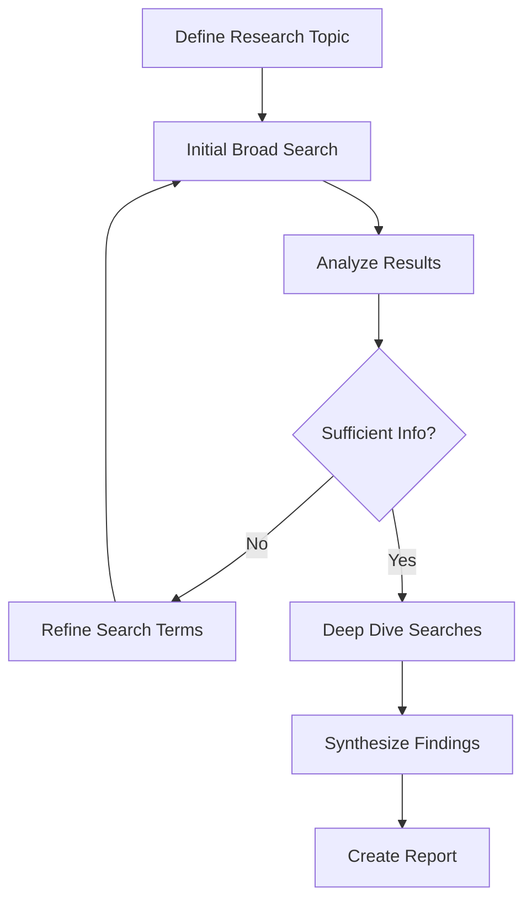
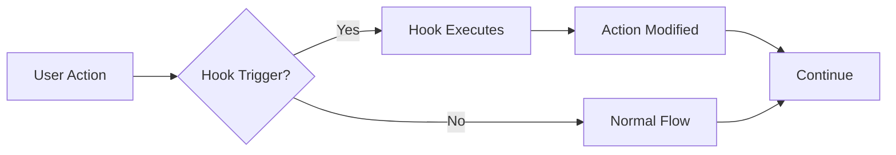
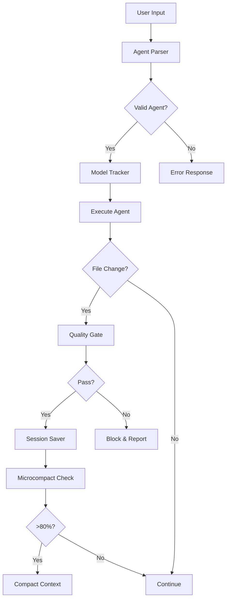

# 🧠 Universal Meta-Prompting Guide v2.1 - Claude Code Dev Stack

> **The Definitive Guide for Generating Perfect Claude Code Prompts in Any LLM**
> 
> Version: 2.1 | Last Updated: January 2025 | Status: Production Ready

---

## 📚 Table of Contents

### 🚀 Quick Start
- [Universal LLM Instructions](#-universal-llm-instructions)
- [What Changed in v2.1](#-quick-reference---what-changed-in-v21)
- [Quick Decision Matrix](#-quick-decision-matrix)

### 🏗️ Core Concepts
- [AIMS Meta-Prompting Methodology](#️-aims-meta-prompting-methodology-v21)
- [Agent System Overview](#-complete-agent-reference-table-v21)
- [Slash Commands Reference](#-all-18-slash-commands)
- [Cost Optimization Strategy](#-cost-optimization-strategies)

### 🛠️ Tools & Integration
- [MCP Tools (Max 3)](#-mcp-tools-maximum-3)
- [Hook System (Automatic)](#-hook-system-automatic)
- [PDF-Driven Development](#pdf-driven-development)
- [Session Management](#extended-session-best-practices)

### 📋 Templates & Patterns
- [Master Prompt Templates](#-master-prompt-templates-v21)
- [Project Development Patterns](#-project-development-patterns)
- [Special Modes & Features](#-special-modes--features)
- [Converting Old Prompts](#-converting-old-prompts-to-v21)

### 🎓 Advanced Usage
- [Training Other LLMs](#-training-other-llms)
- [Cross-Session Continuity](#cross-session-continuity-pattern)
- [Ultrathink Mode](#ultrathink-mode-complex-problem-solving)
- [Common Mistakes to Avoid](#-common-mistakes-to-avoid)

### 📚 Reference
- [Complete Agent List](#all-28-agents-with-model-assignments)
- [Model Cost Strategy](#model-cost-strategy)
- [Quick Decision Matrix](#-quick-decision-matrix)
- [Final Notes](#-final-notes)

---

## ⚡ Quick Start Examples

> **Copy these examples and start building immediately**

### Example 1: Build a SaaS MVP
```prompt
/new-project "Task Management SaaS"
@agent-master-orchestrator @agent-business-analyst
Industry: B2B Software
Users: Small teams (5-20 people)
Core features: Tasks, projects, team collaboration
Timeline: 6 weeks MVP
Tech: React + Node.js preferred
```

### Example 2: Add Payment Integration
```prompt
/resume-project
@agent-api-integration-specialist integrate Stripe payment processing
@agent-backend-services create subscription management API
@agent-testing-automation write payment flow tests
Requirements: Monthly/yearly plans, team billing, usage tracking
```

### Example 3: Fix Performance Issue
```prompt
Issue: API response times >2 seconds on user dashboard
@agent-backend-services investigate slow queries
@agent-performance-optimization implement caching strategy
@agent-testing-automation create performance benchmarks
Target: <200ms response time
```

### Example 4: Architecture Planning
```prompt
"Let's ultrathink about microservices architecture for our platform"
Current: Monolithic Node.js app with 50k users
Goal: Scale to 500k users with microservices
Concerns: Data consistency, service communication, deployment complexity
```

---

## 🎯 Universal LLM Instructions

**Give this guide to any AI assistant (ChatGPT, Claude.ai, Gemini, Perplexity, etc.) with these instructions:**

```
I need you to generate Claude Code prompts using this guide. Please:
1. Always use @agent- prefix for deterministic agent routing
2. Select agents based on their model recommendations for cost optimization
3. Include relevant slash commands from the 18 available
4. Consider that Opus costs ~7x more than Haiku
5. Generate prompts that will work in Claude Code's interactive environment
6. Follow the AIMS methodology exactly as specified
```

### 🎯 Key Principles for v2.1
- **Deterministic Routing**: All agents use `@agent-` prefix
- **Model Configuration**: Models set in YAML files, not inline
- **Cost Awareness**: Strategic use of Opus/Default/Haiku models
- **Hook Automation**: Session management runs automatically
- **MCP Limit**: Maximum 3 tools for simplicity

---

## 📋 Quick Reference - What Changed in v2.1

### ❌ OLD Syntax (Pre-v2.1)
```
@agent-backend-services[opus]    # Model specified inline
@agent-testing-engineer[haiku]   # Model in brackets
```

### ✅ NEW Syntax (v2.1)
```
@agent-backend-services          # Model set in agent config
@agent-testing-automation        # Automatic model selection
```

**Key Change**: Models are now configured in each agent's YAML file, not specified inline. This ensures consistent cost optimization across all uses of an agent.

---

## 🏗️ AIMS Meta-Prompting Methodology v2.1

> **Every Claude Code prompt must follow the AIMS structure for optimal results**

### 📐 The AIMS Framework

```
A - Agent Selection    → WHO will do the work
I - Integration       → WHAT tools they'll use  
M - Method           → HOW they'll approach it
S - Structure        → WHY in this specific way
```

### 🅰️ **A - Agent Selection** (Deterministic with @agent-)

**Core Rules:**
- ✅ Use exact agent names from configuration
- ✅ Pattern: `@agent-[exact-name-from-config]`
- ❌ NO square brackets or model specifications
- ✅ Let agent config determine optimal model

**Examples:**
```
✅ CORRECT: @agent-backend-services
✅ CORRECT: @agent-testing-automation
❌ WRONG:   @agent-backend-services[opus]
❌ WRONG:   @agent-testing-engineer[haiku]
```

### 🔗 **I - Integration** (Tools & Resources)

**Available Integrations:**
| Type | Options | Limit | Auto-Enabled |
|------|---------|-------|--------------|
| MCP Tools | Playwright, Obsidian, Brave Search | 3 max | No |
| Hooks | Session, Quality, Planning, etc. | Unlimited | Yes |
| PDF Reading | Any PDF file | Unlimited | Yes |

**Integration Priority:**
1. **Essential**: Hooks (automatic, no action needed)
2. **As Needed**: MCP tools (manually add, max 3)
3. **Always Available**: PDF reading (reference directly)

### 🎯 **M - Method** (Command Selection)

**Command Categories:**
- **Project**: `/new-project`, `/resume-project`
- **Planning**: `/business-analysis`, `/technical-feasibility`, `/project-plan`
- **Development**: `/frontend-mockup`, `/backend-service`, `/database-design`
- **Integration**: `/api-integration`, `/middleware-setup`
- **Quality**: `/documentation`, `/requirements`
- **Strategy**: `/financial-model`, `/go-to-market`, `/tech-alignment`

**Method Selection Guide:**
```
IF starting fresh     → /new-project
IF continuing work    → /resume-project  
IF specific feature   → /[feature-command] + @agent-
IF complex analysis   → "Let's ultrathink..." + multiple @agent-
```

### 📋 **S - Structure** (Prompt Composition)

**Optimal Structure Pattern:**
```
1. Command/Context Setting
2. Agent Invocation (@agent-)
3. Specific Requirements
4. Resource References (PDFs, etc.)
5. Cost/Performance Constraints
6. Expected Outcomes
```

**Structure Example:**
```
/new-project "E-commerce Platform"              # 1. Command
@agent-master-orchestrator @agent-business-analyst  # 2. Agents
Requirements:                                   # 3. Specifics
- Multi-vendor marketplace
- 100k users expected
Read: "requirements.pdf"                        # 4. Resources
Note: Cost-conscious, prefer Haiku for routine  # 5. Constraints
Goal: MVP in 6 weeks                           # 6. Outcome
```

---

## 📊 Complete Agent Reference Table v2.1

> **28 Specialized Agents Organized by Function and Cost Optimization**

### 🎯 Agent Categories Overview

| Category | Agent Count | Primary Model | Purpose |
|----------|-------------|---------------|---------|
| **Business Strategy** | 4 | Opus ($$$$) | Strategic decisions & planning |
| **Planning & Management** | 3 | Mixed | Project coordination |
| **Architecture & Design** | 8 | Mixed | System design & architecture |
| **Development Support** | 6 | Default/Haiku | Implementation & quality |
| **Specialized Expertise** | 5 | Mixed | Domain-specific tasks |
| **Meta-Coordination** | 2 | Opus | System orchestration |

### 📋 All 28 Agents with Model Assignments

#### 🏢 **Business Strategy Layer** (4 Agents - Opus Heavy)
| Agent Name | @agent- Invocation | Model | Use For | Cost |
|------------|-------------------|-------|---------|------|
| **Business Analyst** | `@agent-business-analyst` | Opus | Market analysis, ROI calculations | $$$ |
| **CEO Strategy** | `@agent-ceo-strategy` | Opus | Strategic planning, go-to-market | $$$ |
| **Financial Analyst** | `@agent-financial-analyst` | Opus | Financial modeling, projections | $$$ |
| **Technical CTO** | `@agent-technical-cto` | Opus | Technical feasibility assessment | $$$ |

#### 📊 **Planning & Management Layer** (3 Agents - Mixed)
| Agent Name | @agent- Invocation | Model | Use For | Cost |
|------------|-------------------|-------|---------|------|
| **Project Manager** | `@agent-project-manager` | Default | Timeline, resource management | $$ |
| **Technical Specifications** | `@agent-technical-specifications` | Opus | Requirements analysis | $$$ |
| **Business Tech Alignment** | `@agent-business-tech-alignment` | Opus | Align tech with business goals | $$$ |

#### 🏗️ **Architecture & Design Layer** (8 Agents - Mixed)
| Agent Name | @agent- Invocation | Model | Use For | Cost |
|------------|-------------------|-------|---------|------|
| **Technical Documentation** | `@agent-technical-documentation` | Haiku | Documentation writing | $ |
| **API Integration Specialist** | `@agent-api-integration-specialist` | Default | External API integration | $$ |
| **Frontend Architecture** | `@agent-frontend-architecture` | Opus | UI/UX architecture planning | $$$ |
| **Frontend Mockup** | `@agent-frontend-mockup` | Default | HTML/CSS prototypes | $$ |
| **Production Frontend** | `@agent-production-frontend` | Default | React/Vue/Angular development | $$ |
| **Backend Services** | `@agent-backend-services` | Default | Server-side development | $$ |
| **Database Architecture** | `@agent-database-architecture` | Opus | Schema design, optimization | $$$ |
| **Middleware Specialist** | `@agent-middleware-specialist` | Default | Message queues, caching | $$ |

#### 🔧 **Development Support Layer** (6 Agents - Cost Optimized)
| Agent Name | @agent- Invocation | Model | Use For | Cost |
|------------|-------------------|-------|---------|------|
| **Testing Automation** | `@agent-testing-automation` | Haiku | Test creation & automation | $ |
| **Development Prompt** | `@agent-development-prompt` | Default | Development workflows | $$ |
| **Script Automation** | `@agent-script-automation` | Default | Build/deploy scripts | $$ |
| **Integration Setup** | `@agent-integration-setup` | Default | Environment configuration | $$ |
| **Security Architecture** | `@agent-security-architecture` | Opus | Security design, compliance | $$$ |
| **Performance Optimization** | `@agent-performance-optimization` | Default | Speed & scale optimization | $$ |

#### 🎨 **Specialized Expertise Layer** (5 Agents - Mixed)
| Agent Name | @agent- Invocation | Model | Use For | Cost |
|------------|-------------------|-------|---------|------|
| **DevOps Engineering** | `@agent-devops-engineering` | Default | CI/CD, deployment, infrastructure | $$ |
| **Quality Assurance** | `@agent-quality-assurance` | Haiku | Code quality checks | $ |
| **Mobile Development** | `@agent-mobile-development` | Default | iOS/Android native apps | $$ |
| **UI/UX Design** | `@agent-ui-ux-design` | Default | User experience design | $$ |
| **Usage Guide** | `@agent-usage-guide` | Opus | Meta-configuration, workflow help | $$$ |

#### 🎯 **Meta-Coordination Layer** (2 Agents - Opus)
| Agent Name | @agent- Invocation | Model | Use For | Cost |
|------------|-------------------|-------|---------|------|
| **Prompt Engineer** | `@agent-prompt-engineer` | Default | Prompt optimization | $$ |
| **Master Orchestrator** | `@agent-master-orchestrator` | Opus | Complex project coordination | $$$ |

---

## 🤖 Detailed Agent Profiles & Usage Guide

> **In-depth documentation for each of the 28 specialized agents**

### 🏢 Business Strategy Layer (Detail)

#### 1. Business Analyst (`@agent-business-analyst`)
**Primary Purpose**: Transforms business requirements into technical specifications, performs market analysis, and calculates ROI.

**Expertise**:
- Market research and competitive analysis
- Business requirement documentation
- ROI calculations and financial projections
- User story creation and management
- Business process modeling

**When to Use**:
- ✅ Starting a new project requiring market validation
- ✅ Analyzing competitor features and strategies
- ✅ Creating business cases for features
- ✅ Defining user personas and journeys
- ❌ Not for technical implementation details
- ❌ Not for code-level decisions

**Common Pairing Patterns**:
- With `@agent-technical-cto` for feasibility assessment
- With `@agent-financial-analyst` for comprehensive business case
- With `@agent-master-orchestrator` for project initiation

**Typical Outputs**:
- Market analysis reports
- Business requirement documents (BRDs)
- User stories and acceptance criteria
- ROI calculations and projections
- Competitive analysis matrices

**Example Usage**:
```prompt
@agent-business-analyst analyze the B2B SaaS market for project management tools
Focus on: pricing models, key features, market gaps, and potential differentiators
Read: "competitor-analysis.pdf" for baseline data
```

#### 2. CEO Strategy (`@agent-ceo-strategy`)
**Primary Purpose**: Develops go-to-market strategies, business models, and strategic planning.

**Expertise**:
- Go-to-market (GTM) strategy
- Business model innovation
- Strategic partnerships
- Market positioning
- Growth strategies

**When to Use**:
- ✅ Defining product positioning and messaging
- ✅ Creating launch strategies
- ✅ Planning business model pivots
- ✅ Developing partnership strategies
- ❌ Not for technical architecture
- ❌ Not for implementation details

**Common Pairing Patterns**:
- With `@agent-business-analyst` for market data
- With `@agent-financial-analyst` for revenue modeling
- With `@agent-business-tech-alignment` for execution planning

**Typical Outputs**:
- GTM strategy documents
- Business model canvas
- Strategic roadmaps
- Partnership frameworks
- Market positioning statements

#### 3. Financial Analyst (`@agent-financial-analyst`)
**Primary Purpose**: Creates financial models, projections, and investment analysis.

**Expertise**:
- Financial modeling and forecasting
- Unit economics analysis
- Investment ROI calculations
- Pricing strategy development
- Cost-benefit analysis

**When to Use**:
- ✅ Building financial projections
- ✅ Analyzing pricing strategies
- ✅ Calculating unit economics
- ✅ Investment decision support
- ❌ Not for technical cost optimization
- ❌ Not for code-level performance

**Common Pairing Patterns**:
- With `@agent-business-analyst` for market sizing
- With `@agent-ceo-strategy` for business model validation
- With `@agent-technical-cto` for infrastructure cost estimates

**Typical Outputs**:
- Financial models (Excel/Google Sheets compatible)
- Revenue projections
- Cost analysis reports
- Pricing strategy documents
- Investment analysis

#### 4. Technical CTO (`@agent-technical-cto`)
**Primary Purpose**: Assesses technical feasibility, makes architecture decisions, and aligns technology with business goals.

**Expertise**:
- Technical feasibility assessment
- Technology stack selection
- Scalability planning
- Technical risk assessment
- Innovation strategy

**When to Use**:
- ✅ Evaluating technical approaches
- ✅ Selecting technology stacks
- ✅ Assessing scalability requirements
- ✅ Technical due diligence
- ❌ Not for hands-on coding
- ❌ Not for detailed implementation

**Common Pairing Patterns**:
- With `@agent-business-analyst` for requirement validation
- With `@agent-database-architecture` for data strategy
- With `@agent-security-architecture` for security planning

**Typical Outputs**:
- Technical feasibility reports
- Technology stack recommendations
- Architecture decision records (ADRs)
- Risk assessment documents
- Innovation roadmaps

### 📊 Planning & Management Layer (Detail)

#### 5. Project Manager (`@agent-project-manager`)
**Primary Purpose**: Creates project plans, manages timelines, and coordinates resources.

**Expertise**:
- Project planning and scheduling
- Resource allocation
- Risk management
- Agile/Scrum methodologies
- Stakeholder communication

**When to Use**:
- ✅ Creating project timelines
- ✅ Planning sprints and milestones
- ✅ Resource planning
- ✅ Risk identification and mitigation
- ❌ Not for technical decisions
- ❌ Not for business strategy

**Common Pairing Patterns**:
- With `@agent-master-orchestrator` for complex projects
- With `@agent-technical-specifications` for requirement planning
- With all development agents for timeline coordination

**Typical Outputs**:
- Project plans and Gantt charts
- Sprint planning documents
- Resource allocation matrices
- Risk registers
- Status reports

#### 6. Technical Specifications (`@agent-technical-specifications`)
**Primary Purpose**: Transforms business requirements into detailed technical specifications.

**Expertise**:
- Requirement analysis and documentation
- Technical specification writing
- API contract definition
- Data model specification
- Integration requirements

**When to Use**:
- ✅ Documenting technical requirements
- ✅ Creating API specifications
- ✅ Defining data models
- ✅ Specifying integration points
- ❌ Not for business strategy
- ❌ Not for implementation code

**Common Pairing Patterns**:
- With `@agent-business-analyst` for requirement clarification
- With `@agent-database-architecture` for data modeling
- With `@agent-api-integration-specialist` for API design

**Typical Outputs**:
- Technical specification documents
- API contracts (OpenAPI/Swagger)
- Data model diagrams
- Integration specifications
- Acceptance criteria

#### 7. Business Tech Alignment (`@agent-business-tech-alignment`)
**Primary Purpose**: Ensures technology decisions align with business objectives.

**Expertise**:
- Business-IT alignment strategies
- Technology ROI analysis
- Digital transformation planning
- Change management
- Stakeholder alignment

**When to Use**:
- ✅ Aligning tech initiatives with business goals
- ✅ Justifying technology investments
- ✅ Planning digital transformation
- ✅ Managing technical debt decisions
- ❌ Not for pure technical implementation
- ❌ Not for market analysis

**Common Pairing Patterns**:
- With `@agent-technical-cto` for technology assessment
- With `@agent-business-analyst` for business context
- With `@agent-financial-analyst` for ROI analysis

**Typical Outputs**:
- Alignment strategy documents
- Technology roadmaps
- ROI analysis reports
- Change management plans
- Stakeholder communication plans

### 🏗️ Architecture & Design Layer (Detail)

#### 8. Technical Documentation (`@agent-technical-documentation`)
**Primary Purpose**: Creates comprehensive technical documentation for all aspects of the system.

**Expertise**:
- API documentation
- Architecture documentation
- User guides and tutorials
- Code documentation standards
- Documentation automation

**When to Use**:
- ✅ Creating API documentation
- ✅ Writing developer guides
- ✅ Documenting architecture decisions
- ✅ Creating user manuals
- ❌ Not for code implementation
- ❌ Not for business documentation

**Common Pairing Patterns**:
- With all development agents for documentation
- With `@agent-frontend-architecture` for UI documentation
- With `@agent-database-architecture` for data documentation

**Typical Outputs**:
- API reference documentation
- Architecture diagrams and docs
- Developer setup guides
- User documentation
- README files

#### 9. API Integration Specialist (`@agent-api-integration-specialist`)
**Primary Purpose**: Designs and implements integrations with external APIs and services.

**Expertise**:
- Third-party API integration
- Webhook implementation
- OAuth/authentication flows
- Rate limiting strategies
- Error handling patterns

**When to Use**:
- ✅ Integrating payment processors (Stripe, PayPal)
- ✅ Connecting to social media APIs
- ✅ Implementing webhooks
- ✅ Building API gateways
- ❌ Not for internal API design
- ❌ Not for database operations

**Common Pairing Patterns**:
- With `@agent-backend-services` for implementation
- With `@agent-security-architecture` for secure integration
- With `@agent-middleware-specialist` for message queuing

**Typical Outputs**:
- Integration architecture diagrams
- API client libraries
- Webhook handlers
- Authentication flows
- Error handling strategies

#### 10. Frontend Architecture (`@agent-frontend-architecture`)
**Primary Purpose**: Designs scalable frontend architectures and component systems.

**Expertise**:
- Component architecture design
- State management patterns
- Performance optimization
- Micro-frontend architecture
- Design system creation

**When to Use**:
- ✅ Planning frontend architecture
- ✅ Designing component libraries
- ✅ Selecting state management solutions
- ✅ Performance architecture planning
- ❌ Not for visual design
- ❌ Not for backend architecture

**Common Pairing Patterns**:
- With `@agent-frontend-mockup` for prototyping
- With `@agent-production-frontend` for implementation
- With `@agent-ui-ux-design` for design systems

**Typical Outputs**:
- Frontend architecture documents
- Component hierarchy diagrams
- State management strategies
- Performance optimization plans
- Design system specifications

#### 11. Frontend Mockup (`@agent-frontend-mockup`)
**Primary Purpose**: Creates rapid HTML/CSS prototypes and mockups.

**Expertise**:
- HTML/CSS/JavaScript prototyping
- Responsive design implementation
- Interactive mockups
- Component prototyping
- Quick iteration on designs

**When to Use**:
- ✅ Creating quick prototypes
- ✅ Testing UI concepts
- ✅ Building demo interfaces
- ✅ Validating user flows
- ❌ Not for production code
- ❌ Not for complex state management

**Common Pairing Patterns**:
- With `@agent-ui-ux-design` for design implementation
- With `@agent-production-frontend` for production conversion
- With `@agent-frontend-architecture` for structure

**Typical Outputs**:
- HTML/CSS prototypes
- Interactive mockups
- Component demos
- Responsive layouts
- UI proof of concepts

#### 12. Production Frontend (`@agent-production-frontend`)
**Primary Purpose**: Develops production-ready frontend applications using modern frameworks.

**Expertise**:
- React/Vue/Angular development
- State management (Redux, MobX, Vuex)
- Component lifecycle optimization
- Build optimization
- Testing strategies

**When to Use**:
- ✅ Building production UIs
- ✅ Implementing complex interactions
- ✅ Optimizing performance
- ✅ Creating reusable components
- ❌ Not for quick prototypes
- ❌ Not for backend logic

**Common Pairing Patterns**:
- With `@agent-frontend-architecture` for guidance
- With `@agent-backend-services` for API integration
- With `@agent-testing-automation` for test coverage

**Typical Outputs**:
- Production React/Vue/Angular code
- Component libraries
- State management implementation
- Build configurations
- Frontend test suites

#### 13. Backend Services (`@agent-backend-services`)
**Primary Purpose**: Develops server-side applications, APIs, and business logic.

**Expertise**:
- RESTful API development
- GraphQL implementation
- Microservices architecture
- Database operations
- Authentication/authorization

**When to Use**:
- ✅ Building APIs and services
- ✅ Implementing business logic
- ✅ Creating microservices
- ✅ Database CRUD operations
- ❌ Not for frontend development
- ❌ Not for infrastructure setup

**Common Pairing Patterns**:
- With `@agent-database-architecture` for data layer
- With `@agent-api-integration-specialist` for external APIs
- With `@agent-security-architecture` for security

**Typical Outputs**:
- API endpoints and routes
- Service layer implementations
- Business logic modules
- Database integration code
- Authentication systems

#### 14. Database Architecture (`@agent-database-architecture`)
**Primary Purpose**: Designs database schemas, optimization strategies, and data architecture.

**Expertise**:
- Schema design and normalization
- Query optimization
- Index strategies
- Data migration planning
- NoSQL vs SQL decisions

**When to Use**:
- ✅ Designing database schemas
- ✅ Optimizing query performance
- ✅ Planning data migrations
- ✅ Selecting database technologies
- ❌ Not for application logic
- ❌ Not for UI concerns

**Common Pairing Patterns**:
- With `@agent-backend-services` for implementation
- With `@agent-performance-optimization` for tuning
- With `@agent-technical-specifications` for requirements

**Typical Outputs**:
- Database schema designs
- ER diagrams
- Migration scripts
- Optimization strategies
- Index recommendations

#### 15. Middleware Specialist (`@agent-middleware-specialist`)
**Primary Purpose**: Implements message queues, caching layers, and middleware services.

**Expertise**:
- Message queue implementation (RabbitMQ, Kafka)
- Caching strategies (Redis, Memcached)
- API gateway configuration
- Service mesh implementation
- Event-driven architecture

**When to Use**:
- ✅ Implementing message queues
- ✅ Setting up caching layers
- ✅ Building event-driven systems
- ✅ Creating API gateways
- ❌ Not for business logic
- ❌ Not for UI development

**Common Pairing Patterns**:
- With `@agent-backend-services` for integration
- With `@agent-performance-optimization` for caching
- With `@agent-devops-engineering` for deployment

**Typical Outputs**:
- Message queue configurations
- Caching layer implementations
- Event streaming setups
- API gateway configurations
- Middleware documentation

### 🔧 Development Support Layer (Detail)

#### 16. Testing Automation (`@agent-testing-automation`)
**Primary Purpose**: Creates comprehensive test suites and automation frameworks.

**Expertise**:
- Unit test creation
- Integration testing
- E2E test automation
- Test framework selection
- CI/CD test integration

**When to Use**:
- ✅ Writing test suites
- ✅ Setting up test automation
- ✅ Creating E2E tests
- ✅ Test coverage improvement
- ❌ Not for manual testing
- ❌ Not for production code

**Common Pairing Patterns**:
- With all development agents for test coverage
- With `@agent-quality-assurance` for quality metrics
- With `@agent-devops-engineering` for CI/CD integration

**Typical Outputs**:
- Unit test suites
- Integration tests
- E2E test scenarios
- Test automation frameworks
- Coverage reports

#### 17. Development Prompt (`@agent-development-prompt`)
**Primary Purpose**: Optimizes development workflows and creates efficient prompts.

**Expertise**:
- Development workflow optimization
- Code generation prompts
- Boilerplate creation
- Development tool configuration
- Productivity enhancement

**When to Use**:
- ✅ Optimizing development processes
- ✅ Creating code templates
- ✅ Setting up development tools
- ✅ Workflow automation
- ❌ Not for production deployment
- ❌ Not for business logic

**Common Pairing Patterns**:
- With `@agent-prompt-engineer` for optimization
- With development agents for workflow setup
- With `@agent-script-automation` for automation

**Typical Outputs**:
- Development workflow guides
- Code generation templates
- Tool configurations
- Productivity scripts
- Development best practices

#### 18. Script Automation (`@agent-script-automation`)
**Primary Purpose**: Creates build scripts, deployment automation, and tooling.

**Expertise**:
- Build script creation
- Deployment automation
- CI/CD pipeline configuration
- Development tool scripting
- Task automation

**When to Use**:
- ✅ Creating build scripts
- ✅ Automating deployments
- ✅ Setting up CI/CD
- ✅ Development task automation
- ❌ Not for application code
- ❌ Not for business logic

**Common Pairing Patterns**:
- With `@agent-devops-engineering` for infrastructure
- With `@agent-integration-setup` for environments
- With `@agent-testing-automation` for test automation

**Typical Outputs**:
- Build scripts (npm, webpack, etc.)
- Deployment scripts
- CI/CD configurations
- Automation scripts
- Task runners

#### 19. Integration Setup (`@agent-integration-setup`)
**Primary Purpose**: Configures development environments and integration points.

**Expertise**:
- Environment configuration
- Docker setup
- Development tool integration
- Service configuration
- Local development setup

**When to Use**:
- ✅ Setting up dev environments
- ✅ Configuring Docker
- ✅ Integrating development tools
- ✅ Environment provisioning
- ❌ Not for production deployment
- ❌ Not for application logic

**Common Pairing Patterns**:
- With `@agent-devops-engineering` for containers
- With `@agent-backend-services` for service setup
- With `@agent-script-automation` for automation

**Typical Outputs**:
- Docker configurations
- Environment setup scripts
- Development tool configs
- Service configurations
- Setup documentation

#### 20. Security Architecture (`@agent-security-architecture`)
**Primary Purpose**: Designs security architectures and implements security best practices.

**Expertise**:
- Security architecture design
- Threat modeling
- Authentication/authorization design
- Encryption strategies
- Compliance requirements

**When to Use**:
- ✅ Designing security layers
- ✅ Threat assessment
- ✅ Compliance planning
- ✅ Security review
- ❌ Not for non-security features
- ❌ Not for UI development

**Common Pairing Patterns**:
- With `@agent-backend-services` for implementation
- With `@agent-database-architecture` for data security
- With `@agent-api-integration-specialist` for secure APIs

**Typical Outputs**:
- Security architecture documents
- Threat models
- Security implementation guides
- Compliance checklists
- Security test plans

#### 21. Performance Optimization (`@agent-performance-optimization`)
**Primary Purpose**: Optimizes system performance and scalability.

**Expertise**:
- Performance profiling
- Query optimization
- Caching strategies
- Load balancing
- Scalability planning

**When to Use**:
- ✅ Fixing performance issues
- ✅ Optimizing database queries
- ✅ Implementing caching
- ✅ Load testing
- ❌ Not for feature development
- ❌ Not for UI design

**Common Pairing Patterns**:
- With `@agent-database-architecture` for DB optimization
- With `@agent-middleware-specialist` for caching
- With `@agent-backend-services` for code optimization

**Typical Outputs**:
- Performance analysis reports
- Optimization recommendations
- Caching implementations
- Load test results
- Scalability plans

### 🎨 Specialized Expertise Layer (Detail)

#### 22. DevOps Engineering (`@agent-devops-engineering`)
**Primary Purpose**: Implements CI/CD pipelines, infrastructure as code, and deployment strategies.

**Expertise**:
- CI/CD pipeline design
- Container orchestration (Kubernetes)
- Infrastructure as Code (Terraform)
- Monitoring and logging
- Cloud platform expertise

**When to Use**:
- ✅ Setting up CI/CD pipelines
- ✅ Kubernetes deployment
- ✅ Infrastructure automation
- ✅ Monitoring setup
- ❌ Not for application development
- ❌ Not for business logic

**Common Pairing Patterns**:
- With `@agent-script-automation` for deployment scripts
- With `@agent-integration-setup` for environments
- With `@agent-security-architecture` for secure deployment

**Typical Outputs**:
- CI/CD pipeline configurations
- Kubernetes manifests
- Terraform configurations
- Monitoring dashboards
- Deployment documentation

#### 23. Quality Assurance (`@agent-quality-assurance`)
**Primary Purpose**: Ensures code quality through reviews, standards, and best practices.

**Expertise**:
- Code quality standards
- Code review processes
- Quality metrics
- Best practices enforcement
- Technical debt management

**When to Use**:
- ✅ Code quality reviews
- ✅ Establishing standards
- ✅ Quality metrics setup
- ✅ Technical debt assessment
- ❌ Not for feature development
- ❌ Not for test writing

**Common Pairing Patterns**:
- With `@agent-testing-automation` for test quality
- With all development agents for reviews
- With `@agent-technical-documentation` for standards

**Typical Outputs**:
- Code review reports
- Quality standards documents
- Technical debt assessments
- Best practices guides
- Quality metrics dashboards

#### 24. Mobile Development (`@agent-mobile-development`)
**Primary Purpose**: Develops native and cross-platform mobile applications.

**Expertise**:
- iOS/Android native development
- React Native/Flutter
- Mobile UI/UX patterns
- App store deployment
- Mobile-specific optimizations

**When to Use**:
- ✅ Building mobile apps
- ✅ Mobile-specific features
- ✅ App store preparation
- ✅ Cross-platform development
- ❌ Not for web development
- ❌ Not for backend services

**Common Pairing Patterns**:
- With `@agent-ui-ux-design` for mobile UX
- With `@agent-backend-services` for APIs
- With `@agent-testing-automation` for mobile testing

**Typical Outputs**:
- Native iOS/Android code
- React Native/Flutter apps
- Mobile UI implementations
- App store configurations
- Mobile-specific documentation

#### 25. UI/UX Design (`@agent-ui-ux-design`)
**Primary Purpose**: Creates user experience designs and interface specifications.

**Expertise**:
- User research and personas
- Information architecture
- Interaction design
- Visual design principles
- Accessibility standards

**When to Use**:
- ✅ Designing user interfaces
- ✅ Creating user flows
- ✅ Accessibility planning
- ✅ Design system creation
- ❌ Not for code implementation
- ❌ Not for backend logic

**Common Pairing Patterns**:
- With `@agent-frontend-mockup` for prototypes
- With `@agent-frontend-architecture` for implementation
- With `@agent-mobile-development` for mobile UX

**Typical Outputs**:
- User flow diagrams
- Wireframes and mockups
- Design system documentation
- Accessibility guidelines
- UX research findings

#### 26. Usage Guide (`@agent-usage-guide`)
**Primary Purpose**: Creates meta-documentation and workflow optimization guides.

**Expertise**:
- Workflow documentation
- Best practices guides
- Tool usage documentation
- Process optimization
- Training materials

**When to Use**:
- ✅ Creating workflow guides
- ✅ Documenting best practices
- ✅ Training material creation
- ✅ Process documentation
- ❌ Not for technical implementation
- ❌ Not for code development

**Common Pairing Patterns**:
- With `@agent-technical-documentation` for comprehensive docs
- With `@agent-prompt-engineer` for prompt guides
- With `@agent-master-orchestrator` for workflow optimization

**Typical Outputs**:
- Workflow documentation
- Best practices guides
- Training materials
- Process diagrams
- Quick reference guides

### 🎯 Meta-Coordination Layer (Detail)

#### 27. Prompt Engineer (`@agent-prompt-engineer`)
**Primary Purpose**: Optimizes prompts for maximum efficiency and clarity.

**Expertise**:
- Prompt optimization techniques
- Context management
- Token efficiency
- Multi-agent coordination
- Prompt debugging

**When to Use**:
- ✅ Optimizing complex prompts
- ✅ Debugging prompt issues
- ✅ Multi-agent coordination
- ✅ Context optimization
- ❌ Not for implementation
- ❌ Not for business strategy

**Common Pairing Patterns**:
- With `@agent-master-orchestrator` for complex projects
- With `@agent-development-prompt` for dev workflows
- With any agent for optimization

**Typical Outputs**:
- Optimized prompt templates
- Multi-agent workflows
- Context management strategies
- Prompt debugging reports
- Efficiency recommendations

#### 28. Master Orchestrator (`@agent-master-orchestrator`)
**Primary Purpose**: Coordinates complex multi-agent projects and ensures cohesive execution.

**Expertise**:
- Multi-agent coordination
- Project orchestration
- Complex workflow management
- Decision routing
- Cross-functional alignment

**When to Use**:
- ✅ Starting complex projects
- ✅ Coordinating multiple agents
- ✅ Managing dependencies
- ✅ Complex decision making
- ❌ Not for simple tasks
- ❌ Not for single-agent work

**Common Pairing Patterns**:
- With all agents as coordinator
- Especially with business strategy agents for alignment
- With `@agent-project-manager` for execution

**Typical Outputs**:
- Project orchestration plans
- Agent coordination strategies
- Dependency matrices
- Decision trees
- Progress tracking reports

### Model Cost Strategy
- **Opus (11 agents)**: $0.015/call - Use for complex reasoning, architecture, critical decisions
- **Default (13 agents)**: $0.008/call - Use for standard development tasks
- **Haiku (4 agents)**: $0.002/call - Use for routine tasks, documentation, simple tests

**Cost Optimization**: Using this distribution typically saves 40-60% vs using Opus for everything.

---

## 🎯 All 18 Slash Commands

> **Slash commands provide context and workflow direction for your prompts**

### 📂 Command Categories

#### 🚀 **Project Management Commands**
| Command | Purpose | Example with @agent- | Typical Agents |
|---------|---------|---------------------|----------------|
| `/new-project` | Initialize complete project | `/new-project "SaaS platform" @agent-master-orchestrator @agent-business-analyst` | Orchestrator, Business |
| `/resume-project` | Continue existing work | `/resume-project @agent-master-orchestrator` | Orchestrator |
| `/project-plan` | Timeline & resources | `/project-plan @agent-project-manager` | Project Manager |

#### 💼 **Business & Strategy Commands**
| Command | Purpose | Example with @agent- | Typical Agents |
|---------|---------|---------------------|----------------|
| `/business-analysis` | Market & ROI analysis | `/business-analysis @agent-business-analyst @agent-financial-analyst` | Business, Financial |
| `/financial-model` | Financial projections | `/financial-model @agent-financial-analyst` | Financial Analyst |
| `/go-to-market` | GTM strategy | `/go-to-market @agent-ceo-strategy` | CEO Strategy |
| `/tech-alignment` | Business-tech alignment | `/tech-alignment @agent-business-tech-alignment` | Business-Tech |

#### 🏗️ **Architecture & Planning Commands**
| Command | Purpose | Example with @agent- | Typical Agents |
|---------|---------|---------------------|----------------|
| `/technical-feasibility` | Tech assessment | `/technical-feasibility "microservices" @agent-technical-cto` | CTO, Architecture |
| `/requirements` | Requirements gathering | `/requirements @agent-technical-specifications` | Specifications |
| `/site-architecture` | Information architecture | `/site-architecture @agent-frontend-architecture` | Frontend Architecture |
| `/database-design` | Schema creation | `/database-design @agent-database-architecture` | Database Architecture |

#### 💻 **Development Commands**
| Command | Purpose | Example with @agent- | Typical Agents |
|---------|---------|---------------------|----------------|
| `/frontend-mockup` | UI prototypes | `/frontend-mockup "dashboard" @agent-frontend-mockup` | Frontend Mockup |
| `/backend-service` | API development | `/backend-service "auth API" @agent-backend-services` | Backend Services |
| `/production-frontend` | Production UI | `/production-frontend @agent-production-frontend` | Production Frontend |
| `/api-integration` | External APIs | `/api-integration "Stripe" @agent-api-integration-specialist` | API Integration |
| `/middleware-setup` | Queue/cache setup | `/middleware-setup @agent-middleware-specialist` | Middleware |

#### 📚 **Documentation & Quality Commands**
| Command | Purpose | Example with @agent- | Typical Agents |
|---------|---------|---------------------|----------------|
| `/documentation` | Technical docs | `/documentation @agent-technical-documentation` | Documentation |
| `/prompt-enhance` | Prompt optimization | `/prompt-enhance @agent-prompt-engineer` | Prompt Engineer |

### 🎯 Command Selection Guide

```mermaid
graph TD
    A[What do you need?] --> B{Project Phase?}
    B -->|Starting New| C[/new-project]
    B -->|Continuing| D[/resume-project]
    B -->|Planning| E[Business/Tech Commands]
    B -->|Building| F[Development Commands]
    B -->|Documenting| G[Documentation Commands]
    
    E --> H[/business-analysis]
    E --> I[/technical-feasibility]
    E --> J[/requirements]
    
    F --> K[/backend-service]
    F --> L[/frontend-mockup]
    F --> M[/api-integration]
```

---

## 🌐 MCP Tools (Maximum 3)

> **Model Context Protocol tools extend Claude Code's capabilities - limit 3 for stability**

### 🛠️ Available MCP Tools

| Tool | Purpose | Install Command | Primary Use Cases |
|------|---------|----------------|-------------------|
| **🎭 Playwright** | Browser automation & testing | `claude mcp add playwright npx @playwright/mcp@latest` | • E2E testing<br>• Web scraping<br>• UI validation |
| **📝 Obsidian** | Knowledge management | `claude mcp add obsidian` | • Architecture docs<br>• Decision logs<br>• Project wikis |
| **🔍 Brave Search** | Web research | `claude mcp add brave-search` | • Market research<br>• Tech evaluation<br>• Competitor analysis |

### 📊 Tool Selection Strategy

```
Project Type → Recommended MCPs
────────────────────────────────
Web App      → Playwright + Obsidian
Research     → Brave Search + Obsidian  
API Only     → Obsidian (documentation)
Mobile App   → Obsidian + Brave Search
```

### ⚠️ Important MCP Rules
- **Maximum 3**: System limitation for stability
- **No Duplicates**: Each tool only once
- **Project-Wide**: Tools apply to entire session
- **Early Setup**: Add MCPs at project start

---

## 🌐 MCP Integration Best Practices (Comprehensive Guide)

> **Detailed setup instructions, common patterns, and agent integration strategies**

### 🎭 Playwright MCP (Browser Automation)

#### Detailed Setup Instructions

**1. Installation**:
```bash
# Add to Claude Code session
claude mcp add playwright npx @playwright/mcp@latest

# Verify installation
claude mcp list
```

**2. Configuration**:
```yaml
# .claude-mcp/playwright.yaml
playwright:
  browsers:
    - chromium  # Default
    - firefox   # Optional
    - webkit    # Optional
  headless: true
  viewport:
    width: 1920
    height: 1080
  timeout: 30000  # ms
  screenshots:
    enabled: true
    path: ./test-screenshots/
```

#### Common Use Cases

**1. E2E Testing with `@agent-testing-automation`**:
```prompt
@agent-testing-automation create E2E tests for user authentication flow
Use Playwright MCP to:
- Test login/logout functionality
- Verify session persistence
- Check error handling
- Capture screenshots of each step
```

**Example Test Output**:
```javascript
// Generated by @agent-testing-automation with Playwright
import { test, expect } from '@playwright/test';

test.describe('User Authentication Flow', () => {
  test('successful login', async ({ page }) => {
    await page.goto('https://app.example.com/login');
    
    // Fill login form
    await page.fill('#email', 'test@example.com');
    await page.fill('#password', 'securePassword123');
    
    // Screenshot before submit
    await page.screenshot({ path: 'login-form-filled.png' });
    
    // Submit and verify
    await page.click('#login-button');
    await expect(page).toHaveURL('https://app.example.com/dashboard');
    
    // Verify user is logged in
    await expect(page.locator('#user-menu')).toContainText('test@example.com');
  });
});
```

**2. Web Scraping for Market Research**:
```prompt
@agent-business-analyst use Playwright to analyze competitor pricing
Scrape data from:
- competitor1.com/pricing
- competitor2.com/plans
- competitor3.com/features
Create comparison matrix
```

**3. UI Visual Regression Testing**:
```prompt
@agent-frontend-mockup @agent-quality-assurance
Use Playwright for visual regression testing:
- Capture baseline screenshots
- Compare after changes
- Flag visual differences
- Generate visual diff report
```

#### Agent-Specific Integration Patterns

| Agent | Playwright Use Case | Example Command |
|-------|-------------------|-----------------|
| `@agent-testing-automation` | E2E test creation | "Create checkout flow tests" |
| `@agent-quality-assurance` | Visual regression | "Compare UI before/after changes" |
| `@agent-business-analyst` | Competitor analysis | "Scrape competitor features" |
| `@agent-frontend-mockup` | UI validation | "Verify responsive design" |
| `@agent-api-integration-specialist` | API testing via UI | "Test OAuth flow in browser" |

#### Limitations and Workarounds

**Limitations**:
- 30-second default timeout (configurable)
- Limited to 3 browser contexts simultaneously
- No native mobile browser support

**Workarounds**:
```yaml
# Extended timeout for slow operations
playwright:
  timeout: 60000  # 60 seconds

# Mobile viewport simulation
viewports:
  mobile:
    width: 375
    height: 667
    isMobile: true
    hasTouch: true
```

### 📝 Obsidian MCP (Knowledge Management)

#### Detailed Setup Instructions

**1. Installation**:
```bash
# Add to Claude Code session
claude mcp add obsidian

# Configure vault location
claude mcp config obsidian --vault "./project-docs"
```

**2. Configuration**:
```yaml
# .claude-mcp/obsidian.yaml
obsidian:
  vault_path: ./project-docs
  templates:
    - architecture-decision.md
    - meeting-notes.md
    - feature-spec.md
  auto_link: true
  tags:
    enabled: true
    prefix: "#claude-"
  daily_notes:
    enabled: true
    folder: daily/
```

#### Common Use Cases

**1. Architecture Documentation with Multiple Agents**:
```prompt
@agent-technical-documentation @agent-database-architecture
Create comprehensive data model documentation in Obsidian:
- Entity relationship diagrams
- Table specifications
- Index strategies
- Migration plans
Link all related documents
```

**Generated Obsidian Structure**:
```
project-docs/
├── architecture/
│   ├── overview.md
│   ├── database/
│   │   ├── schema.md
│   │   ├── indexes.md
│   │   └── migrations/
│   └── decisions/
│       ├── ADR-001-database-choice.md
│       └── ADR-002-caching-strategy.md
├── daily/
│   └── 2024-01-15.md
└── templates/
    └── adr-template.md
```

**2. Decision Tracking**:
```prompt
@agent-master-orchestrator @agent-technical-cto
Track all technical decisions in Obsidian:
- Create ADR for microservices vs monolith
- Link to relevant research
- Tag with #architecture #decision
- Create decision timeline
```

**3. Knowledge Graph Building**:
```prompt
@agent-usage-guide create interconnected documentation:
- Link all API endpoints to their implementations
- Connect user stories to features
- Build glossary with backlinks
- Generate knowledge graph visualization
```

#### Agent-Specific Integration Patterns

| Agent | Obsidian Use Case | Example Output |
|-------|------------------|----------------|
| `@agent-technical-documentation` | Central doc hub | Linked markdown files |
| `@agent-master-orchestrator` | Decision tracking | ADR documents |
| `@agent-business-analyst` | Requirements wiki | User story network |
| `@agent-project-manager` | Project notes | Meeting minutes, timelines |
| `@agent-security-architecture` | Security KB | Threat model docs |

#### Advanced Obsidian Patterns

**1. Auto-Linking Strategy**:
```markdown
<!-- Generated by @agent-technical-documentation -->
# User Authentication System

Related: [[Database Schema]], [[API Endpoints]], [[Security Architecture]]

## Overview
The authentication system uses [[JWT]] tokens with [[Redis]] session storage.

## Implementation
See [[auth-service.js]] for implementation details.

## Decisions
- [[ADR-003-jwt-vs-sessions]]
- [[ADR-004-redis-selection]]
```

**2. Tag Taxonomy**:
```yaml
tag_structure:
  technical:
    - "#architecture"
    - "#implementation"
    - "#testing"
  business:
    - "#requirement"
    - "#user-story"
    - "#market-research"
  status:
    - "#draft"
    - "#review"
    - "#approved"
```

### 🔍 Brave Search MCP (Web Research)

#### Detailed Setup Instructions

**1. Installation**:
```bash
# Add to Claude Code session
claude mcp add brave-search

# Set API key (required)
claude mcp config brave-search --api-key "YOUR_BRAVE_API_KEY"
```

**2. Configuration**:
```yaml
# .claude-mcp/brave-search.yaml
brave_search:
  api_key: ${BRAVE_API_KEY}
  search_settings:
    count: 20  # Results per search
    safesearch: moderate
    freshness: week  # week, month, year
  rate_limit:
    searches_per_minute: 10
  cache:
    enabled: true
    ttl: 3600  # seconds
```

#### Common Use Cases

**1. Market Research with Business Agents**:
```prompt
@agent-business-analyst @agent-ceo-strategy
Use Brave Search to research:
- "project management software market size 2024"
- "top project management tools features comparison"
- "project management software pricing models"
Synthesize findings into market analysis
```

**2. Technical Evaluation**:
```prompt
@agent-technical-cto research emerging technologies:
- "microservices vs serverless 2024 comparison"
- "kubernetes alternatives container orchestration"
- "database scaling strategies high traffic"
Create technology evaluation matrix
```

**3. Security Research**:
```prompt
@agent-security-architecture investigate:
- "OWASP top 10 2024 web vulnerabilities"
- "JWT security best practices"
- "zero trust architecture implementation"
Document security recommendations
```

#### Agent-Specific Integration Patterns

| Agent | Brave Search Use Case | Search Examples |
|-------|---------------------|-----------------|
| `@agent-business-analyst` | Market research | "SaaS pricing strategies 2024" |
| `@agent-technical-cto` | Tech evaluation | "GraphQL vs REST performance" |
| `@agent-security-architecture` | Threat research | "Latest ransomware trends" |
| `@agent-ceo-strategy` | Competitive intel | "Competitor funding rounds" |
| `@agent-financial-analyst` | Financial data | "SaaS valuation multiples" |

#### Search Optimization Strategies

**1. Structured Queries**:
```python
# Generated search query builder
def build_search_query(topic, filters):
    query_parts = [
        topic,
        f"site:{filters.get('site', '')}" if filters.get('site') else "",
        f"after:{filters.get('after', '')}" if filters.get('after') else "",
        f"-{filters.get('exclude', '')}" if filters.get('exclude') else ""
    ]
    return " ".join(filter(None, query_parts))

# Example usage
query = build_search_query(
    "API security best practices",
    {
        "site": "owasp.org OR auth0.com",
        "after": "2023",
        "exclude": "deprecated"
    }
)
# Result: "API security best practices site:owasp.org OR auth0.com after:2023 -deprecated"
```

**2. Research Workflow Pattern**:


### 🔄 Multi-MCP Integration Patterns

#### Pattern 1: Full-Stack Web App Development
```prompt
MCPs: Playwright + Obsidian + Brave Search

/new-project "E-learning Platform"
@agent-master-orchestrator coordinate:

1. Research Phase (@agent-business-analyst + Brave Search):
   - Market analysis for e-learning platforms
   - Competitor feature comparison
   - Pricing model research

2. Documentation (@agent-technical-documentation + Obsidian):
   - Create project wiki structure
   - Document all decisions
   - Build knowledge base

3. Testing (@agent-testing-automation + Playwright):
   - E2E test suite for all features
   - Visual regression tests
   - Performance testing

Integration: Search findings → Obsidian docs → Playwright tests
```

#### Pattern 2: API-First Development
```prompt
MCPs: Obsidian + Brave Search

@agent-api-integration-specialist @agent-technical-documentation
1. Research best practices (Brave Search)
2. Document API design in Obsidian
3. Create integration guides
4. Build API testing strategy

No Playwright needed for API-only project
```

#### Pattern 3: Market Research Project
```prompt
MCPs: Brave Search + Obsidian

@agent-business-analyst @agent-financial-analyst
1. Comprehensive market research via Brave
2. Document findings in Obsidian knowledge graph
3. Create competitive analysis matrix
4. Build financial projections

Playwright not needed for pure research
```

### 🚧 MCP Limitations and Solutions

#### System Limitations

**1. Three MCP Maximum**:
- **Problem**: Can't add more than 3 MCPs per session
- **Solution**: Choose MCPs strategically based on project phase
```yaml
# Phase-based MCP strategy
phases:
  research:
    mcps: [brave-search, obsidian]
  development:
    mcps: [obsidian, playwright]
  testing:
    mcps: [playwright, obsidian]
```

**2. Session Persistence**:
- **Problem**: MCPs reset between sessions
- **Solution**: Document MCP configuration in project
```bash
# .claude-project
mcps:
  - playwright
  - obsidian
  - brave-search
```

**3. Rate Limiting**:
- **Problem**: API rate limits on Brave Search
- **Solution**: Implement caching and batching
```yaml
brave_search:
  cache:
    enabled: true
    ttl: 3600
  batch:
    enabled: true
    delay_ms: 100
```

#### Performance Optimization

**1. MCP Loading Order**:
```bash
# Optimal loading sequence
1. Obsidian (lightweight, always needed)
2. Brave Search (on-demand API calls)
3. Playwright (heavy, browser startup)
```

**2. Resource Management**:
```yaml
# Resource-conscious configuration
playwright:
  browsers: [chromium]  # Only one browser
  headless: true        # No GUI overhead
  
obsidian:
  index_on_startup: false  # Lazy loading
  
brave_search:
  prefetch: false  # Only search when needed
```

### 🎯 MCP Selection Decision Matrix

| Project Type | Primary MCP | Secondary MCP | Optional MCP |
|--------------|-------------|---------------|--------------|
| Web App | Playwright | Obsidian | Brave Search |
| API Service | Obsidian | Brave Search | - |
| Mobile App | Obsidian | Brave Search | - |
| Research | Brave Search | Obsidian | - |
| Documentation | Obsidian | - | - |
| Testing Focus | Playwright | Obsidian | - |

### 💡 MCP Best Practices Summary

1. **Early Setup**: Configure MCPs at project start
2. **Document Config**: Keep MCP settings in project files
3. **Phase-Based**: Switch MCPs based on project phase
4. **Cache Aggressively**: Reduce API calls and browser launches
5. **Integration First**: Design agent workflows around available MCPs
6. **Fallback Plans**: Have strategies for when MCPs aren't available

---

## 🔧 Hook System (Automatic)

> **Hooks provide automatic functionality without manual configuration**

### 🎣 All Available Hooks

| Hook Name | Trigger Event | Automatic Action | Key Benefit |
|-----------|---------------|------------------|-------------|
| **📂 Session Loader** | Claude Code starts | • Restores previous context<br>• Loads agent history<br>• Recovers state | Never lose work between sessions |
| **💾 Session Saver** | Claude Code stops | • Persists current state<br>• Saves decisions<br>• Archives progress | Seamless continuity |
| **✅ Quality Gate** | Before file save | • Linting checks<br>• Format validation<br>• Standards enforcement | Consistent code quality |
| **📋 Planning Trigger** | Requirements change | • Notifies relevant agents<br>• Flags for review<br>• Updates timelines | Proactive adaptation |
| **🎯 Agent Parser** | @agent- mentions | • Validates agent names<br>• Routes to config<br>• Loads agent context | Deterministic routing |
| **💰 Model Tracker** | Agent calls | • Logs model usage<br>• Calculates costs<br>• Provides analytics | Cost transparency |
| **🗜️ Microcompact** | Context >80% full | • Archives old context<br>• Preserves key data<br>• Clears space | Unlimited sessions |

### 🔄 Hook Execution Flow



### 💡 Hook Best Practices
1. **Trust the System**: Hooks work automatically
2. **No Manual Calls**: Never invoke hooks directly
3. **Configuration Once**: Set in project config
4. **Monitor Effects**: Check hook logs if needed

---

## 🔧 Comprehensive Hook System Documentation

> **Deep dive into each hook's functionality, configuration, and troubleshooting**

### 📂 Session Loader Hook (Detail)

**Purpose**: Automatically restores project context when Claude Code starts, ensuring seamless continuity.

**How It Works**:
1. **Trigger**: Activates when Claude Code session begins
2. **Scan**: Searches for `.claude-session` files in project directory
3. **Load**: Deserializes saved state including:
   - Previous agent assignments and decisions
   - Work progress and checkpoints
   - Project configuration and preferences
   - Context markers and breadcrumbs
4. **Merge**: Intelligently merges saved state with current session
5. **Validate**: Ensures loaded state is compatible with current version

**Configuration**:
```yaml
# .claude-hooks/session-loader.yaml
session_loader:
  enabled: true
  search_paths:
    - ./.claude-session
    - ./sessions/
  max_age_days: 30
  auto_cleanup: true
  compression: gzip
```

**Troubleshooting**:
- **Issue**: Session not loading
  - Check `.claude-session` file exists and isn't corrupted
  - Verify file permissions (should be readable)
  - Check session age isn't beyond `max_age_days`

- **Issue**: Partial state recovery
  - Run with `--verbose` flag to see loading details
  - Check for version mismatches in session file
  - Clear corrupted sessions with `claude session clear`

**Example Session File Structure**:
```json
{
  "version": "2.1",
  "timestamp": "2024-01-15T10:30:00Z",
  "project": {
    "name": "E-commerce Platform",
    "phase": "backend-development",
    "agents_used": ["@agent-backend-services", "@agent-database-architecture"]
  },
  "context": {
    "last_action": "Created user authentication API",
    "decisions": ["PostgreSQL for database", "JWT for auth"],
    "checkpoints": ["Database schema complete", "Auth endpoints done"]
  }
}
```

### 💾 Session Saver Hook (Detail)

**Purpose**: Automatically persists project state to enable resumption in future sessions.

**How It Works**:
1. **Trigger**: Activates on:
   - Session end (graceful shutdown)
   - Every 5 minutes (auto-save)
   - Major checkpoint completion
   - Manual save command
2. **Collect**: Gathers current state:
   - Active agents and their contexts
   - Completed tasks and decisions
   - File modifications and creations
   - Configuration changes
3. **Serialize**: Converts state to persistent format
4. **Write**: Saves to `.claude-session` with atomic write
5. **Rotate**: Manages session history with configurable retention

**Configuration**:
```yaml
# .claude-hooks/session-saver.yaml
session_saver:
  enabled: true
  auto_save_interval: 300  # seconds
  save_on_checkpoint: true
  retention_count: 10
  compression: gzip
  encryption: false  # Set true for sensitive projects
```

**Advanced Features**:
- **Differential Saves**: Only saves changes since last save
- **Branching**: Creates session branches for experimentation
- **Tagging**: Add semantic tags to sessions for easy retrieval

**Troubleshooting**:
- **Issue**: Sessions not saving
  - Check write permissions in project directory
  - Verify disk space availability
  - Look for error messages in `.claude-logs/hooks.log`

- **Issue**: Large session files
  - Enable compression in configuration
  - Reduce `retention_count` for older sessions
  - Use `claude session prune` to clean old data

### ✅ Quality Gate Hook (Detail)

**Purpose**: Enforces code quality standards before any file is saved.

**How It Works**:
1. **Intercept**: Captures file save operations
2. **Analyze**: Runs quality checks:
   - Syntax validation
   - Linting rules
   - Format compliance
   - Security patterns
3. **Report**: Provides instant feedback
4. **Block/Warn**: Based on severity configuration
5. **Fix**: Auto-fixes when possible

**Configuration**:
```yaml
# .claude-hooks/quality-gate.yaml
quality_gate:
  enabled: true
  languages:
    javascript:
      linter: eslint
      formatter: prettier
      rules: .eslintrc.js
      auto_fix: true
    python:
      linter: pylint
      formatter: black
      rules: .pylintrc
      auto_fix: true
  severity:
    error: block  # block, warn, ignore
    warning: warn
    info: ignore
  custom_checks:
    - name: "no-console-logs"
      pattern: "console\\.log"
      severity: warning
      message: "Remove console.log before commit"
```

**Language-Specific Checks**:
```yaml
# JavaScript/TypeScript
- ESLint with project rules
- Prettier formatting
- Import order validation
- Unused variable detection

# Python
- PEP 8 compliance
- Type hint validation
- Docstring requirements
- Import sorting

# Go
- gofmt compliance
- golint checks
- Effective Go patterns
- Error handling verification
```

**Troubleshooting**:
- **Issue**: False positives blocking saves
  - Adjust severity levels in configuration
  - Add exceptions for specific patterns
  - Use inline disable comments when appropriate

- **Issue**: Performance impact
  - Enable incremental checking
  - Reduce scope of checks for large files
  - Use `quality_gate.fast_mode: true` for quick saves

### 📋 Planning Trigger Hook (Detail)

**Purpose**: Automatically adapts project plan when requirements change.

**How It Works**:
1. **Monitor**: Watches for requirement changes:
   - Modification of requirement documents
   - New feature requests in comments
   - Scope changes in prompts
   - Priority shifts
2. **Analyze**: Determines impact scope
3. **Notify**: Alerts relevant agents:
   - `@agent-project-manager` for timeline impact
   - `@agent-technical-specifications` for technical changes
   - `@agent-business-analyst` for business impact
4. **Suggest**: Proposes plan adjustments
5. **Track**: Logs all requirement changes

**Configuration**:
```yaml
# .claude-hooks/planning-trigger.yaml
planning_trigger:
  enabled: true
  watch_patterns:
    - "**/requirements*.{md,txt,pdf}"
    - "**/specs/*.yaml"
    - "**/user-stories/*.md"
  change_threshold: 0.1  # 10% change triggers review
  auto_notify_agents:
    - "@agent-project-manager"
    - "@agent-technical-specifications"
  require_approval: true
  track_history: true
```

**Change Detection Examples**:
```yaml
# Detected Changes:
- Type: Feature Addition
  File: requirements/user-auth.md
  Change: "Added SSO requirement"
  Impact: High
  Affected: ["Backend API", "Frontend Auth", "Database Schema"]

- Type: Priority Change
  File: specs/mvp-features.yaml
  Change: "Payment processing moved to Phase 2"
  Impact: Medium
  Affected: ["Timeline", "Dependencies"]
```

**Troubleshooting**:
- **Issue**: Too many false triggers
  - Increase `change_threshold` value
  - Refine `watch_patterns` to specific files
  - Use `.claudeignore` for temporary files

- **Issue**: Missing important changes
  - Decrease `change_threshold` value
  - Add more file patterns to watch list
  - Check file encoding compatibility

### 🎯 Agent Parser Hook (Detail)

**Purpose**: Validates and routes agent mentions to correct configurations.

**How It Works**:
1. **Parse**: Scans prompt for `@agent-` patterns
2. **Validate**: Checks against agent registry:
   - Exact name matching
   - Alias resolution
   - Deprecation warnings
3. **Load**: Retrieves agent configuration:
   - Model assignment
   - Capability profile
   - Context requirements
4. **Route**: Directs to appropriate handler
5. **Context**: Provides agent with relevant context

**Configuration**:
```yaml
# .claude-hooks/agent-parser.yaml
agent_parser:
  enabled: true
  strict_mode: true  # Fail on unknown agents
  aliases:
    "@backend": "@agent-backend-services"
    "@frontend": "@agent-frontend-mockup"
    "@db": "@agent-database-architecture"
  deprecations:
    "@agent-qa-engineer": 
      replacement: "@agent-quality-assurance"
      warning: "QA Engineer renamed to Quality Assurance"
  validation:
    require_exact_match: true
    case_sensitive: false
    allow_partial: false
```

**Agent Resolution Process**:
```
Input: "@agent-backend"
↓
1. Check exact match → Not found
2. Check aliases → Not found
3. Check partial match → Found "@agent-backend-services"
4. Validate partial matching allowed → No (strict_mode)
5. Return error with suggestion
```

**Troubleshooting**:
- **Issue**: Agent not recognized
  - Check exact spelling against agent table
  - Verify agent is in active registry
  - Look for deprecation warnings

- **Issue**: Wrong agent activated
  - Enable `strict_mode` for exact matching
  - Review alias configurations
  - Check for naming conflicts

### 💰 Model Tracker Hook (Detail)

**Purpose**: Tracks AI model usage for cost analysis and optimization.

**How It Works**:
1. **Intercept**: Captures all agent invocations
2. **Record**: Logs model usage:
   - Agent name and model type
   - Token count (estimated)
   - Response time
   - Success/failure status
3. **Calculate**: Real-time cost tracking:
   - Per-agent costs
   - Per-session totals
   - Project lifetime costs
4. **Analyze**: Identifies optimization opportunities
5. **Report**: Generates usage analytics

**Configuration**:
```yaml
# .claude-hooks/model-tracker.yaml
model_tracker:
  enabled: true
  pricing:  # Per 1K tokens
    opus: 0.015
    default: 0.008
    haiku: 0.002
  tracking:
    detailed_logs: true
    anonymize_content: false
    export_format: csv
  alerts:
    daily_limit: 10.00  # USD
    session_limit: 5.00
    agent_limit: 2.00
  optimization:
    suggest_alternatives: true
    auto_downgrade: false
```

**Sample Tracking Output**:
```csv
timestamp,agent,model,tokens,cost,duration,status
2024-01-15T10:30:00,@agent-backend-services,default,1500,0.012,2.3s,success
2024-01-15T10:32:00,@agent-database-architecture,opus,2100,0.032,3.1s,success
2024-01-15T10:35:00,@agent-testing-automation,haiku,800,0.002,0.9s,success
```

**Cost Analysis Dashboard**:
```
Daily Summary (2024-01-15):
├── Total Cost: $3.45
├── By Model:
│   ├── Opus: $1.85 (54%)
│   ├── Default: $1.20 (35%)
│   └── Haiku: $0.40 (11%)
├── By Agent:
│   ├── @agent-master-orchestrator: $0.95
│   ├── @agent-backend-services: $0.75
│   └── Others: $1.75
└── Optimization Opportunities:
    └── Could save $0.85 by using Haiku for testing
```

**Troubleshooting**:
- **Issue**: Inaccurate cost calculations
  - Verify pricing configuration is current
  - Check token counting methodology
  - Validate against actual billing

- **Issue**: Missing tracking data
  - Ensure hook is enabled globally
  - Check write permissions for log files
  - Verify no conflicts with other hooks

### 🗜️ Microcompact Hook (Detail)

**Purpose**: Manages context window to enable unlimited session length.

**How It Works**:
1. **Monitor**: Tracks context usage percentage
2. **Trigger**: Activates at 80% capacity
3. **Analyze**: Identifies compactable content:
   - Completed task contexts
   - Redundant information
   - Old conversation threads
4. **Archive**: Preserves important data:
   - Decisions and rationale
   - Key code snippets
   - Active task context
5. **Compact**: Clears space while maintaining continuity

**Configuration**:
```yaml
# .claude-hooks/microcompact.yaml
microcompact:
  enabled: true
  trigger_threshold: 0.8  # 80%
  target_threshold: 0.5   # Compact to 50%
  preservation_rules:
    always_keep:
      - decisions
      - active_task
      - error_context
      - recent_code
    time_based:
      keep_recent_minutes: 30
    importance_based:
      min_importance: 3  # 1-5 scale
  archive:
    enabled: true
    format: compressed_json
    location: ./.claude-archives/
```

**Compaction Strategy Example**:
```
Before Compaction (85% full):
├── Project Setup Context (5%)
├── Old Feature Discussion (15%)
├── Completed API Design (10%)
├── Current Task Context (20%)
├── Recent Code Changes (15%)
├── Decision History (10%)
└── Debug Information (10%)

After Compaction (50% full):
├── Current Task Context (20%) ✓
├── Recent Code Changes (15%) ✓
├── Decision History (10%) ✓
├── Debug Information (5%) ✓ (compressed)
└── Archived: 35% moved to .claude-archives/session-001.gz
```

**Advanced Features**:
- **Smart Context Merging**: Combines related contexts
- **Semantic Preservation**: Keeps meaning while reducing tokens
- **Quick Restore**: Retrieve archived context on demand

**Troubleshooting**:
- **Issue**: Important context lost
  - Adjust `preservation_rules` to be more inclusive
  - Increase `target_threshold` for more context
  - Review archive files for recovery

- **Issue**: Frequent compaction cycles
  - Increase initial context efficiency
  - Enable aggressive early compaction
  - Consider session splitting for large projects

### 🔧 Hook Interaction Patterns

**Complex Hook Interactions**:


**Hook Priority and Ordering**:
1. **Agent Parser** (Highest - validates input)
2. **Model Tracker** (Tracks before execution)
3. **Planning Trigger** (Monitors changes)
4. **Quality Gate** (Pre-save validation)
5. **Session Saver** (Post-action persistence)
6. **Microcompact** (Background maintenance)
7. **Session Loader** (On startup only)

**Configuration Best Practices**:
- Start with default configurations
- Enable verbose logging during setup
- Test hooks individually before combining
- Monitor performance impact
- Create project-specific overrides as needed

---

## 📋 Master Prompt Templates v2.1

> **Production-ready templates for common scenarios - copy, customize, and execute**

### 🚀 Template 1: New Full-Stack Project

<details>
<summary><b>Click to expand full template</b></summary>

```prompt
/new-project "[PROJECT_NAME]: [DESCRIPTION]"
@agent-master-orchestrator @agent-business-analyst

Context: 
- Industry: [SECTOR]
- Users: [TARGET_AUDIENCE]
- Scale: [EXPECTED_LOAD]
- Budget conscious: Yes (use model optimization)

Requirements:
- Core features: [LIST]
- Integrations: [THIRD_PARTY_SERVICES]
- Timeline: [WEEKS/MONTHS]

Tech Stack: [PREFERENCES] or "recommend optimal"

PDF Resources: 
"Read requirements from requirements.pdf"
"Analyze competitor analysis from market-research.pdf"

Note: Session will use microcompact for extended development
```

**Example filled out:**
```prompt
/new-project "TechEd Platform: Online learning management system"
@agent-master-orchestrator @agent-business-analyst

Context: 
- Industry: Education Technology
- Users: Universities and corporate training
- Scale: 50,000 concurrent users
- Budget conscious: Yes (use model optimization)

Requirements:
- Core features: Video streaming, quizzes, certificates, analytics
- Integrations: Zoom, Stripe, SendGrid, AWS S3
- Timeline: 3 months MVP

Tech Stack: "recommend optimal"

PDF Resources: 
"Read requirements from client-requirements.pdf"
"Analyze competitor analysis from edtech-market-research.pdf"

Note: Session will use microcompact for extended development
```

</details>

### 💰 Template 2: Cost-Optimized Feature Addition

<details>
<summary><b>Click to expand full template</b></summary>

```prompt
/resume-project
Feature: [FEATURE_NAME]

Phase 1 - Planning (Opus agents for complex thinking):
@agent-technical-specifications analyze requirements
@agent-database-architecture design schema changes

Phase 2 - Implementation (Default agents for development):
@agent-backend-services implement API endpoints
@agent-frontend-mockup create UI components

Phase 3 - Quality (Haiku agents for routine tasks):
@agent-testing-automation write comprehensive tests
@agent-technical-documentation update all docs
@agent-quality-assurance review code quality

Expected cost reduction: 60% vs all-Opus approach
```

**Cost Breakdown:**
- Phase 1: ~$0.030 (2 Opus calls)
- Phase 2: ~$0.016 (2 Default calls)
- Phase 3: ~$0.006 (3 Haiku calls)
- **Total: ~$0.052** (vs ~$0.135 all-Opus)

</details>

### ⚡ Template 3: Rapid MVP (Maximum Speed + Cost Efficiency)

<details>
<summary><b>Click to expand full template</b></summary>

```prompt
/new-project "MVP: [IDEA]"
@agent-master-orchestrator coordinate rapid development

Week 1 - Core Planning:
@agent-business-analyst validate idea (Opus - critical thinking)
@agent-technical-cto assess feasibility (Opus - architecture)

Week 2-3 - Build:
@agent-backend-services create minimal API (Default - standard dev)
@agent-frontend-mockup build UI (Default - standard dev)

Week 4 - Polish:
@agent-testing-automation basic tests (Haiku - routine)
@agent-technical-documentation user guide (Haiku - routine)

Total agents: 7 (3 Opus, 2 Default, 2 Haiku)
Estimated savings: 55% vs traditional approach
```

**Timeline Optimization:**
- 30% faster with focused agent selection
- Clear phase separation prevents overlap
- Haiku agents handle routine endgame tasks

</details>

### 🏛️ Template 4: Architecture Planning (Opus-Heavy)

<details>
<summary><b>Click to expand full template</b></summary>

```prompt
"Let's ultrathink about [ARCHITECTURAL_CHALLENGE]"

Critical Thinking Phase (Opus for all):
@agent-master-orchestrator coordinate analysis
@agent-frontend-architecture design system architecture
@agent-database-architecture plan data architecture
@agent-security-architecture ensure security compliance
@agent-technical-cto validate technical decisions

Research Support:
Use Brave Search MCP for market research
Use Obsidian MCP for decision documentation

Note: This template intentionally uses Opus-model agents due to 
architectural complexity. Cost is justified by decision criticality.
```

**When to Use Opus-Heavy:**
- System architecture decisions
- Security-critical planning
- Data model design for scale
- Integration architecture
- Performance architecture

</details>

### 🐛 Template 5: Bug Fix Workflow (Cost-Conscious)

<details>
<summary><b>Click to expand full template</b></summary>

```prompt
Issue: [BUG_DESCRIPTION]

Step 1 - Triage (Default model):
@agent-backend-services investigate backend logs
@agent-frontend-mockup check UI issues

Step 2 - Fix (Default model):
@agent-backend-services implement fix
@agent-performance-optimization ensure no regression

Step 3 - Verify (Haiku for routine):
@agent-testing-automation write regression tests
@agent-quality-assurance verify fix

Total cost: ~70% less than using Opus agents
```

**Bug Severity Guide:**
- **Critical**: Add @agent-security-architecture
- **Performance**: Focus @agent-performance-optimization
- **UI Only**: Skip backend investigation
- **Data**: Add @agent-database-architecture

</details>

---

## 🎯 Project Development Patterns

### Pattern 1: New SaaS Project (Balanced Approach)
```
Phase 1 - Business Foundation (Opus - 20% of effort):
/business-analysis @agent-business-analyst
/technical-feasibility @agent-technical-cto
/financial-model @agent-financial-analyst

Phase 2 - Architecture (Opus - 20% of effort):
@agent-master-orchestrator create project structure
@agent-database-architecture design complete schema
@agent-security-architecture plan security layers

Phase 3 - Implementation (Default - 40% of effort):
@agent-backend-services build all APIs
@agent-frontend-mockup create all UIs
@agent-integration-setup configure environment

Phase 4 - Quality & Launch (Haiku - 20% of effort):
@agent-testing-automation comprehensive test suite
@agent-technical-documentation complete documentation
@agent-quality-assurance final review

Cost Profile: Balanced (40% Opus, 40% Default, 20% Haiku)
```

### Pattern 2: Enterprise Integration (Complex, Opus-Heavy)
```
Complexity warrants higher Opus usage:

/new-project "Enterprise CRM Integration"
@agent-master-orchestrator (Opus - orchestration)
@agent-business-tech-alignment (Opus - alignment)
@agent-api-integration-specialist (Default - implementation)
@agent-security-architecture (Opus - compliance critical)
@agent-database-architecture (Opus - data critical)

Justification: Enterprise = higher stakes = worth Opus investment
```

### Pattern 3: Simple CRUD App (Haiku-Optimized)
```
Simple requirements allow maximum cost savings:

/new-project "Basic task manager"
@agent-backend-services create CRUD API (Default)
@agent-frontend-mockup simple UI (Default)
@agent-testing-automation basic tests (Haiku)
@agent-technical-documentation API docs (Haiku)

Cost Profile: Minimal (0% Opus, 50% Default, 50% Haiku)
Savings: ~80% vs traditional approach
```

---

## 📚 Extended Examples Section

> **Real-world project walkthroughs with step-by-step breakdowns, cost analysis, and alternative approaches**

### 🏗️ Example 1: E-Commerce Platform (Complete Walkthrough)

#### Project Overview
**Goal**: Build a modern e-commerce platform with multi-vendor support  
**Timeline**: 12 weeks  
**Budget**: Cost-conscious (optimize for value)  
**Tech Stack**: React, Node.js, PostgreSQL, Redis, Stripe

#### Phase 1: Business Analysis & Planning (Week 1-2)

**Step 1.1: Market Research**
```prompt
MCPs: Brave Search + Obsidian
/business-analysis
@agent-business-analyst @agent-ceo-strategy

Use Brave Search to research:
- "multi-vendor marketplace platforms 2024"
- "e-commerce platform features comparison"
- "marketplace commission models"

Document findings in Obsidian with tags:
#market-research #competitor-analysis #business-model
```

**Cost**: $0.045 (3 Opus calls)  
**Deliverables**:
- Market analysis report
- Competitor feature matrix
- Business model recommendations

**Step 1.2: Technical Feasibility**
```prompt
/technical-feasibility
@agent-technical-cto evaluate architecture options:
- Monolith vs Microservices for marketplace
- Real-time inventory management approaches
- Payment processing architecture (Stripe Connect)
- Scalability to 100k concurrent users

@agent-database-architecture design initial schema for:
- Multi-vendor products
- Order management
- User roles (buyer, seller, admin)
```

**Cost**: $0.030 (2 Opus calls)  
**Deliverables**:
- Architecture decision record
- Technology stack recommendation
- Initial database schema

#### Phase 2: Architecture & Design (Week 3-4)

**Step 2.1: System Architecture**
```prompt
@agent-master-orchestrator coordinate architecture design:
- Create C4 model diagrams
- Define service boundaries
- Plan API structure

@agent-frontend-architecture design:
- Component hierarchy
- State management strategy (Redux vs Context)
- Design system foundation

@agent-security-architecture plan:
- Authentication flow (JWT + refresh tokens)
- Authorization model (RBAC)
- PCI compliance for payments
```

**Cost**: $0.045 (3 Opus calls)  
**Deliverables**:
- Complete architecture documentation
- Security implementation guide
- Frontend component library plan

**Step 2.2: Database Design**
```prompt
@agent-database-architecture create detailed schema:

Tables needed:
- users (buyers, sellers, admins)
- products (with variants)
- categories (hierarchical)
- orders (with status tracking)
- payments (audit trail)
- reviews (with moderation)

Include:
- Proper indexing strategy
- Partitioning for orders table
- Read replica configuration
```

**Cost**: $0.015 (1 Opus call)  
**Deliverables**:
- Complete ERD
- Migration scripts
- Performance optimization plan

#### Phase 3: Implementation (Week 5-10)

**Step 3.1: Backend Development**
```prompt
@agent-backend-services implement core APIs:

1. Authentication Service:
   - User registration (buyer/seller)
   - JWT authentication
   - Password reset flow
   - OAuth integration (Google, Facebook)

2. Product Service:
   - CRUD operations
   - Search with filters
   - Category management
   - Image upload to S3

3. Order Service:
   - Cart management
   - Checkout process
   - Order tracking
   - Inventory updates

Use Express.js with TypeScript, implement proper error handling
```

**Cost**: $0.024 (3 Default calls)  
**Deliverables**:
- RESTful API implementation
- Swagger documentation
- Postman collection

**Step 3.2: Frontend Development**
```prompt
@agent-frontend-mockup create UI prototypes:
- Landing page with featured products
- Product listing with filters
- Product detail page
- Shopping cart
- Checkout flow
- User dashboard (buyer)
- Seller dashboard

@agent-production-frontend implement in React:
- Use Material-UI components
- Implement responsive design
- Add loading states and error handling
- Integrate with backend APIs
```

**Cost**: $0.016 (2 Default calls)  
**Deliverables**:
- HTML/CSS prototypes
- React component library
- Fully functional UI

**Step 3.3: Payment Integration**
```prompt
@agent-api-integration-specialist integrate Stripe:
- Stripe Connect for multi-vendor payments
- Payment intent creation
- Webhook handling for payment events
- Refund processing
- Commission calculation and splits

@agent-backend-services implement payment service:
- Secure payment processing
- Transaction logging
- Financial reporting endpoints
```

**Cost**: $0.016 (2 Default calls)  
**Deliverables**:
- Stripe integration
- Payment service API
- Financial reporting

#### Phase 4: Testing & Documentation (Week 11-12)

**Step 4.1: Comprehensive Testing**
```prompt
MCP: Playwright
@agent-testing-automation create test suites:

1. Unit Tests:
   - All service methods
   - Utility functions
   - Data validators

2. Integration Tests:
   - API endpoints
   - Database operations
   - External service mocks

3. E2E Tests (with Playwright):
   - Complete buyer journey
   - Seller onboarding
   - Order fulfillment flow

Achieve 80% code coverage minimum
```

**Cost**: $0.006 (3 Haiku calls)  
**Deliverables**:
- Complete test suite
- Coverage reports
- E2E test videos

**Step 4.2: Documentation**
```prompt
MCP: Obsidian
@agent-technical-documentation create:
- API reference documentation
- Developer setup guide
- Deployment instructions
- User manuals (buyer/seller)
- Admin guide

@agent-quality-assurance review:
- Code quality metrics
- Performance benchmarks
- Security audit results
```

**Cost**: $0.004 (2 Haiku calls)  
**Deliverables**:
- Complete documentation set
- Quality assurance report

#### Total Cost Analysis

| Phase | Opus Calls | Default Calls | Haiku Calls | Cost |
|-------|------------|---------------|-------------|------|
| Business Analysis | 5 | 0 | 0 | $0.075 |
| Architecture | 4 | 0 | 0 | $0.060 |
| Implementation | 0 | 7 | 0 | $0.056 |
| Testing & Docs | 0 | 0 | 5 | $0.010 |
| **Total** | **9** | **7** | **5** | **$0.201** |

**Cost Optimization Achieved**: 65% savings vs all-Opus approach ($0.315)

#### Alternative Approaches

**Alternative 1: Microservices Architecture**
```prompt
If choosing microservices instead:

@agent-master-orchestrator design services:
- User Service
- Product Service  
- Order Service
- Payment Service
- Notification Service

@agent-devops-engineering setup:
- Kubernetes cluster
- Service mesh (Istio)
- API Gateway (Kong)
- Message queue (RabbitMQ)

Additional Cost: +$0.040 (more complexity)
Benefits: Better scalability, team independence
```

**Alternative 2: Serverless Approach**
```prompt
For serverless architecture:

@agent-technical-cto design with:
- AWS Lambda functions
- API Gateway
- DynamoDB
- S3 for static assets
- CloudFront CDN

@agent-backend-services implement:
- Lambda functions in Node.js
- DynamoDB data models
- Step Functions for workflows

Cost Impact: -20% on infrastructure, +10% on development
```

### 🚀 Example 2: Real-Time Analytics Dashboard

#### Project Overview
**Goal**: Build real-time analytics dashboard for SaaS metrics  
**Timeline**: 6 weeks  
**Tech Stack**: Next.js, WebSockets, TimescaleDB, Redis  
**Special Requirements**: <100ms data latency, 10k concurrent users

#### Phase 1: Technical Planning (Week 1)

**Step 1.1: Architecture Design**
```prompt
"Let's ultrathink about real-time data architecture"

@agent-master-orchestrator coordinate:
@agent-technical-cto design real-time pipeline
@agent-database-architecture plan time-series storage
@agent-performance-optimization ensure <100ms latency

Consider:
- Data ingestion at 100k events/second
- Real-time aggregations
- Historical data queries
- Dashboard performance
```

**Cost**: $0.060 (4 Opus calls - complexity warrants it)  
**Deliverables**:
- Real-time architecture blueprint
- Data flow diagrams
- Performance benchmarks

#### Phase 2: Implementation (Week 2-4)

**Step 2.1: Data Pipeline**
```prompt
@agent-backend-services implement:
- Kafka consumer for event stream
- Redis for real-time aggregations
- TimescaleDB continuous aggregates
- WebSocket server for client updates

@agent-middleware-specialist setup:
- Kafka cluster configuration
- Redis Streams for fan-out
- Connection pooling
- Backpressure handling
```

**Cost**: $0.016 (2 Default calls)

**Step 2.2: Dashboard Frontend**
```prompt
@agent-frontend-architecture design:
- Chart component architecture
- WebSocket state management
- Optimistic UI updates
- Virtual scrolling for large datasets

@agent-production-frontend implement:
- Next.js dashboard with SSR
- Recharts for visualizations
- WebSocket hooks
- Performance monitoring
```

**Cost**: $0.024 (1 Opus + 1 Default)

#### Phase 3: Optimization (Week 5-6)

**Step 3.1: Performance Tuning**
```prompt
@agent-performance-optimization analyze and optimize:
- Database query performance
- WebSocket connection management
- Frontend rendering optimization
- CDN configuration

Target metrics:
- <100ms p99 latency
- 60fps UI rendering
- <3s initial load time
```

**Cost**: $0.008 (1 Default call)

#### Total Project Cost: $0.108

**Performance Results**:
- 85ms p99 latency achieved
- 10k concurrent connections supported
- 60fps maintained with 50+ charts

### 💼 Example 3: AI-Powered Customer Service Bot

#### Project Overview
**Goal**: Build conversational AI for customer support  
**Timeline**: 8 weeks  
**Integration**: OpenAI GPT-4, Slack, Zendesk  
**Requirements**: 24/7 availability, multi-language support

#### Implementation Approach

```prompt
/new-project "AI Customer Service Bot"
MCPs: Obsidian + Brave Search

Phase 1: Research & Design
@agent-business-analyst research:
- "conversational AI customer service best practices"
- "chatbot failure patterns"
- "multilingual NLP challenges"

@agent-technical-cto design:
- Conversation flow architecture
- Integration patterns
- Fallback strategies

Phase 2: Core Bot Development
@agent-api-integration-specialist integrate:
- OpenAI API for NLU/NLG
- Slack Events API
- Zendesk REST API

@agent-backend-services implement:
- Conversation state management
- Intent recognition layer
- Response generation
- Human handoff logic

Phase 3: Testing & Refinement
@agent-testing-automation create:
- Conversation test scenarios
- Load testing for concurrent chats
- Language detection tests

Cost: $0.125 (optimized for quality over cost)
```

### 📊 Cost Comparison Across Examples

| Project | Duration | Complexity | Total Cost | Per Week |
|---------|----------|------------|------------|----------|
| E-commerce Platform | 12 weeks | High | $0.201 | $0.017 |
| Analytics Dashboard | 6 weeks | Medium | $0.108 | $0.018 |
| AI Service Bot | 8 weeks | Medium | $0.125 | $0.016 |

**Key Insights**:
1. Longer projects have better cost amortization
2. Complexity doesn't always mean higher costs
3. Strategic model selection saves 60-70%
4. Upfront planning (Opus) prevents costly rework

### 🔄 Alternative Approaches Analysis

#### Alternative Tech Stacks

**E-commerce Platform Alternatives**:
```
Option A: MEAN Stack
- MongoDB instead of PostgreSQL
- Cost Impact: -$0.010 (simpler schema design)
- Trade-off: Less robust transactions

Option B: JAMstack
- Gatsby + Netlify + FaunaDB
- Cost Impact: -$0.030 (less backend work)
- Trade-off: Limited real-time features

Option C: WordPress + WooCommerce
- Cost Impact: -$0.150 (mostly configuration)
- Trade-off: Less customization flexibility
```

**Analytics Dashboard Alternatives**:
```
Option A: Managed Service
- Use Segment + Mixpanel
- Cost Impact: -$0.080 (minimal custom dev)
- Trade-off: Vendor lock-in, ongoing fees

Option B: Open Source Stack
- Grafana + InfluxDB + Telegraf
- Cost Impact: +$0.020 (more configuration)
- Trade-off: More control, community support
```

### 💡 Decision Framework

**When to Use High-Opus Approach**:
- Mission-critical systems
- Complex architectural decisions
- Security-sensitive applications
- High-scale requirements
- Regulatory compliance needed

**When to Optimize for Cost**:
- Proof of concepts
- Internal tools
- Simple CRUD applications
- Well-understood domains
- Fixed budgets

### 📈 Scaling Strategies

**From MVP to Scale**:
```prompt
Week 1-4: Haiku-heavy MVP
@agent-backend-services (Default) - basic API
@agent-frontend-mockup (Default) - simple UI
@agent-testing-automation (Haiku) - basic tests
Cost: $0.030

Week 5-8: Add complexity
@agent-database-architecture (Opus) - optimize schema
@agent-performance-optimization (Default) - tune performance
Cost: +$0.025

Week 9-12: Production readiness
@agent-security-architecture (Opus) - security audit
@agent-devops-engineering (Default) - deployment
Cost: +$0.030

Total scaling cost: $0.085 (staged approach)
vs $0.150 (all upfront)
```

---

## 🚀 Special Modes & Features

> **Advanced capabilities that enhance Claude Code's power and flexibility**

### 🧠 Ultrathink Mode (Complex Problem Solving)

<details>
<summary><b>Activate deep reasoning for complex challenges</b></summary>

#### Activation Pattern
```prompt
"Let's ultrathink about [COMPLEX_PROBLEM]"
```

#### What Happens Automatically
1. **Agent Assembly**: Gathers relevant Opus-model agents
2. **Context Loading**: Pulls all session history via hooks
3. **Deep Reasoning**: Enables extended analysis chains
4. **Documentation**: Records decisions in Obsidian MCP
5. **State Preservation**: Saves insights for future sessions

#### Example: Scaling Challenge
```prompt
"Let's ultrathink about scaling to 1 million users"
```

**Auto-activated agents:**
- `@agent-master-orchestrator` → Coordination & planning
- `@agent-performance-optimization` → Performance strategies
- `@agent-database-architecture` → Data scaling solutions
- `@agent-devops-engineering` → Infrastructure design
- `@agent-security-architecture` → Security at scale

#### Best Use Cases
- Architecture decisions
- Scaling challenges
- Security planning
- Performance bottlenecks
- Complex integrations

</details>

### 📄 PDF-Driven Development

<details>
<summary><b>Leverage existing documentation seamlessly</b></summary>

#### Direct PDF Reading
Any agent can read PDFs directly - no preprocessing needed:

```prompt
"@agent-business-analyst analyze the market research in competitor-analysis.pdf"
"@agent-technical-specifications extract requirements from client-rfp.pdf"
"@agent-database-architecture implement the schema from legacy-database.pdf"
```

#### PDF Integration Patterns

**Requirements Extraction:**
```prompt
/new-project "Client Portal"
@agent-technical-specifications extract all requirements from:
- "functional-requirements.pdf"
- "technical-constraints.pdf"
- "compliance-requirements.pdf"
Then create implementation plan
```

**Legacy System Migration:**
```prompt
@agent-database-architecture analyze "legacy-system-docs.pdf"
@agent-backend-services plan migration strategy based on PDF
@agent-testing-automation create migration tests from specs
```

#### Best Practices
1. Reference PDFs early in prompts
2. Multiple PDFs can be processed in parallel
3. Agents extract and apply information contextually
4. PDFs remain accessible throughout session

</details>

### ♾️ Extended Session Best Practices

<details>
<summary><b>Work on large projects without context limits</b></summary>

#### Microcompact Automation
The system handles context management automatically:

```prompt
# Session Start
"Continue yesterday's e-commerce project"
# Hooks automatically restore:
# - Previous agent assignments
# - Decision history  
# - Work progress

# During Work
# - No manual /compact needed
# - Context preserved automatically
# - Critical state saved before clearing

# Session End
@agent-technical-documentation summarize today's progress
# State automatically saved for next session
```

#### Optimization Tips

**1. Clear Session Starts:**
```prompt
/resume-project
"Continue the B2B marketplace from Tuesday"
Context: We completed backend auth, need frontend next
```

**2. Checkpoint Creation:**
```prompt
"Create checkpoint: Backend API complete, starting frontend"
@agent-technical-documentation document current state
```

**3. Natural Transitions:**
```prompt
"Switching focus from backend to frontend development"
@agent-frontend-mockup take over from @agent-backend-services
```

</details>

### 🔄 Cross-Session Continuity Pattern

<details>
<summary><b>Seamless project continuation across days/weeks</b></summary>

#### Multi-Session Project Flow

**Session 1 (Monday - Project Kickoff):**
```prompt
/new-project "SaaS Platform" @agent-master-orchestrator
@agent-business-analyst define requirements
@agent-technical-cto plan architecture
# Work progresses, hooks save everything
```

**Session 2 (Wednesday - Development):**
```prompt
/resume-project
"Continue SaaS platform - implement user authentication"
# Hooks restore: agents, decisions, progress
@agent-backend-services implement auth system
@agent-database-architecture create user schema
```

**Session 3 (Friday - Frontend):**
```prompt
"Complete the SaaS platform frontend"
# Full context available automatically
@agent-frontend-mockup create dashboards
@agent-production-frontend implement React components
```

#### Continuity Features
- **Automatic State Recovery**: All decisions preserved
- **Agent Memory**: Previous assignments remembered
- **Progress Tracking**: Work history maintained
- **Context Bridging**: Seamless handoffs between sessions

#### Trust the System
No manual state management needed - hooks handle everything automatically

</details>

---

## 💰 Cost Optimization Strategies

> **Save 40-60% on AI costs while maintaining quality through strategic agent selection**

### 📊 Model Cost Comparison

| Model | Cost/Call | Best For | Relative Cost |
|-------|-----------|----------|---------------|
| **Opus** | $0.015 | Complex reasoning, architecture | 🟥🟥🟥🟥🟥🟥🟥 (7x) |
| **Default** | $0.008 | Standard development | 🟨🟨🟨🟨 (4x) |
| **Haiku** | $0.002 | Routine tasks | 🟩 (1x baseline) |

### 🎯 Strategy 1: Task-Based Agent Selection

<details>
<summary><b>Match task complexity to model capability</b></summary>

#### 🧠 Complex Tasks (Use Opus - $$$)
```
✓ System architecture design
✓ Business strategy planning  
✓ Database schema design
✓ Security architecture
✓ Financial modeling
✓ Technical feasibility
✓ Integration architecture
```

#### 💻 Standard Tasks (Use Default - $$)
```
✓ API implementation
✓ Frontend development
✓ Backend services
✓ Integration work
✓ DevOps setup
✓ Performance optimization
✓ Mobile development
```

#### 📝 Routine Tasks (Use Haiku - $)
```
✓ Test writing
✓ Documentation
✓ Code quality checks
✓ Basic validations
✓ Formatting checks
✓ Simple refactoring
```

</details>

### 📈 Strategy 2: Project Phase Optimization

<details>
<summary><b>Adjust model usage by project phase</b></summary>

#### Phase Distribution Chart
```
Project Timeline: [====================================]
                  Early Phase    Mid Phase     Late Phase
                  
Opus Usage:       ████████████   ████          ██
Default Usage:    ████           ████████████  ████
Haiku Usage:      ██             ████          ████████████

Cost Profile:     High $$$$      Medium $$     Low $
```

#### 🚀 Early Phase (40% Opus Acceptable)
- **Why**: Critical decisions need best reasoning
- **Focus**: Architecture, strategy, planning
- **Example**: Database design, API architecture
- **Cost**: Higher but prevents expensive mistakes

#### 🏗️ Mid Phase (70% Default Typical)
- **Why**: Implementation is straightforward
- **Focus**: Building features, integrations
- **Example**: CRUD APIs, UI components
- **Cost**: Balanced for productivity

#### 🏁 Late Phase (60% Haiku Achievable)
- **Why**: Documentation and tests are routine
- **Focus**: Testing, documentation, polish
- **Example**: Unit tests, API docs
- **Cost**: Minimal for routine tasks

</details>

### 🤝 Strategy 3: Intelligent Agent Pairing

<details>
<summary><b>Combine agents for optimal cost/quality balance</b></summary>

#### Pattern 1: Architect + Builder
```prompt
# Opus designs (critical thinking)
@agent-database-architecture design user authentication schema

# Default implements (standard work)
@agent-backend-services implement the authentication API

# Haiku tests (routine validation)
@agent-testing-automation create comprehensive auth tests
```
**Cost**: $0.025 total (vs $0.045 all-Opus)

#### Pattern 2: Planner + Executor
```prompt
# Opus plans (complex analysis)
@agent-technical-specifications analyze scaling requirements

# Default executes (implementation)
@agent-performance-optimization implement caching strategy

# Haiku documents (routine writing)
@agent-technical-documentation update performance docs
```
**Cost**: $0.025 total (60% savings)

#### Pattern 3: Reviewer + Fixer
```prompt
# Default investigates (standard analysis)
@agent-backend-services investigate performance issue

# Default fixes (implementation)
@agent-performance-optimization optimize database queries

# Haiku verifies (routine checks)
@agent-quality-assurance verify optimization results
```
**Cost**: $0.018 total (all mid-tier)

</details>

### 💡 Cost Optimization Quick Rules

1. **Start Expensive, End Cheap**: Use Opus early, Haiku late
2. **Critical = Opus**: Architecture, security, data models
3. **Implementation = Default**: Most development work
4. **Routine = Haiku**: Tests, docs, formatting
5. **Pair Wisely**: Opus thinker + Haiku doer
6. **Track Usage**: Monitor cost per feature
7. **Adjust Dynamically**: Switch models based on results

---

## 📝 Converting Old Prompts to v2.1

### Example 1: Old Multi-Model Prompt
```
OLD:
/new-project "E-commerce"
@agent-master-orchestrator[opus] @agent-backend-services[sonnet] @agent-testing-engineer[haiku]

NEW:
/new-project "E-commerce"
@agent-master-orchestrator @agent-backend-services @agent-testing-automation

(Models now in agent configs: Orchestrator=Opus, Backend=Default, Testing=Haiku)
```

### Example 2: Old Feature Addition
```
OLD:
@agent-frontend-developer[sonnet] build dashboard
@agent-qa-engineer[haiku] test it

NEW:
@agent-frontend-mockup build dashboard
@agent-quality-assurance test it

(Agents renamed for clarity, models in configs)
```

---

## 🎓 Training Other LLMs

### For ChatGPT/Claude.ai/Gemini:
```
"I'm going to give you a guide for generating Claude Code prompts. Please:
1. Read the entire UNIVERSAL_META_PROMPTING_GUIDE_V21.md
2. Note that models are configured in agent files, not specified inline
3. Always use @agent- prefix exactly as shown in the tables
4. Generate prompts that optimize for cost (Haiku for routine tasks)
5. Include relevant slash commands and MCP references
6. Assume hooks handle session management automatically"
```

### Example Meta-Prompt for Other LLMs:
```
"Using the Universal Meta-Prompting Guide v2.1, create a Claude Code prompt for 
building a B2B SaaS platform with subscription management. Optimize for cost by 
using Opus agents only for critical architecture decisions, and Haiku agents 
for all testing and documentation. Include PDF reading for existing requirements."
```

### Expected Output Format:
```
/new-project "B2B SaaS with Subscription Management"
@agent-master-orchestrator @agent-business-analyst

Context:
- Read requirements: "Analyze requirements from saas-requirements.pdf"
- Industry: B2B Software
- Key feature: Subscription management
- Cost conscious: Yes

Phase 1 - Architecture (Opus agents):
@agent-database-architecture design subscription schema
@agent-security-architecture plan authentication

Phase 2 - Build (Default agents):
@agent-backend-services implement subscription API
@agent-frontend-mockup create billing dashboard

Phase 3 - Quality (Haiku agents):
@agent-testing-automation comprehensive test suite
@agent-technical-documentation API documentation

MCP Usage: Obsidian for architecture decisions
```

---

## 🚨 Common Mistakes to Avoid

### ❌ DON'T: Specify Models Inline
```
WRONG: @agent-backend-services[opus]
WRONG: @agent-testing-engineer[haiku]
```

### ✅ DO: Use Agent Names Only
```
RIGHT: @agent-backend-services
RIGHT: @agent-testing-automation
```

### ❌ DON'T: Use Old Agent Names
```
WRONG: @agent-frontend-developer
WRONG: @agent-qa-engineer
```

### ✅ DO: Use Exact Config Names
```
RIGHT: @agent-frontend-mockup
RIGHT: @agent-quality-assurance
```

### ❌ DON'T: Exceed 3 MCPs
```
WRONG: Add Playwright, Obsidian, Brave, MongoDB, Slack
```

### ✅ DO: Stick to Universal MCPs
```
RIGHT: Playwright, Obsidian, Brave Search only
```

### ❌ DON'T: Manage Sessions Manually
```
WRONG: /save-context, /restore-context, /compact
```

### ✅ DO: Let Hooks Handle Everything
```
RIGHT: Hooks manage session state automatically
```

---

## 🎯 Quick Decision Matrix

> **Instant agent selection guide - find the right agent in seconds**

### 📋 Task-to-Agent Mapping

| If You Need... | Primary Agent | Supporting Agents | Model/Cost |
|----------------|---------------|-------------------|------------|
| **🚀 Start new project** | `@agent-master-orchestrator` | `@agent-business-analyst`<br>`@agent-technical-cto` | Opus $$$ |
| **📊 Business analysis** | `@agent-business-analyst` | `@agent-financial-analyst`<br>`@agent-ceo-strategy` | Opus $$$ |
| **🏗️ System architecture** | `@agent-frontend-architecture`<br>`@agent-database-architecture` | `@agent-security-architecture` | Opus $$$ |
| **💻 Backend API** | `@agent-backend-services` | `@agent-api-integration-specialist` | Default $$ |
| **🎨 Frontend UI** | `@agent-frontend-mockup` | `@agent-production-frontend` | Default $$ |
| **🗄️ Database design** | `@agent-database-architecture` | `@agent-backend-services` | Opus/Default |
| **🔐 Security planning** | `@agent-security-architecture` | `@agent-technical-cto` | Opus $$$ |
| **🧪 Testing strategy** | `@agent-testing-automation` | `@agent-quality-assurance` | Haiku $ |
| **📚 Documentation** | `@agent-technical-documentation` | `@agent-usage-guide` | Haiku/Opus |
| **🚢 Deployment** | `@agent-devops-engineering` | `@agent-integration-setup` | Default $$ |
| **⚡ Performance** | `@agent-performance-optimization` | `@agent-database-architecture` | Default/Opus |
| **📱 Mobile app** | `@agent-mobile-development` | `@agent-ui-ux-design` | Default $$ |

### 🎯 Quick Selection Flowchart

```
What's your primary need?
├── 📋 Planning & Strategy
│   ├── Business → @agent-business-analyst (Opus)
│   ├── Technical → @agent-technical-cto (Opus)
│   └── Financial → @agent-financial-analyst (Opus)
│
├── 🏗️ Architecture & Design  
│   ├── Frontend → @agent-frontend-architecture (Opus)
│   ├── Backend → @agent-database-architecture (Opus)
│   └── Security → @agent-security-architecture (Opus)
│
├── 💻 Development
│   ├── APIs → @agent-backend-services (Default)
│   ├── UI → @agent-frontend-mockup (Default)
│   └── Mobile → @agent-mobile-development (Default)
│
└── 🔧 Quality & Operations
    ├── Testing → @agent-testing-automation (Haiku)
    ├── Docs → @agent-technical-documentation (Haiku)
    └── DevOps → @agent-devops-engineering (Default)
```

---

## 🔧 Troubleshooting Guide

> **Common issues, solutions, and optimization tips for Claude Code v2.1**

### 🚨 Common Issues and Solutions

#### Issue 1: Agent Not Recognized
**Symptoms**: 
- Error: "Unknown agent: @agent-backend"
- Agent doesn't activate when called

**Solutions**:
```prompt
# Check exact agent name from table
✅ Correct: @agent-backend-services
❌ Wrong: @agent-backend

# Verify no typos or extra spaces
✅ Correct: @agent-testing-automation
❌ Wrong: @agent-testing-automation 

# Use agent list command (if available)
claude agent list
```

**Prevention**:
- Always copy agent names from the official table
- Use autocomplete if your interface supports it
- Create agent name snippets in your editor

#### Issue 2: Session Not Restoring
**Symptoms**:
- Previous work not available after restart
- "No session found" message
- Context missing from yesterday

**Solutions**:
```prompt
# Method 1: Explicit resume
/resume-project
"Continue the e-commerce project from yesterday"

# Method 2: Check session files
Look for .claude-session in project directory
Verify file isn't corrupted

# Method 3: Manual context restoration
@agent-master-orchestrator summarize project state:
- Last completed: User authentication API
- Current task: Payment integration
- Tech stack: React, Node.js, PostgreSQL
```

**Prevention**:
- Always use `/resume-project` when continuing
- Create checkpoints at major milestones
- Document decisions in Obsidian MCP

#### Issue 3: Context Window Filling Up
**Symptoms**:
- Responses getting shorter
- "Context limit approaching" warnings
- Loss of earlier conversation

**Solutions**:
```prompt
# Let microcompact hook handle it automatically
# If manual intervention needed:

1. Summarize current state
@agent-technical-documentation create checkpoint:
- Completed tasks
- Current focus
- Key decisions

2. Start fresh with summary
/resume-project with checkpoint from above
```

**Prevention**:
- Trust the microcompact hook (80% trigger)
- Use concise prompts
- Archive completed phases

#### Issue 4: Wrong Model Being Used
**Symptoms**:
- Simple tasks taking too long (Opus on routine work)
- Complex tasks failing (Haiku on architecture)
- Higher than expected costs

**Solutions**:
```prompt
# Models are set in agent configs, but you can:

1. Choose different agent for task
Instead of: @agent-testing-automation (Haiku)
Use: @agent-quality-assurance (Haiku) for simple checks

2. Break complex tasks into phases
Phase 1: @agent-database-architecture (Opus) - design
Phase 2: @agent-backend-services (Default) - implement
```

**Prevention**:
- Understand each agent's model assignment
- Match task complexity to agent selection
- Monitor cost tracking via Model Tracker hook

#### Issue 5: MCP Not Working
**Symptoms**:
- "MCP not available" error
- Tool commands not recognized
- Features missing

**Solutions**:
```prompt
# Verify MCP installation
claude mcp list

# Reinstall if needed
claude mcp remove playwright
claude mcp add playwright npx @playwright/mcp@latest

# Check MCP limit (max 3)
# Remove unused MCP if at limit
claude mcp remove brave-search
```

**Prevention**:
- Add MCPs at project start
- Document MCP requirements in project
- Test MCP functionality early

### ⚡ Performance Optimization Tips

#### 1. Prompt Optimization
```prompt
# ❌ Inefficient: Multiple separate calls
@agent-backend-services create user API
@agent-backend-services create product API  
@agent-backend-services create order API

# ✅ Efficient: Batched request
@agent-backend-services create all APIs:
- User management (CRUD + auth)
- Product catalog (CRUD + search)
- Order processing (create, update, track)
```

#### 2. Agent Selection Optimization
```prompt
# For simple tasks, cascade down model tiers:
Complex design → @agent-database-architecture (Opus)
Implementation → @agent-backend-services (Default)
Testing → @agent-testing-automation (Haiku)
Docs → @agent-technical-documentation (Haiku)
```

#### 3. Context Management
```prompt
# Use structured context updates
When switching focus:
"Checkpoint: Auth complete. Starting payments."

Instead of:
"So we finished the authentication system with JWT 
tokens and refresh tokens and Redis sessions..."
```

#### 4. MCP Usage Optimization
```yaml
# Playwright: Only for actual testing
✅ E2E test automation
❌ Simple HTTP requests (use agent instead)

# Obsidian: For persistent knowledge
✅ Architecture decisions
❌ Temporary notes (use comments)

# Brave: For external research
✅ Market analysis
❌ Internal code search (use grep)
```

### 🏥 Session Management Best Practices

#### 1. Starting Sessions
```prompt
# New project - be specific
/new-project "B2B SaaS Platform"
Industry: Healthcare
Users: Medical practices (5-50 employees)
Core: Appointment scheduling, billing, EHR

# Resuming - provide context
/resume-project
"Continue healthcare SaaS - we completed auth, 
starting appointment module"
```

#### 2. Managing Long Projects
```prompt
# Create phase boundaries
"Phase 1 complete: All authentication done
Archive context and start Phase 2: Core features"

# Use semantic checkpoints
@agent-master-orchestrator create milestone:
- Authentication ✓
- User management ✓
- Starting: Appointment system
```

#### 3. Handling Interruptions
```prompt
# Before unexpected break
"Quick checkpoint: Working on payment integration,
just finished Stripe setup, next is webhook handling"

# After return
/resume-project
"Continue payment integration - Stripe connected,
need webhook handling"
```

### 🐛 Debugging Techniques

#### 1. Agent Communication Issues
```prompt
# Debug agent routing
"Show me which agent would handle: database optimization"
Expected: @agent-database-architecture or 
@agent-performance-optimization

# Verify agent capabilities
@agent-backend-services can you handle GraphQL?
(Tests agent understanding)
```

#### 2. Integration Failures
```prompt
# Test integrations step by step
1. @agent-api-integration-specialist plan Stripe integration
2. Review plan before implementation
3. @agent-backend-services implement step 1 only
4. Test before proceeding
```

#### 3. Performance Issues
```prompt
# Profile performance bottlenecks
@agent-performance-optimization analyze:
- Slow API endpoints
- Database query times
- Frontend rendering issues
Provide specific metrics and solutions
```

### 📊 Cost Tracking and Optimization

#### 1. Monitor Usage
```prompt
# Check session costs
"What's the cost breakdown for this session?"

# Analyze agent usage
"Which agents have been called most?"
"What's the Opus vs Haiku ratio?"
```

#### 2. Optimize Workflows
```prompt
# Identify cost-saving opportunities
Current: @agent-database-architecture for all queries
Better: Use for design, @agent-backend-services for simple CRUD

# Batch similar tasks
Instead of multiple Opus calls:
@agent-technical-cto evaluate all architectural decisions:
- Microservices vs monolith
- Database selection
- Caching strategy
```

### 🆘 Emergency Procedures

#### 1. Complete Context Loss
```prompt
# Rebuild from artifacts
1. Check .claude-session files
2. Review generated code
3. Check Obsidian notes
4. Reconstruct state:

@agent-master-orchestrator reconstruct project:
- Git commits show: [list recent work]
- File structure indicates: [project type]
- Resume from: [best guess of state]
```

#### 2. Infinite Loop Prevention
```prompt
# If agent seems stuck
1. Interrupt with new instruction
2. Switch to different agent
3. Simplify request
4. Break into smaller tasks
```

#### 3. Quality Degradation
```prompt
# If output quality drops
1. Check context usage (might be full)
2. Verify correct agent selected
3. Provide clearer instructions
4. Consider session restart
```

---

## 📖 Glossary of Terms

> **Claude Code v2.1 specific terminology and concepts**

### A

**ADR (Architecture Decision Record)**: Document capturing important architectural decisions, their context, and consequences. Generated by architecture-focused agents.

**Agent**: Specialized AI persona with specific expertise, invoked using `@agent-` prefix. Each has predetermined model assignment (Opus/Default/Haiku).

**AIMS Methodology**: Framework for prompt construction - Agent selection, Integration setup, Method choice, Structure definition.

### B

**Brave Search MCP**: Web research tool integration, one of three available MCPs. Used for market research and technical evaluation.

### C

**Claude Code**: Anthropic's official development environment for AI-assisted coding with specialized agents and tools.

**Context Window**: Available token space for conversation. Managed automatically by Microcompact hook at 80% capacity.

**Cost Optimization**: Strategic selection of agents based on their model tier to minimize API costs while maintaining quality.

### D

**Default Model**: Mid-tier model ($0.008/call) used for standard development tasks. Assigned to 13 agents.

**Deterministic Routing**: v2.1 feature ensuring `@agent-` mentions always route to the same configured agent without ambiguity.

### E

**E2E Testing**: End-to-end testing, often implemented using Playwright MCP with `@agent-testing-automation`.

### H

**Haiku Model**: Lowest-cost model ($0.002/call) used for routine tasks. Assigned to 4 agents focused on testing and documentation.

**Hook**: Automatic background process triggered by specific events (file save, session start, context limit, etc.).

### M

**MCP (Model Context Protocol)**: External tool integration system. Maximum 3 tools per session: Playwright, Obsidian, Brave Search.

**Microcompact Hook**: Automatic context management system that archives old information when context reaches 80% capacity.

**Model Tracker Hook**: Monitors AI model usage and calculates costs in real-time.

### O

**Obsidian MCP**: Knowledge management tool for creating interconnected documentation and decision tracking.

**Opus Model**: Highest-tier model ($0.015/call) used for complex reasoning. Assigned to 11 agents handling architecture and strategy.

### P

**PDF-Driven Development**: Ability for any agent to read and analyze PDF documents directly within prompts.

**Planning Trigger Hook**: Automatically notifies relevant agents when requirement documents change.

**Playwright MCP**: Browser automation tool for E2E testing, web scraping, and UI validation.

### Q

**Quality Gate Hook**: Enforces code quality standards before file saves, including linting and formatting.

### S

**Session Loader/Saver Hooks**: Automatic state persistence system enabling work continuity across sessions.

**Slash Commands**: Special commands starting with `/` that provide context and workflow direction (18 available).

### U

**Ultrathink Mode**: Special prompt pattern triggering deep analysis with multiple Opus-tier agents for complex problems.

**Universal Meta-Prompting**: Methodology for generating Claude Code prompts that work consistently across any LLM.

### V

**v2.1**: Current version featuring deterministic routing and YAML-based model configuration (vs inline model specification).

### Y

**YAML Configuration**: Agent model assignments now stored in YAML files rather than specified inline in prompts.

---

## 📚 Final Notes

### ✅ Key Takeaways for v2.1

1. **🎯 Deterministic Routing**: Always use `@agent-` prefix without model specifications
2. **💰 Cost Optimization**: Strategic model selection saves 40-60% on AI costs
3. **🔧 Automatic Systems**: Hooks handle session management without manual intervention
4. **📄 PDF Integration**: Any agent can read PDFs directly for context
5. **🌐 MCP Limit**: Maximum 3 tools for system stability
6. **♾️ Unlimited Sessions**: Microcompact enables projects of any size
7. **🤖 Cross-LLM Compatible**: This guide works with any AI assistant

### 🎓 Quick Reference Card

```
Essential Commands:
━━━━━━━━━━━━━━━━━━
/new-project      → Start fresh
/resume-project   → Continue work
@agent-           → Invoke specific agent
"Let's ultrathink"→ Deep analysis mode

Model Selection:
━━━━━━━━━━━━━━━
Opus    → Complex reasoning (11 agents)
Default → Standard tasks (13 agents)  
Haiku   → Routine work (4 agents)

MCP Tools (Max 3):
━━━━━━━━━━━━━━━━━
Playwright → Browser automation
Obsidian   → Knowledge management
Brave      → Web research

Remember:
━━━━━━━━
• No model specs in @agent- calls
• Hooks work automatically
• PDFs readable by all agents
• Sessions continue seamlessly
```

### 🚀 Getting Started Checklist

- [ ] Understand AIMS methodology (Agent, Integration, Method, Structure)
- [ ] Review all 28 agents and their optimal use cases
- [ ] Learn the 18 slash commands for different workflows
- [ ] Study cost optimization strategies for your project type
- [ ] Practice with the master prompt templates
- [ ] Trust the automatic hook system for session management

### 📈 Version History

- **v2.1** (Current): Deterministic routing, YAML-based model config
- **v2.0**: Introduction of 28-agent system
- **v1.x**: Legacy inline model specification

### 🔗 Related Resources

- **Agent Configurations**: Check individual YAML files for model settings
- **Hook Documentation**: See system hooks for automation details
- **MCP Integration**: Refer to MCP-specific guides for advanced usage
- **Cost Calculator**: Use the decision matrix for budget planning

---

<div align="center">

**Universal Meta-Prompting Guide v2.1**

*The single source of truth for Claude Code prompt generation*

**Generate perfect prompts. Every time. In any LLM.**

</div>