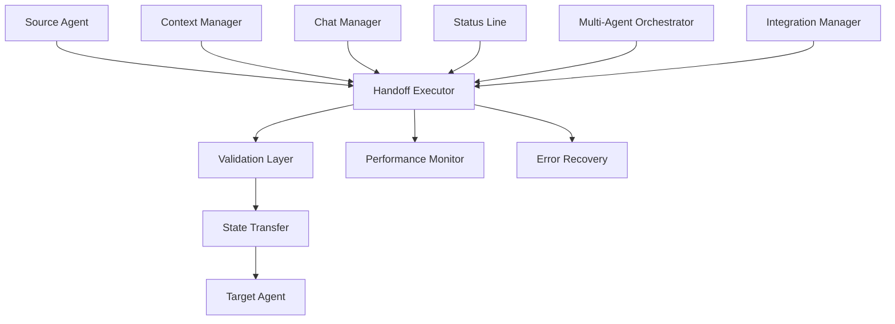

# Agent Handoff Protocols Guide - V3.6.9

## Table of Contents
1. [Overview](#overview)
2. [Core Components](#core-components)
3. [Handoff Types & Scenarios](#handoff-types--scenarios)
4. [Implementation Guide](#implementation-guide)
5. [Integration with V3.6.9 Framework](#integration-with-v369-framework)
6. [JSON Schemas](#json-schemas)
7. [Error Handling & Recovery](#error-handling--recovery)
8. [Performance Guidelines](#performance-guidelines)
9. [Testing & Validation](#testing--validation)
10. [Troubleshooting](#troubleshooting)

## Overview

The Agent Handoff Protocols system provides comprehensive, standardized mechanisms for seamless communication and state transfer between agents in the Claude Code V3.6.9 framework. This system ensures continuity, preserves context, and maintains quality throughout agent transitions.

### Key Features

- **Standardized Data Formats**: JSON-schema validated handoff packages
- **Context Packaging**: Complete state preservation during transfers
- **Error Handling**: Robust rollback and recovery mechanisms
- **Quality Gates**: Validation checkpoints ensure successful handoffs
- **Performance Monitoring**: Real-time tracking and optimization
- **Framework Integration**: Seamless integration with existing V3.6.9 components

### Architecture Overview



## Core Components

### 1. HandoffPackage
The complete data structure for agent handoffs:

```python
@dataclass
class HandoffPackage:
    handoff_id: str
    source_agent: str
    target_agent: str
    handoff_type: HandoffType
    priority: HandoffPriority
    
    # Core handoff data
    state_transfer: AgentState
    work_summary: str
    completed_tasks: List[Dict[str, Any]]
    pending_tasks: List[Dict[str, Any]]
    next_actions: List[str]
    
    # Context preservation
    conversation_context: Dict[str, Any]
    technical_context: Dict[str, Any]
    business_context: Dict[str, Any]
    
    # Quality assurance
    validation_checkpoints: List[Dict[str, str]]
    rollback_points: List[Dict[str, Any]]
    success_criteria: List[str]
```

### 2. AgentState
Represents the complete state of an agent:

```python
@dataclass
class AgentState:
    agent_id: str
    agent_type: str
    current_task: Optional[str]
    progress: float  # 0.0 to 1.0
    context: Dict[str, Any]
    active_files: List[str]
    dependencies: List[str]
    performance_metrics: Dict[str, float]
    error_state: Optional[Dict[str, Any]]
    memory_snapshot: Dict[str, Any]
    timestamp: str
```

### 3. HandoffExecutor
Executes handoffs with complete error handling:

- **Validation Phase**: Validates package completeness and agent compatibility
- **Preparation Phase**: Prepares both source and target agents
- **Transfer Phase**: Transfers state and context data
- **Verification Phase**: Verifies successful transfer
- **Activation Phase**: Activates target agent with transferred state

### 4. MultiAgentHandoffOrchestrator
Manages complex workflows involving multiple agents:

- **Sequential Workflows**: Handoffs in sequence
- **Parallel Collaborations**: Multiple agents working together
- **Dynamic Coordination**: Adaptive workflow management
- **Emergency Escalations**: Critical failure handling

## Handoff Types & Scenarios

### 1. Direct Handoffs (DIRECT)
Simple agent-to-agent transfers:

```python
# Example: Business Analyst to Technical CTO
package = HandoffPackage(
    handoff_type=HandoffType.DIRECT,
    source_agent="business-analyst",
    target_agent="technical-cto",
    priority=HandoffPriority.NORMAL,
    # ... additional configuration
)
```

**Use Cases:**
- Phase transitions (requirements → design)
- Specialization needs (business → technical)
- Load balancing

### 2. Collaborative Handoffs (COLLABORATIVE)
Multi-agent coordination:

```python
collaboration_spec = {
    "agents": ["frontend-architecture", "backend-services", "security-architecture"],
    "type": "parallel",
    "shared_context": {"feature": "user_authentication"}
}
```

**Use Cases:**
- Cross-functional development
- Parallel implementation
- Coordinated testing

### 3. Emergency Handoffs (EMERGENCY)
Critical failure escalations:

```python
escalation_request = {
    "source_agent": "backend-services",
    "target_agent": "devops-engineer",
    "emergency_summary": "Production database failure",
    "priority": HandoffPriority.EMERGENCY
}
```

**Use Cases:**
- Production failures
- Security incidents
- Critical performance issues

### 4. Phase Transition Handoffs (PHASE_TRANSITION)
Development phase changes:

```python
# Example: Design to Implementation
package = HandoffPackage(
    handoff_type=HandoffType.PHASE_TRANSITION,
    source_agent="system-architect",
    target_agent="production-frontend",
    business_context={"phase_change": "design_to_implementation"}
)
```

**Use Cases:**
- Natural workflow progression
- Milestone completions
- Process standardization

### 5. Load Balance Handoffs (LOAD_BALANCE)
Resource optimization:

**Use Cases:**
- High CPU/memory usage
- Performance optimization
- Resource distribution

### 6. Specialized Handoffs (SPECIALIZED)
Domain expertise requirements:

**Use Cases:**
- Security reviews
- Performance optimization
- Compliance requirements

## Implementation Guide

### Basic Handoff Implementation

```python
from core.hooks.handoff_protocols import HandoffExecutor, HandoffPackage, AgentState, HandoffType, HandoffPriority

# 1. Create handoff package
package = HandoffPackage(
    handoff_id="my_handoff_001",
    source_agent="current-agent",
    target_agent="next-agent",
    handoff_type=HandoffType.DIRECT,
    priority=HandoffPriority.NORMAL,
    
    # Transfer current state
    state_transfer=AgentState(
        agent_id="current-agent",
        agent_type="business-analyst",
        current_task="requirements_gathering",
        progress=0.8,
        context={"project": "ecommerce", "phase": "requirements"},
        active_files=["requirements.md", "stakeholder_notes.json"],
        dependencies=["stakeholder_approval"],
        performance_metrics={"requirements_count": 47},
        error_state=None,
        memory_snapshot={"key_decisions": ["microservices", "cloud_first"]},
        timestamp=datetime.now().isoformat()
    ),
    
    work_summary="Requirements gathering complete, moving to technical design",
    completed_tasks=[
        {"task": "stakeholder_interviews", "result": "47 requirements identified"}
    ],
    pending_tasks=[
        {"task": "technical_architecture", "priority": "high"}
    ],
    next_actions=["Design system architecture", "Select technology stack"],
    
    # Context preservation
    conversation_context={"current_phase": "requirements_to_design"},
    technical_context={"preferred_stack": "React/Node.js/PostgreSQL"},
    business_context={"budget": "$150k", "timeline": "6 months"},
    
    # Quality gates
    validation_checkpoints=[
        {"checkpoint": "requirements_complete", "criteria": "All requirements documented"}
    ],
    success_criteria=["Architecture design started", "Technology stack selected"],
    
    created_at=datetime.now().isoformat(),
    timeout_at=(datetime.now() + timedelta(hours=2)).isoformat(),
    retry_count=0,
    metadata={"project_id": "ecommerce_2024"}
)

# 2. Execute handoff
executor = HandoffExecutor()
result = executor.execute_handoff(package)

# 3. Check result
if result.success:
    print(f"Handoff successful! Continuity score: {result.continuity_score}")
else:
    print(f"Handoff failed: {result.error_message}")
    if result.rollback_executed:
        print("Rollback completed - system restored to previous state")
```

### Multi-Agent Workflow Implementation

```python
from core.hooks.handoff_protocols import MultiAgentHandoffOrchestrator

# 1. Define workflow
workflow_spec = {
    "workflow_name": "Feature_Development_Complete",
    "phases": [
        {
            "name": "design_phase",
            "agents": ["system-architect", "ui-ux-designer"],
            "type": "parallel",
            "duration_weeks": 2,
            "handoff_required": True,
            "handoff_spec": {
                "source_agent": "system-architect",
                "target_agent": "production-frontend",
                "success_criteria": ["Design approved", "Specifications complete"]
            }
        },
        {
            "name": "implementation_phase", 
            "agents": ["production-frontend", "backend-services"],
            "type": "parallel",
            "duration_weeks": 4,
            "handoff_required": True,
            "handoff_spec": {
                "source_agent": "production-frontend",
                "target_agent": "testing-automation",
                "success_criteria": ["Code complete", "Unit tests passing"]
            }
        }
    ]
}

# 2. Execute workflow
orchestrator = MultiAgentHandoffOrchestrator()
result = orchestrator.orchestrate_workflow_handoff(workflow_spec)

# 3. Monitor progress
print(f"Workflow status: {result['status']}")
print(f"Phases completed: {len(result['phases'])}")
print(f"Handoffs executed: {len(result['handoffs_executed'])}")
```

### Emergency Escalation Implementation

```python
# Emergency escalation for production issues
escalation_request = {
    "source_agent": "backend-services",
    "source_type": "backend-services",
    "target_agent": "devops-engineer",
    "emergency_summary": "Database connection pool exhausted - service unavailable",
    "reason": "production_critical_failure",
    
    "error_state": {
        "error_type": "database_connection_failure",
        "affected_services": ["user_auth", "session_mgmt"],
        "impact": "100% service unavailable",
        "estimated_revenue_loss": "$2000/hour"
    },
    
    "recovery_actions": [
        "Restart database connection pool",
        "Scale database instance",
        "Route traffic to backup"
    ],
    
    "context": {
        "incident_id": "INC-2024-001",
        "severity": "critical",
        "sla_breach": True
    }
}

# Execute emergency handoff
result = orchestrator.execute_emergency_escalation(escalation_request)

if result.success:
    print(f"Emergency escalation successful in {result.performance_metrics['total_time_ms']}ms")
else:
    print(f"Emergency escalation failed: {result.error_message}")
```

## Integration with V3.6.9 Framework

### Automatic Integration

The handoff system automatically integrates with existing V3.6.9 components:

```python
from core.hooks.handoff_integration import get_integration_manager

# Get integrated manager
integration_manager = get_integration_manager()

# Process events with automatic handoff assessment
result = integration_manager.process_integration_request("user_prompt", {
    "prompt": "Implement user authentication system",
    "context": {"project": "ecommerce", "phase": "implementation"}
})

if result["handoff_triggered"]:
    handoff_result = result["handoff_result"]
    print(f"Automatic handoff executed: {handoff_result.continuity_score}")
```

### Framework Component Integration

#### 1. Context Manager Integration
```python
# Context-triggered handoffs
if context_manager.get_status()["health"] == "critical":
    # Automatic handoff triggered
    integration_manager.process_integration_request("context_emergency", {
        "context_status": context_manager.get_status(),
        "trigger": "context_critical"
    })
```

#### 2. Chat Manager Integration
```python
# Chat health monitoring
if chat_manager.get_chat_health()["status"] == "critical":
    # Suggest handoff documentation
    integration_manager.process_integration_request("chat_handoff_needed", {
        "chat_health": chat_manager.get_chat_health(),
        "recommendation": "Generate handoff documentation"
    })
```

#### 3. Smart Orchestrator Integration
```python
# Multi-agent workflow detection
orchestration_result = smart_orchestrator.execute_orchestration(user_prompt)
if len(orchestration_result["selected_agents"]) > 1:
    # Collaborative handoff triggered
    integration_manager.process_integration_request("multi_agent_workflow", {
        "agents": orchestration_result["selected_agents"],
        "execution_plan": orchestration_result["plan"]
    })
```

### Manual Integration

```python
# Manual handoff execution
result = integration_manager.execute_manual_handoff(
    source_agent="business-analyst",
    target_agent="technical-cto", 
    context={
        "project": "ecommerce_platform",
        "phase_transition": "requirements_to_design",
        "handoff_reason": "requirements_complete"
    }
)
```

## JSON Schemas

### HandoffPackage Schema

```json
{
  "type": "object",
  "required": ["handoff_id", "source_agent", "target_agent", "state_transfer"],
  "properties": {
    "handoff_id": {"type": "string"},
    "source_agent": {"type": "string"},
    "target_agent": {"type": "string"},
    "handoff_type": {
      "type": "string", 
      "enum": ["direct", "collaborative", "emergency", "phase_transition", "load_balance", "specialized"]
    },
    "priority": {"type": "integer", "minimum": 1, "maximum": 5},
    "state_transfer": {
      "type": "object",
      "required": ["agent_id", "current_task", "progress", "context"],
      "properties": {
        "agent_id": {"type": "string"},
        "agent_type": {"type": "string"},
        "current_task": {"type": ["string", "null"]},
        "progress": {"type": "number", "minimum": 0, "maximum": 1},
        "context": {"type": "object"},
        "active_files": {"type": "array", "items": {"type": "string"}},
        "dependencies": {"type": "array", "items": {"type": "string"}},
        "performance_metrics": {"type": "object"},
        "error_state": {"type": ["object", "null"]},
        "memory_snapshot": {"type": "object"},
        "timestamp": {"type": "string"}
      }
    },
    "work_summary": {"type": "string"},
    "completed_tasks": {"type": "array"},
    "pending_tasks": {"type": "array"},
    "next_actions": {"type": "array", "items": {"type": "string"}},
    "conversation_context": {"type": "object"},
    "technical_context": {"type": "object"},
    "business_context": {"type": "object"},
    "validation_checkpoints": {"type": "array"},
    "rollback_points": {"type": "array"},
    "success_criteria": {"type": "array", "items": {"type": "string"}},
    "created_at": {"type": "string"},
    "timeout_at": {"type": "string"},
    "retry_count": {"type": "integer"},
    "metadata": {"type": "object"}
  }
}
```

### HandoffResult Schema

```json
{
  "type": "object",
  "required": ["handoff_id", "status", "success"],
  "properties": {
    "handoff_id": {"type": "string"},
    "status": {
      "type": "string", 
      "enum": ["pending", "in_progress", "completed", "failed", "timed_out", "rolled_back"]
    },
    "success": {"type": "boolean"},
    "completion_time": {"type": "string"},
    "error_message": {"type": ["string", "null"]},
    "rollback_executed": {"type": "boolean"},
    "continuity_score": {"type": "number", "minimum": 0, "maximum": 1},
    "performance_metrics": {"type": "object"},
    "validation_results": {"type": "array"}
  }
}
```

## Error Handling & Recovery

### Automatic Rollback

When handoffs fail, the system automatically attempts rollback:

```python
# Rollback triggers
rollback_triggers = [
    "validation_failure",
    "agent_unavailable", 
    "state_transfer_error",
    "timeout_exceeded",
    "verification_failed"
]

# Rollback process
def execute_rollback(package, error_context):
    """
    1. Restore source agent state
    2. Restore conversation context
    3. Restore file states
    4. Notify stakeholders
    5. Log rollback event
    """
```

### Error Recovery Strategies

#### 1. Timeout Recovery
```python
# Configure timeout handling
executor = HandoffExecutor(timeout_seconds=300)  # 5 minute timeout

# Timeout recovery plan
timeout_recovery = {
    "detection": "Monitor execution time vs timeout threshold",
    "immediate_action": "Cancel current operation and preserve state",
    "escalation": "Try backup agent or emergency escalation",
    "notification": "Alert monitoring systems and stakeholders"
}
```

#### 2. Agent Failure Recovery
```python
# Agent failure detection and recovery
agent_failure_recovery = {
    "detection_methods": [
        "Health check timeouts",
        "Repeated operation failures", 
        "Resource exhaustion alerts"
    ],
    "recovery_actions": [
        "Switch to backup agent",
        "Emergency escalation",
        "Graceful degradation"
    ],
    "prevention": [
        "Regular health monitoring",
        "Resource usage tracking",
        "Proactive capacity planning"
    ]
}
```

#### 3. State Corruption Recovery
```python
# State integrity validation and recovery
state_recovery = {
    "validation_checks": [
        "Required fields present",
        "Data type consistency",
        "Reference integrity",
        "Business rule validation"
    ],
    "recovery_methods": [
        "Restore from rollback point",
        "Reconstruct from audit trail",
        "Manual state reconstruction",
        "Emergency state reset"
    ]
}
```

### Emergency Procedures

#### Critical System Failure
```python
emergency_procedures = {
    "system_wide_failure": {
        "immediate_actions": [
            "Preserve all current state",
            "Activate incident response team",
            "Switch to emergency mode",
            "Notify all stakeholders"
        ],
        "recovery_timeline": "15 minutes maximum",
        "escalation_path": ["Technical Lead", "Engineering Manager", "CTO"]
    },
    
    "data_loss_prevention": {
        "continuous_backup": "Every handoff creates backup point",
        "audit_trail": "Complete history of all operations",
        "state_snapshots": "Periodic state preservation",
        "redundant_storage": "Multiple backup locations"
    }
}
```

## Performance Guidelines

### Optimization Recommendations

#### 1. Handoff Package Size
```python
# Optimize package size for performance
optimization_guidelines = {
    "context_size": "< 1MB for optimal performance",
    "file_list_size": "< 100 files for quick processing",
    "memory_snapshot": "Essential data only, not full memory dump",
    "task_history": "Last 50 tasks maximum",
    "compression": "Use JSON compression for large payloads"
}
```

#### 2. Concurrent Handoffs
```python
# Manage concurrent handoff performance
concurrency_limits = {
    "max_concurrent_handoffs": 10,
    "queue_management": "Priority-based queuing",
    "resource_allocation": "Dynamic based on system load",
    "timeout_scaling": "Longer timeouts under high load"
}
```

#### 3. Performance Monitoring
```python
# Monitor handoff performance
performance_metrics = {
    "execution_time": "Target < 5 seconds",
    "success_rate": "Target > 95%",
    "continuity_score": "Target > 0.8",
    "throughput": "Target > 100 handoffs/minute",
    "resource_usage": "Monitor CPU/memory during handoffs"
}
```

### Performance Tuning

#### Database Optimization
```python
# Optimize handoff data storage
database_optimization = {
    "indexing": "Index on handoff_id, timestamp, agent_ids",
    "partitioning": "Partition by date for historical data",
    "cleanup": "Archive handoffs older than 30 days",
    "caching": "Cache frequently accessed handoff patterns"
}
```

#### Network Optimization
```python
# Optimize network communications
network_optimization = {
    "compression": "Gzip compression for large payloads",
    "connection_pooling": "Reuse connections between agents",
    "timeout_tuning": "Optimize based on network latency",
    "retry_logic": "Exponential backoff for network failures"
}
```

## Testing & Validation

### Running Tests

```bash
# Run comprehensive test suite
cd core/hooks
python handoff_testing.py

# Run specific test categories
python -m unittest handoff_testing.HandoffProtocolTestSuite.test_handoff_execution
python -m unittest handoff_testing.HandoffProtocolTestSuite.test_emergency_escalation

# Run performance benchmarks
python handoff_testing.py --benchmarks-only

# Run integration tests
python handoff_testing.py --integration-tests
```

### Custom Test Implementation

```python
from core.hooks.handoff_testing import HandoffProtocolTestSuite

# Create custom test suite
class CustomHandoffTests(HandoffProtocolTestSuite):
    def test_custom_scenario(self):
        """Test custom handoff scenario"""
        # Your custom test implementation
        package = self._create_custom_package()
        result = self.executor.execute_handoff(package)
        
        self.assertTrue(result.success)
        self.assertGreater(result.continuity_score, 0.8)

# Run custom tests
custom_tests = CustomHandoffTests()
results = custom_tests.run_all_tests()
```

### Validation Checklist

#### Pre-Production Validation
- [ ] All unit tests passing (>95% success rate)
- [ ] Integration tests with V3.6.9 framework passing
- [ ] Performance benchmarks within acceptable limits
- [ ] Error handling scenarios tested
- [ ] Rollback functionality verified
- [ ] Concurrent handoff testing completed
- [ ] Emergency escalation procedures tested
- [ ] Documentation reviewed and updated

#### Production Monitoring
- [ ] Performance metrics dashboard configured
- [ ] Error rate monitoring active
- [ ] Success rate tracking enabled
- [ ] Continuity score monitoring in place
- [ ] Resource usage alerts configured
- [ ] Audit trail logging active

## Troubleshooting

### Common Issues

#### 1. Handoff Validation Failures
```python
# Symptom: Handoffs fail validation
# Causes:
validation_failures = {
    "missing_required_fields": "Check HandoffPackage completeness",
    "invalid_agent_names": "Verify agent exists in system",
    "malformed_state_data": "Validate AgentState structure",
    "context_size_exceeded": "Reduce context payload size"
}

# Solutions:
def fix_validation_failures():
    """
    1. Use HandoffValidator to check package before execution
    2. Verify all required fields are populated
    3. Check agent compatibility matrix
    4. Validate data types and structures
    """
```

#### 2. Performance Issues
```python
# Symptom: Slow handoff execution
# Causes:
performance_issues = {
    "large_state_transfer": "Optimize context and memory snapshot size",
    "network_latency": "Check network connectivity between agents",
    "resource_contention": "Monitor system resources during handoffs",
    "inefficient_validation": "Profile validation logic performance"
}

# Solutions:
def optimize_performance():
    """
    1. Implement state compression
    2. Use asynchronous operations where possible
    3. Cache frequently used data
    4. Optimize validation logic
    5. Monitor and tune timeout values
    """
```

#### 3. State Transfer Problems
```python
# Symptom: Context or state not properly transferred
# Causes:
state_transfer_issues = {
    "serialization_errors": "Check data type compatibility",
    "context_corruption": "Validate context data integrity",
    "partial_transfer": "Check for network interruptions",
    "agent_compatibility": "Verify agent can handle transferred state"
}

# Solutions:
def fix_state_transfer():
    """
    1. Implement state validation checksums
    2. Use transactional state transfer
    3. Add state reconstruction capabilities
    4. Implement partial transfer recovery
    """
```

#### 4. Integration Problems
```python
# Symptom: Framework integration not working
# Causes:
integration_issues = {
    "component_unavailable": "Check V3.6.9 component initialization",
    "version_mismatch": "Verify compatible versions",
    "configuration_error": "Check integration configuration",
    "event_handling_failure": "Verify event routing logic"
}

# Solutions:
def fix_integration():
    """
    1. Verify all V3.6.9 components are initialized
    2. Check integration configuration
    3. Test event handling independently
    4. Use fallback modes for missing components
    """
```

### Diagnostic Tools

#### 1. Handoff Health Check
```python
from core.hooks.handoff_integration import get_integration_manager

def diagnose_handoff_system():
    """Run comprehensive system health check"""
    manager = get_integration_manager()
    status = manager.get_integration_status()
    
    print("=== Handoff System Health Check ===")
    print(f"Active handoffs: {status['active_handoffs']}")
    print(f"Total handoffs: {status['total_handoffs']}")
    print(f"Success rate: {status['integration_metrics']}")
    print(f"Component status: {status['component_status']}")
    
    # Check performance
    performance = status['performance_analysis']
    if performance.get('recommendations'):
        print("⚠️  Performance recommendations:")
        for rec in performance['recommendations']:
            print(f"  - {rec}")
    
    return status
```

#### 2. Performance Profiler
```python
from core.hooks.handoff_protocols import HandoffPerformanceMonitor

def profile_handoff_performance():
    """Profile handoff performance characteristics"""
    monitor = HandoffPerformanceMonitor()
    analysis = monitor.get_performance_analysis()
    
    print("=== Performance Analysis ===")
    print(f"Average execution time: {analysis['average_execution_time_ms']}ms")
    print(f"Success rate: {analysis['success_rate']*100:.1f}%")
    print(f"Continuity score: {analysis['average_continuity_score']:.2f}")
    
    trends = analysis.get('performance_trends', {})
    for metric, trend in trends.items():
        print(f"{metric}: {trend}")
    
    return analysis
```

#### 3. Integration Validator
```python
def validate_v3_integration():
    """Validate integration with V3.6.9 framework"""
    from core.hooks.handoff_integration import HandoffIntegrationManager
    
    integration = HandoffIntegrationManager()
    
    validation_results = {
        "v3_orchestrator": integration.v3_orchestrator is not None,
        "smart_orchestrator": integration.smart_orchestrator is not None,
        "context_manager": integration.context_manager is not None,
        "chat_manager": integration.chat_manager is not None,
        "status_line_manager": integration.status_line_manager is not None
    }
    
    print("=== V3.6.9 Integration Status ===")
    for component, available in validation_results.items():
        status = "✓ Available" if available else "✗ Missing"
        print(f"{component}: {status}")
    
    overall_health = sum(validation_results.values()) / len(validation_results)
    print(f"\nOverall integration health: {overall_health*100:.0f}%")
    
    return validation_results
```

### Support and Monitoring

#### Log Analysis
```python
# Enable detailed logging
import logging

logging.basicConfig(
    level=logging.DEBUG,
    format='%(asctime)s - %(name)s - %(levelname)s - %(message)s',
    handlers=[
        logging.FileHandler('handoff_system.log'),
        logging.StreamHandler()
    ]
)

# Monitor specific handoff events
logger = logging.getLogger('handoff_protocols')
logger.info("Handoff system monitoring enabled")
```

#### Monitoring Dashboard
```python
# Real-time monitoring setup
def setup_monitoring_dashboard():
    """Setup real-time monitoring for handoff system"""
    dashboard_config = {
        "metrics": [
            "handoff_success_rate",
            "average_execution_time",
            "continuity_score",
            "error_rate",
            "system_resource_usage"
        ],
        "alerts": [
            {"metric": "success_rate", "threshold": 0.95, "action": "email"},
            {"metric": "execution_time", "threshold": 5000, "action": "slack"},
            {"metric": "error_rate", "threshold": 0.05, "action": "page"}
        ],
        "reporting": {
            "daily_summary": True,
            "weekly_trends": True,
            "monthly_analysis": True
        }
    }
    
    return dashboard_config
```

---

## Conclusion

The Agent Handoff Protocols system provides a robust, scalable foundation for agent communication in the Claude Code V3.6.9 framework. By following this guide, you can implement reliable handoff mechanisms that maintain context, ensure quality, and provide excellent error recovery capabilities.

For additional support or questions, please refer to the test suite examples or contact the development team.