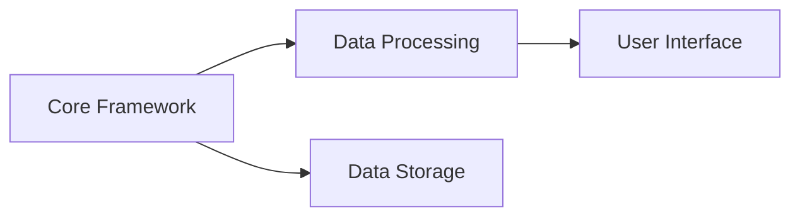
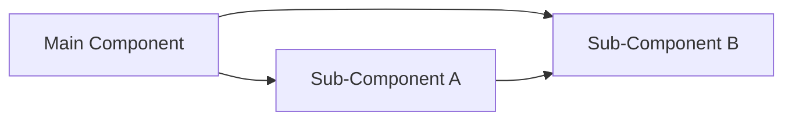
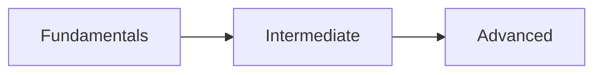
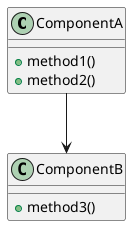

# Visual Documentation Pipeline

A comprehensive visual documentation generator that creates interactive diagrams, screenshots, and video tutorials from code analysis, integrating seamlessly with CodeBoarding patterns.

## Overview

The Visual Documentation Pipeline automatically generates:

- **Interactive Diagrams**: Mermaid, PlantUML, and D3.js visualizations
- **System Architecture**: Automated flowcharts from code structure
- **Interactive Documentation**: HTML pages with embedded examples
- **Screenshots**: Automated UI documentation capture
- **Video Tutorials**: Generated walkthrough videos
- **CodeBoarding Integration**: Compatible with existing onboarding patterns

## Features

### 🎨 Diagram Generation
- **Mermaid Diagrams**: System architecture, component relationships, learning paths
- **PlantUML Diagrams**: Detailed UML class and sequence diagrams
- **D3.js Visualizations**: Interactive network graphs and hierarchies
- **Flowcharts**: Automated workflow diagrams from code analysis

### 📖 Interactive Documentation
- **Component Pages**: Detailed documentation for each module
- **Diagram Viewer**: Interactive exploration of system architecture
- **Code Examples**: Embedded usage examples and snippets
- **Navigation**: Intuitive browsing experience

### 📷 Screenshot Automation
- **Multi-Device**: Desktop, tablet, and mobile viewports
- **Element Capture**: Specific component screenshots
- **Gallery Generation**: Organized screenshot collections
- **Browser Support**: Playwright, Selenium, Chrome headless

### 🎥 Video Generation
- **Tutorial Creation**: Automated walkthrough videos
- **Component Demos**: Individual feature demonstrations
- **Architecture Tours**: Interactive diagram explorations
- **Animated GIFs**: Quick demonstrations

### 🔗 CodeBoarding Integration
- **Pattern Compatibility**: Follows established visual guidelines
- **Badge Integration**: Automatic CodeBoarding branding
- **Onboarding Updates**: Seamless integration with existing docs
- **FAQ Linking**: Consistent help references

## Installation

### Prerequisites

**Required:**
- Python 3.8+
- Basic Python packages (ast, pathlib, json)

**Optional (for enhanced features):**
```bash
# Diagram rendering
npm install -g @mermaid-js/mermaid-cli
# or
pip install plantuml

# Screenshot generation
pip install playwright
playwright install chromium

# Video generation
# Install FFmpeg: https://ffmpeg.org/download.html

# Image processing
pip install Pillow

# Advanced diagrams
pip install matplotlib networkx
```

### Quick Setup

1. **Clone or copy the visual-docs directory to your project**
2. **Install optional dependencies for enhanced features**
3. **Run the pipeline on your project**

## Usage

### Basic Usage

```bash
# Generate visual documentation for current project
python core/visual-docs/run_pipeline.py /path/to/your/project

# With screenshots and videos
python core/visual-docs/run_pipeline.py /path/to/your/project --screenshots --videos

# Custom output directory
python core/visual-docs/run_pipeline.py /path/to/your/project --output ./custom-docs
```

### Advanced Configuration

```bash
# Generate sample configuration
python core/visual-docs/run_pipeline.py /path/to/your/project --dry-run

# Use custom configuration
python core/visual-docs/run_pipeline.py /path/to/your/project --config config.json

# Specific diagram formats
python core/visual-docs/run_pipeline.py /path/to/your/project --formats mermaid plantuml d3

# Verbose output
python core/visual-docs/run_pipeline.py /path/to/your/project --verbose
```

### Python API Usage

```python
from core.visual_docs.pipeline.visual_docs_pipeline import VisualDocsPipeline, create_default_config

# Create configuration
config = create_default_config("/path/to/project")
config.generate_screenshots = True
config.generate_videos = True

# Run pipeline
pipeline = VisualDocsPipeline(config)
summary = pipeline.run_full_pipeline()

print(f"Generated {summary['diagrams_generated']} diagrams")
print(f"Output: {summary['output_directory']}")
```

## Configuration

### Configuration File Format

```json
{
  "project_root": "/path/to/project",
  "output_dir": "/path/to/project/docs/visual",
  "source_dirs": [
    "/path/to/project/src",
    "/path/to/project/lib"
  ],
  "include_patterns": ["*.py", "*.js", "*.ts", "*.md"],
  "exclude_patterns": ["__pycache__", "node_modules", ".git"],
  "diagram_formats": ["mermaid", "plantuml", "d3"],
  "generate_screenshots": true,
  "generate_videos": false,
  "integration_mode": "codeboarding"
}
```

### Configuration Options

| Option | Description | Default |
|--------|-------------|---------|
| `project_root` | Root directory of the project | Required |
| `output_dir` | Output directory for documentation | `{project_root}/docs/visual` |
| `source_dirs` | Directories to analyze | Auto-detected |
| `include_patterns` | File patterns to include | `["*.py", "*.js", "*.ts", "*.md"]` |
| `exclude_patterns` | Patterns to exclude | `["__pycache__", "node_modules", ".git"]` |
| `diagram_formats` | Diagram types to generate | `["mermaid", "d3"]` |
| `generate_screenshots` | Enable screenshot generation | `false` |
| `generate_videos` | Enable video generation | `false` |
| `integration_mode` | Integration type | `"codeboarding"` |

## Output Structure

```
docs/visual/
├── diagrams/
│   ├── mermaid/           # Mermaid diagram files (.mmd, .svg)
│   ├── plantuml/          # PlantUML diagrams (.puml, .svg)
│   ├── d3/                # D3.js interactive diagrams (.html)
│   └── flowcharts/        # Generated flowcharts (.mmd, .svg)
├── interactive/
│   ├── index.html         # Main interactive documentation
│   ├── components/        # Individual component pages
│   ├── diagrams/          # Diagram detail pages
│   ├── css/               # Styling
│   └── js/                # Interactive functionality
├── screenshots/
│   ├── gallery.html       # Screenshot gallery
│   └── *.png              # Generated screenshots
├── videos/
│   ├── index.html         # Video gallery
│   ├── *.mp4              # Generated videos
│   └── *.gif              # Animated demonstrations
└── pipeline_summary.json  # Generation summary
```

## Diagram Types

### Mermaid Diagrams

**System Architecture**


**Component Details**


**Learning Paths**


### PlantUML Diagrams

**Class Diagrams**


### D3.js Visualizations

- **Interactive Network Graphs**: Explore component relationships
- **Hierarchical Trees**: Navigate code structure
- **Dependency Graphs**: Understand module dependencies

## CodeBoarding Integration

### Automatic Integration

When `integration_mode` is set to `"codeboarding"`, the pipeline:

1. **Updates existing onboarding documentation** with new diagrams
2. **Creates component detail files** following CodeBoarding patterns
3. **Adds visual assets** to the onboarding assets directory
4. **Includes CodeBoarding badges** and FAQ links
5. **Follows visual guidelines** for consistency

### Manual Integration

```python
from core.visual_docs.integration.codeboarding_integration import CodeBoardingIntegrator

integrator = CodeBoardingIntegrator(project_root, visual_docs_output)
results = integrator.integrate_visual_docs(analysis, diagrams)
```

### Generated CodeBoarding Assets

- `docs/onboarding/on_boarding.md` - Updated main onboarding
- `docs/onboarding/components/` - Individual component docs
- `docs/onboarding/assets/` - Visual assets and diagrams
- `README_VISUAL_DOCS.md` - Project overview with visual documentation

## Examples

### Educational Project

For projects like "30-Days-Of-Python":
```bash
python core/visual-docs/run_pipeline.py ./30-Days-Of-Python --screenshots
```

Generates:
- Learning progression diagrams
- Day-by-day component relationships
- Interactive tutorial navigation
- Screenshot gallery of lessons

### Framework Project

For frameworks like "AdalFlow":
```bash
python core/visual-docs/run_pipeline.py ./AdalFlow --formats mermaid plantuml d3 --videos
```

Generates:
- System architecture diagrams
- Class hierarchy visualizations
- API interaction flows
- Video walkthroughs

### Application Project

For applications like "AutoGPT":
```bash
python core/visual-docs/run_pipeline.py ./AutoGPT --integration codeboarding --screenshots --videos
```

Generates:
- Service architecture diagrams
- User journey flows
- Component interaction videos
- Complete CodeBoarding integration

## Troubleshooting

### Common Issues

**No diagrams generated:**
- Check that source files exist in specified directories
- Verify include/exclude patterns
- Check console output for analysis errors

**Screenshots fail:**
- Install Playwright: `pip install playwright && playwright install`
- Ensure HTML files are generated first
- Check browser availability

**Videos not created:**
- Install FFmpeg: https://ffmpeg.org/download.html
- Enable video generation: `--videos` flag
- Check dependencies with `--verbose` flag

**CodeBoarding integration issues:**
- Verify `docs/onboarding/` directory exists
- Check file permissions
- Review integration logs

### Dependency Check

```bash
python core/visual-docs/run_pipeline.py /path/to/project --dry-run --verbose
```

This will show:
- Available tools and their status
- What would be generated
- Dependency recommendations

## Contributing

### Adding New Diagram Types

1. Create generator in `generators/your_generator.py`
2. Implement `generate()` method
3. Add to pipeline initialization
4. Update configuration options

### Extending Screenshot Automation

1. Add new browser support in `automation/screenshot_generator.py`
2. Implement browser-specific methods
3. Update availability checking
4. Add to tool selection logic

### Custom Templates

1. Add templates to `templates/` directory
2. Update template loading in generators
3. Create template validation
4. Document template variables

## License

This visual documentation pipeline is part of the Claude Code Dev Stack and follows the same licensing terms.

## Support

For issues, questions, or contributions:

1. Check the troubleshooting section above
2. Review generated log files
3. Use `--verbose` and `--dry-run` for debugging
4. Report issues with full configuration and error logs

---

**Generated by Visual Documentation Pipeline**  
Part of the Claude Code Dev Stack v3.0